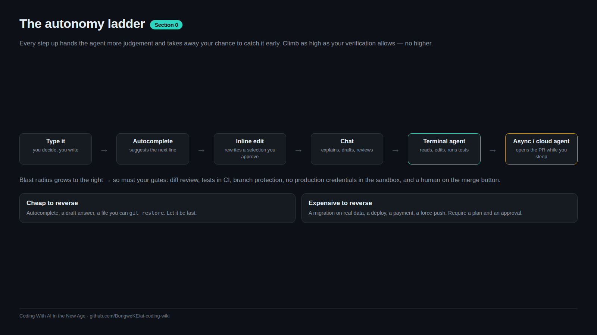

# Coding With AI in the New Age

A **free, technical, bite-sized wiki** for people who are new to software engineering but want to build real things with AI coding agents — and not get burned doing it.

AI wrote a lot of the words here; the lessons came from real projects. Everything is grounded in shipped work, official documentation and public security research. Where a page states a number that changes often, it says so.

## Who this is for

| If you are... | Start here |
|---|---|
| Curious, never shipped anything | [Set up your workbench](00-Setup-Your-Workbench) → [Foundations](01-Foundations) → [Capstone 1](15-Capstone-1-Ship-A-Tiny-App) |
| A junior developer using Copilot or chat | [Agentic workflows](03-Agentic-Workflows) → [Checks that matter](05-Checks-That-Actually-Matter) → [Safety & security](09-Safety-And-Security) |
| Building an AI product | [Prompting & context](02-Prompting-And-Context) → [System design](06-System-Design) → [Evals](10-Evaluating-AI-Features) → [Costs](13-Token-Economics-And-Budgets) |
| Leading a small team | [Rules of operation](12-Rules-Of-Operation) → [Review of AI code](13-Code-Review-For-AI-Code) → [Case studies](14-Case-Studies) |

## The journey

Each lesson is 600–1000 words with one exercise, a diagram, the mistakes people actually make, and links to go deeper. Read one, run one command.

| # | Section | What you get |
|---|---------|--------------|
| 0 | [Start Here](00-Start-Here) | What AI coding actually is, what the tools are, and a workbench that works. |
| 1 | [Foundations](01-Foundations) | A correct mental model: models, tokens, context, the agent loop, and where agents are weak. |
| 2 | [Prompting & Context](02-Prompting-And-Context) | Instructions and context an agent can actually execute — including the rules file loaded every session. |
| 3 | [Agentic Workflows](03-Agentic-Workflows) | The daily craft: plan, implement, test, review, and keep diffs small enough to read. |
| 4 | [Agent Skills](04-Agent-Skills) | Package know-how so any agent gets it right without being re-taught. |
| 5 | [Git & CI/CD](05-Git-And-CICD) | Git, the GitHub CLI, workflows, the checks that matter, hardening, releases and deploys. |
| 6 | [System Design](06-System-Design) | Design before code: boundaries, diagrams, state machines, ADRs, schemas, APIs, scale. |
| 7 | [Shipping & Deploy](07-Shipping-And-Deploy) | Railway, Neon, edge workers, environments, promotion, rollback and cost control. |
| 8 | [MCP](08-MCP) | Connect agents to real tools with the Model Context Protocol — and manage the risks that come with it. |
| 9 | [Safety & Security](09-Safety-And-Security) | Secrets, generated-code risk, prompt injection, supply chain, OWASP catalogues, privacy, accountability. |
| 10 | [Quality](10-Quality) | Tests, integration and smoke tests, evals for AI features, definition of done, debugging. |
| 11 | [Documentation](11-Documentation) | Docs as code, READMEs, per-feature docs, lesson banks, runbooks. |
| 12 | [Rules Of Operation](12-Rules-Of-Operation) | SOPs, ADRs, AGENTS.md, skills as operating rules, versioning and change tracking. |
| 13 | [Team & Process](13-Team-And-Process) | Issues, boards, reviewing AI-written code, token economics, ownership. |
| 14 | [Case Studies](14-Case-Studies) | Four real projects, generalised, with the mistakes that actually happened. |
| 15 | [Capstones](15-Capstones) | Three capstones, a 30-day plan, and where to keep learning afterwards. |
| 16 | [Reference](16-Reference) | Cheat sheets, templates, the mermaid cookbook and the link index. |

## The five rules of this wiki

1. **Verify with evidence.** A green check is not proof anyone read the change.
2. **Small diffs, small steps.** Blast radius scales with diff size.
3. **Test the deployed artefact**, not just your laptop.
4. **Rules belong in the cheapest layer that works** — a rule, a skill, a hook, or a CI gate.
5. **You own every line you commit**, whoever wrote it.

## Start here

- [How to use this wiki](00-How-To-Use-This-Wiki) — the learning paths and how to do the exercises properly
- [What is AI coding, really?](00-What-Is-AI-Coding) — the vocabulary, ten minutes, no jargon
- [Set up your workbench](00-Setup-Your-Workbench) — git, gh, a runtime, an agent, and your first PR
- [The 30-day learning plan](15-30-Day-Learning-Plan) — if you want a schedule

## Extras

- **Interactive tools** (open them from the repository): [prompt anatomy builder](https://github.com/BongweKE/ai-coding-wiki/blob/main/tools/prompt-anatomy-builder.html), [context budget calculator](https://github.com/BongweKE/ai-coding-wiki/blob/main/tools/context-budget-calculator.html), [CI pipeline visualiser](https://github.com/BongweKE/ai-coding-wiki/blob/main/tools/ci-pipeline-visualizer.html), [cost calculator](https://github.com/BongweKE/ai-coding-wiki/blob/main/tools/cost-calculator.html).
- **Templates**: [AGENTS.md, ADR, SOP, PR template, CI workflows, SKILL.md](16-Templates).
- **Cheat sheets**: [git](16-Git-Cheat-Sheet), [gh](16-GitHub-CLI-Cheat-Sheet), [Railway & Neon](16-Railway-And-Neon-Cheat-Sheet), [mermaid](16-Mermaid-Cookbook).
- **Link index**: [every source used in this wiki](16-Link-Index).

## Contributing and licence

Issues and pull requests are welcome — see [Contributing](15-Contributing-To-This-Wiki) and the house style in `STYLE.md`. Text is CC BY 4.0; the scripts and tools are MIT. Nothing here is legal, financial or security advice for your specific system: adapt it, and verify it yourself.

