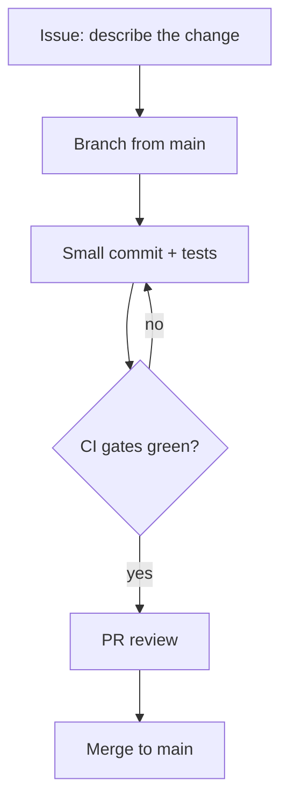
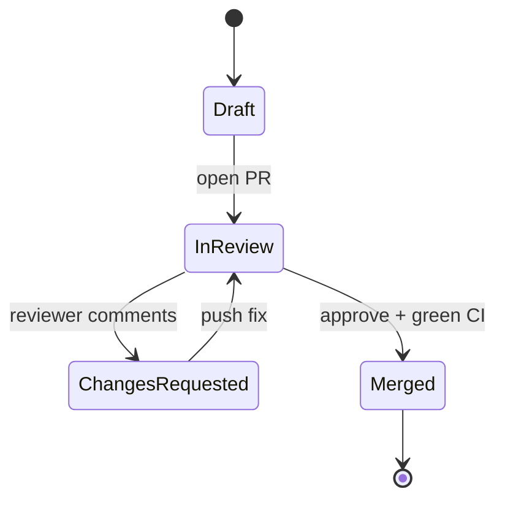

# House style — AI Coding Wiki

Every page in this wiki is written by a human or an agent following these rules. They exist so that
120+ pages written at different times still read like one book.

## Who we are writing for

A motivated beginner who is comfortable opening a terminal but has never shipped software
professionally. They are technical (they will paste commands, read stack traces, get curious about
how things work) but they do not know the vocabulary yet. Assume zero knowledge of CI/CD, MCP,
agents, ADRs, evaluations. Explain a term the first time it appears, in the same sentence, in
brackets. Never talk down to them. Never pad.

Two reader personas, used for spot checks:

- **Amina** — finished a Python course, has built a script that emails a spreadsheet, has never used git in anger.
- **Bilal** — a junior developer at a small company, uses Copilot, has been burned once by an agent that "fixed" tests by deleting them.

A page is good if Amina can follow it start to finish and Bilal learns something he did not know.

## Hard rules

1. **Page shape.** No H1 (the wiki renders the page title itself). Start with the metadata blockquote, then
   `## Why this matters`. Then the body. End with `## Key takeaways` (3–6 bullets), then
   `## Further learning`.
2. **Length.** 600–1000 words of prose. Hard ceiling 1300. Bite-sized beats exhaustive. If a topic needs
   more, split it and link on.
3. **Verified links only.** Link from the URLs listed in your spec file, or from a documentation root you are
   certain exists (`https://docs.github.com/en/actions`, `https://docs.railway.com/`,
   `https://neon.com/docs/introduction`, `https://modelcontextprotocol.io/`, `https://owasp.org/`,
   `https://genai.owasp.org/`, `https://www.anthropic.com/engineering`, `https://agentskills.io/`).
   **Never invent a deep URL.** A deep link you have not seen is a bug: link the docs root instead so
   the reader can search. Do not link a page you "think" exists.
4. **Grounded facts.** Anything numeric or version-specific (free-tier limits, model names, spec versions,
   action versions) must come from the reference material in your spec's `Reads` list and be marked
   "as of <year>" or omitted. Pricing, quotas and model names change constantly — say so rather than
   stating a stale number as permanent truth.
5. **Sanitisation (non-negotiable).** Your source material comes from real, private projects. Never publish
   internal hostnames, service URLs, API keys, account IDs, wallet/merchant/customer details, vendor
   negotiation details, client or org names, private repository paths, or anything that only makes sense
   inside one company. Generalise: "a Kenyan payments platform", "a multi-agent RAG research assistant",
   "a geospatial compliance platform". The lesson survives; the identity does not.
6. **No secrets, ever.** Not even fake-looking ones. Use `sk-...REDACTED` style placeholders or
   `os.environ["SERVICE_API_KEY"]`. Do not print a real-looking token pattern.
7. **Voice.** Second person, active, direct. Short sentences. No hype, no filler. Banned words:
   delve, leverage (as a verb), seamless, robust, game-changer, unlock, empower, supercharge, journey
   (as metaphor), "in today's fast-paced world". No rhetorical questions as section openers.
   Never open a page with "In this page we will".
8. **Code.** Real, runnable, minimal examples in fenced blocks with a language tag. Prefer 8–25 line
   snippets over long listings. Show the command AND the expected output when the output teaches something.
   Pin versions where the spec asks for it.
9. **Every page teaches a loop.** No page may be pure theory: each one has at least one concrete
   `## Try it` exercise (a command to run, a prompt to send, a file to write) and one
   `## Common mistakes` list with 3+ specific, plausible failures.
10. **Diagrams.** Include the diagrams your spec lists. Mermaid rules below. Diagrams are part of the
    lesson, referenced from prose ("see the loop below"), never decorative.

## Metadata block

First line of every page, exactly this shape:

```
> **Section 05 · Lesson 3** · Level: beginner · ~12 min · Prereq: [Git essentials](05-Git-Essentials)
```

Use `Level: beginner | intermediate | advanced`. Prereq links use the wiki page name (filename without `.md`).

## Local links

Link to other wiki pages by page name: `[Checks that matter](05-Checks-That-Actually-Matter)`.
Do not link `foo.md`, and do not use `[[wikilinks]]`.

## Images

Infographics live in the repository and are embedded from the raw URL:

```

```

Only embed the assets your spec lists — they are generated, and the filenames are fixed. Always give a
short, real alt text.

## Mermaid rules

GitHub renders mermaid inside fenced ` ```mermaid ` blocks. To keep every diagram rendering on the first try:

- Use only: `flowchart` / `graph`, `sequenceDiagram`, `stateDiagram-v2`, `erDiagram`, `classDiagram`,
  `gantt`, `timeline`.
- Never use `%%{init}%%` directives, `click`, `linkStyle`, HTML in labels, or emoji in node ids.
- Quote any label containing punctuation: `A["Verify (twice)"]` — not `A[Verify (twice)]`.
- Node ids: short, `[A-Za-z0-9_]` only. No spaces in ids.
- Keep to <= 20 nodes and one idea per diagram; split rather than sprawl.
- Prefer `flowchart TD` for processes, `sequenceDiagram` for interactions, `stateDiagram-v2` for lifecycles,
  `erDiagram` for schemas.
- Test mentally against mermaid's parser: no unclosed brackets, no `end` used as an id, no bare `:` inside ids.

Two worked examples:

````

````

````

````

## Page anatomy (copy this skeleton)

```
> **Section NN · Lesson N** · Level: beginner · ~10 min · Prereq: [X](page-name)

## Why this matters
Two or three sentences. The concrete pain this removes or the capability it unlocks.

## <main sections — 2 to 5 of them>
Prose. Code. A mermaid diagram where the spec says so. An embedded infographic where the spec says so.

## Try it
Numbered, runnable steps.

## Common mistakes
- **<mistake>** — what it looks like, why it happens, what to do instead.

## Key takeaways
- 3–6 bullets, each a rule the reader can act on.

## Further learning
- [Name](url) — one clause on what it covers.
```

## Tone calibration examples

Bad: "Leveraging agentic workflows enables seamless developer productivity gains."
Good: "An agent will happily edit a file you did not ask it to touch. Keep diffs small so you notice."

Bad: "It is important to note that CI/CD is a critical practice."
Good: "CI is the robot that runs your tests before your code reaches main. Without it, 'it works on my
machine' becomes 'it broke production on Friday'."
