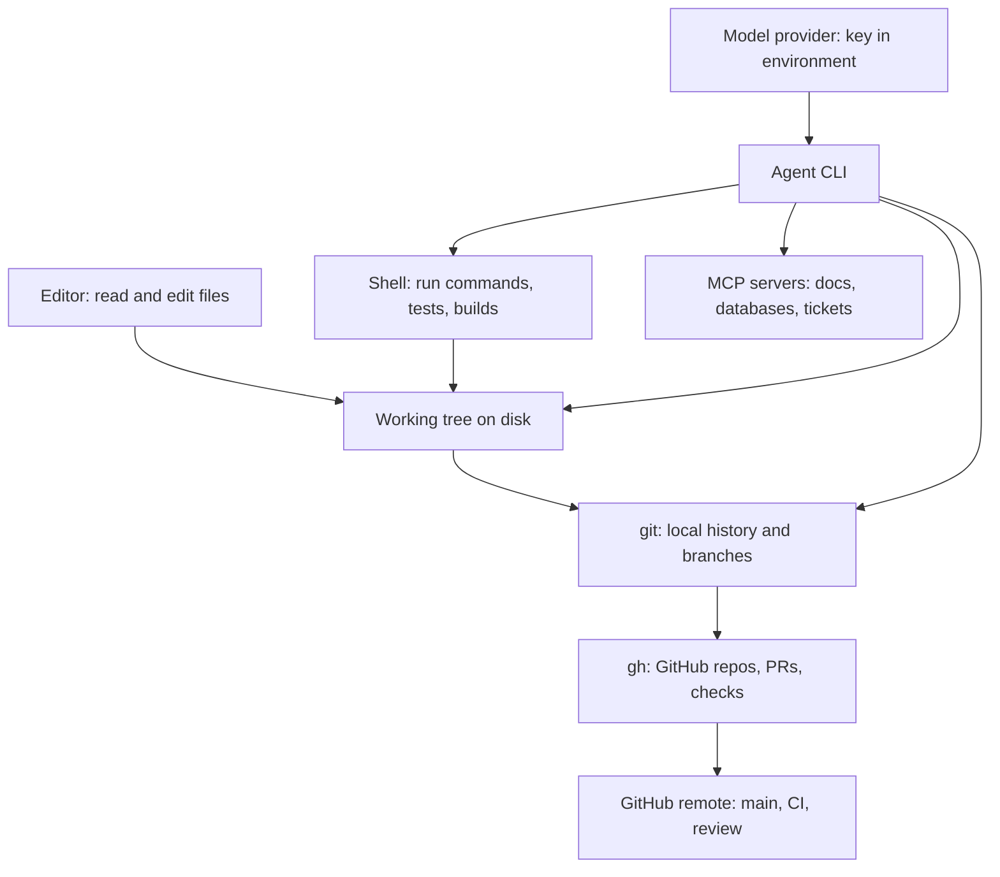

> **Section 00 · Lesson 3** · Level: beginner · ~20 min · Prereq: [The AI coding landscape](00-The-AI-Coding-Landscape)

## Why this matters

Agents are only useful when the boring parts work: a runtime, git, an authenticated GitHub CLI, and one place your API key lives that is not a source file. Twenty minutes here saves a week of "why did my key leak" and "why won't the agent run the tests".

## The workbench map

Five tools, each with one job. Learn the job, not the flags.




Your editor is where you read. The shell is where things run. git records history locally; `gh` talks to GitHub; the model provider is billed and authenticated separately from both. The agent CLI sits on top and borrows all of them — which is why it inherits every mistake in the layer underneath.

## Install the five things

1. **git** — version control. Check: `git --version`.
2. **gh** — GitHub's CLI, so repositories, pull requests and checks are one command instead of five browser tabs.
3. **A runtime** — Python or Node. Pick the one you will actually write in; you can add the other later. Check: `python3 --version` or `node --version`.
4. **An editor** — VS Code or similar, with a terminal inside it.
5. **One terminal agent CLI** — pick exactly one. Two agents in the same working tree will fight over the same files.

Install commands differ per platform, so follow the official instructions for your OS. Verify each tool answers `--version` before moving on; a missing prerequisite is the most common reason an agent "won't run anything".

## Authenticate without leaking

```bash
gh auth login            # choose GitHub.com, HTTPS, and log in via browser
gh auth status           # confirm the account and the token scopes
```

`gh auth status` should print the account you expect and its scopes. If it prints nothing, stop and fix that before continuing — an unauthenticated `gh` fails later, in the middle of a push, with a much more confusing error.

Model provider credentials belong in environment variables, never in a file git can see:

```bash
# in ~/.zshrc, ~/.bashrc, or a tool-specific config — not in the repo
export MODEL_API_KEY="..."     # your value, never committed
```

Your code reads it, it never appears in the source:

```python
import os

api_key = os.environ["MODEL_API_KEY"]   # raises if unset — fail loudly, not silently
```

Fail loudly on purpose. An agent that finds a missing key returns a cryptic error; an agent that finds an empty string may quietly call the provider with no auth and retry for ten minutes.

## First end-to-end proof

The goal is not the repo. The goal is proving that disk, git, `gh` and your account all agree with each other.

```bash
mkdir hello-agent && cd hello-agent
git init -b main
printf '# hello-agent\n\nFirst repo from the terminal.\n' > README.md
git add README.md
git commit -m "Add README"
gh repo create hello-agent --public --source=. --remote=origin --push
```

Now make a change on a branch and review it the way you will review agent work:

```bash
git checkout -b add-notes
printf '\n## Notes\n\n- Set up by hand.\n' >> README.md
git add README.md && git commit -m "Add notes section"
git push -u origin add-notes
gh pr create --title "Add a notes section" --body "Small change to test the flow."
gh pr checks        # prints nothing until a workflow exists
gh pr merge --squash --delete-branch
```

You have now done the whole loop by hand. Everything an agent does is this loop, faster. When a pull request opens a CI run, the checks appear in the same place — see [Writing GitHub Actions](05-Writing-GitHub-Actions) and the [GitHub Actions docs](https://docs.github.com/en/actions).

## Secrets hygiene from day one

Three files and one habit:

```bash
# .gitignore
.env
.env.*
!.env.example
```

- **`.env`** holds real values, only on your machine.
- **`.gitignore`** stops it from ever being staged.
- **`.env.example`** is committed and holds placeholder names only, so the next person knows what to set.

```bash
printf 'MODEL_API_KEY=\nSERVICE_API_KEY=\n' > .env.example
printf 'MODEL_API_KEY=sk-...REDACTED\n' > .env
git check-ignore -v .env   # should print the .gitignore rule that matched
```

`git check-ignore` is the cheap habit: run it whenever you add a new secrets file. A secret that reached a commit is compromised even after you delete the line — history keeps it. Rotate the key, do not just remove the file. Full detail in [Secrets hygiene](09-Secrets-Hygiene) and [Secrets in CI](05-Secrets-In-CI).

## Try it

1. Install the five tools and paste the `--version` line from each into a notes file. Anything that fails, fix now.
2. Run `gh auth login` then `gh auth status`. Copy the account name into the same notes file.
3. Do the end-to-end proof above exactly, including `git check-ignore -v .env`.
4. Add `.env.example` to the repo and commit it. Confirm `.env` is not in `git status`.
5. Start your agent CLI in the repo and ask it: "read the README and tell me what this project does. Do not change anything." Verify it can see the tree without editing it.

## Common mistakes

- **Putting the API key in the repo "temporarily"** — one commit is permanent. Rotate the key if it ever lands.
- **Skipping `gh auth status`** — the failure surfaces mid-push instead of at setup.
- **Installing two agent CLIs on day one** — they edit the same working tree and your diffs become unreadable.
- **Committing generated directories** — `node_modules/`, `venv/`, build output. They bloat diffs until review is impossible.
- **No runtime installed for the tests** — an agent told to "run the tests" with no test runner spends a session installing one, badly.
- **Working on `main` by default** — you lose the branch-and-PR loop that makes agent changes reviewable.

## Key takeaways

- Five tools, one job each: git records, `gh` talks to GitHub, the runtime runs, the editor reads, one agent writes.
- Verify every install with `--version` before trusting the agent to use it.
- Log in once with `gh auth login` and confirm with `gh auth status`.
- Keys live in environment variables; the repo only ever sees `.env.example` with placeholders.
- Learn the manual loop (branch, commit, PR, merge) once — it is the same loop the agent runs.
- Run `git check-ignore -v` on any new secrets file.

## Further learning

- [Git essentials for the AI era](05-Git-Essentials) — the model of branches, commits and diffs you will need for review.
- [GitHub CLI quickstart](05-GitHub-CLI-Quickstart) — `gh` for repos, issues, PRs and checks.
- [GitHub Actions documentation](https://docs.github.com/en/actions) — what runs on each push and how to read a red check.
- [Secrets hygiene](09-Secrets-Hygiene) — storage, rotation and what to do after a leak.
- [Railway docs](https://docs.railway.com/) — deploying the thing you just built.
- [Model Context Protocol](https://modelcontextprotocol.io/) — adding docs, databases and ticket systems to your agent's toolbox.
