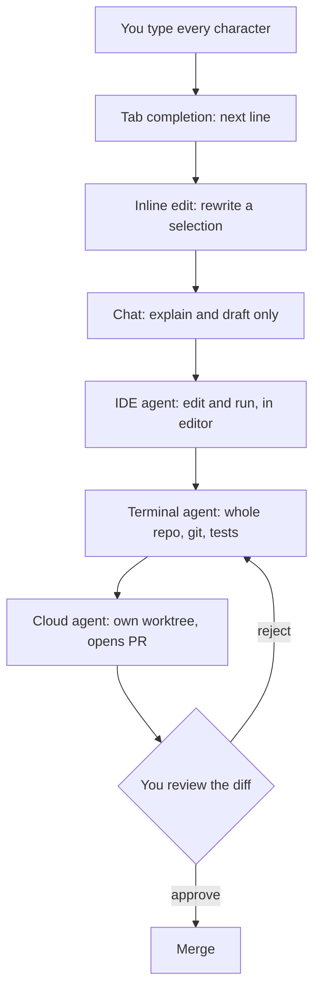

> **Section 00 · Lesson 2** · Level: beginner · ~12 min · Prereq: [What is AI coding](00-What-Is-AI-Coding)

## Why this matters

Every AI coding tool is a trade: the more the machine does on its own, the more it can do wrong before you notice. This lesson puts the tools on one ladder, gives you four questions for choosing a rung, and shows where your real safety comes from — the harness, not the model.

## The autonomy ladder

Six rungs, from "you type every character" to "an agent opens the pull request while you do something else":

1. **Tab completion** — suggests the next line inside your editor. Blast radius: one keystroke away from being ignored.
2. **Inline edit** — you select code, describe a change, it rewrites that selection. You see the diff before accepting.
3. **Chat** — a conversation window with no tools or read-only tools. It can explain and draft, not commit.
4. **IDE agent** — a plug-in that reads the project, edits files and runs commands inside your editor, with a diff view.
5. **Terminal agent** — a CLI in your shell. It sees the whole working tree, runs tests, uses git, can spawn helper agents. Your reviewing happens on the diff afterwards.
6. **Cloud or async agent** — you hand a task to a remote session; it works in its own checkout and opens a pull request for review.

Rungs 1 to 3 keep you in the loop by construction. Rungs 4 to 6 move you to the end of the loop, which is why the rest of this wiki spends so much time on checks, small diffs and review.

## How to pick a rung

Four questions, in this order:

- **Blast radius.** What is the worst thing this rung can do if it is wrong? A wrong completion costs a keystroke. A wrong terminal agent can delete a directory, push to `main`, or rewrite a migration. Pick the least autonomous rung that can do the job.
- **Can you review the diff?** If the change is 600 lines across 14 files, the honest answer is no. Split the task until it fits in one sitting. See [Keeping diffs small](03-Keeping-Diffs-Small).
- **Cost.** Agent sessions read many files and run many commands, and each one is tokens. A cheap task handed to an agent with a large context can cost more than doing it by hand ([Token and cost discipline](03-Token-And-Cost-Discipline)).
- **Latency.** Completion is instant; an agent loop takes minutes and pauses for approvals. For a one-line fix, waiting is slower than typing it.

Say the diff out loud before you start. "Add a nullable column and a migration" is agent work; "make the app better" is not a task.

## The harness is the product

The model is one component. What it is allowed to do lives in the harness:

- **Rules files.** `AGENTS.md` (cross-tool) or `CLAUDE.md` are read at the start of every session and hold commands, style and workflow rules the agent cannot infer from code. Keep them short: a bloated rules file causes the agent to ignore your actual instructions. Put knowledge that only matters sometimes in a [Skill](04-What-Are-Agent-Skills) instead, because skills load on demand.
- **Tools.** File editing, shell, git, test runners, and outside services through [MCP servers](https://modelcontextprotocol.io/). More tools means more capability and more ways to be surprised.
- **Permissions.** Allowlists pre-approve commands you trust (`npm run lint`, `git commit`) so you stop clicking through approvals, which is when reviewing stops happening.
- **Sandbox.** OS-level isolation restricting filesystem and network access, so the agent works inside a boundary instead of asking about everything.
- **Hooks.** Scripts that run at fixed points in the agent's workflow. Rules-file instructions are advisory; hooks are deterministic — a hook that blocks writes to a migrations folder always fires. Use hooks for rules you cannot afford to have forgotten.

This whole stack is the **harness**. It is the part you can actually reason about, test and code-review.

## Portability: what travels

Rules files and skills travel between products; vendor-specific prompt text does not. `AGENTS.md` is read by several agent tools, and [Agent Skills](https://agentskills.io/) package instructions as a `SKILL.md` folder that many harnesses load on demand — the format is shared ([anthropics/skills](https://github.com/anthropics/skills) has public examples). Prompts written against one product's modes and slash commands usually do not survive a move.

Write your rules and skills in the portable form first. When you switch tools, you keep the knowledge and change the wrapper.

## Try it

1. Place the tool you already use on the ladder above. Write down its blast radius: what can it change without asking you?
2. Create the smallest useful rules file: `AGENTS.md` with three lines — your test command, your formatter command, and one rule about what not to touch.
3. Run the agent on a trivial task and list the tools it calls. Note which ones you would pre-approve and which you would never pre-approve.
4. Add a command you run constantly (a linter, a formatter) to the allowlist and count how many approval prompts disappear.
5. Move one paragraph from your rules file into a `SKILL.md` folder and load it on demand. Note how much shorter the rules file gets.

## Common mistakes

- **Reaching for the most autonomous rung by default** — a cloud agent for a typo means waiting two minutes for a pull request you could have merged in ten seconds.
- **Treating approvals as a formality** — after the tenth click, "approve" stops being a decision. Pre-approve the safe commands and keep the rest manual.
- **Letting the rules file grow into a specification** — long rules files get ignored; the rule you care about disappears in the noise.
- **Relying on advisory rules for hard constraints** — "never edit migrations" in a rules file is a request. A hook is an enforcement.
- **Assuming your prompt text will work in another tool** — slash commands, plan modes and config keys differ. Rules files and skills mostly do not.

## Key takeaways

- The ladder runs from one keystroke to a pull request you never watched. Pick the lowest rung that does the job.
- Choose by blast radius first, then reviewability, then cost and latency.
- The harness — rules, tools, permissions, sandbox, hooks — decides what can happen. Configure it deliberately.
- Rules files are advisory; hooks are deterministic. Enforce hard constraints with hooks.
- Prefer portable rules files and skills over vendor-specific prompt text.
- Always be able to see the diff.

## Further learning

- [Best practices for Claude Code](https://www.anthropic.com/engineering/claude-code-best-practices) — rules files, permission modes, sandboxing, hooks, subagents and headless runs.
- [Model Context Protocol](https://modelcontextprotocol.io/) — the standard for connecting agents to outside tools and data.
- [Agent Skills](https://agentskills.io/) — packaging know-how so any agent loads it on demand.
- [Rules files: AGENTS.md and CLAUDE.md](02-Rules-Files-AGENTS-and-CLAUDE-md) — writing the file the agent reads every session.
- [Hooks and guardrails](03-Hooks-And-Guardrails) — turning a rule you keep repeating into automation.
- [From autocomplete to agents](01-From-Autocomplete-To-Agents) — how one model behaves at each rung.
