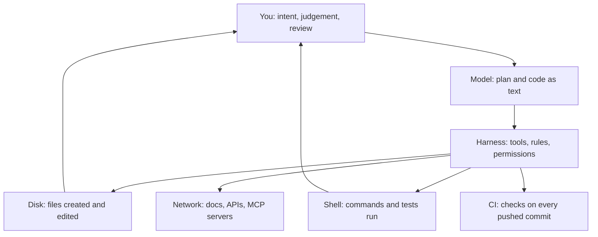

> **Section 00 · Lesson 1** · Level: beginner · ~10 min · Prereq: none

## Why this matters

Three different products all get called "AI coding" and they fail in different ways. Knowing which one you are using tells you what to trust, what to check, and how bad a wrong answer can get. This lesson gives you that map and the vocabulary the rest of this wiki assumes.

## Three things people conflate

**Autocomplete.** Your editor suggests the rest of the line as you type. It sees the current file and a little nearby context. It is fast, cheap, and it never runs anything.

**Chat assistants.** You paste code or an error into a chat box and ask a question. It cannot break anything, because it has no hands: nothing it says changes a file.

**Agents that run tools.** The model can read your files, write to them, run shell commands, and read the output. This is the category that ships real work and the category that breaks real things. An agent works in a loop: propose an action, run it, read the result, choose the next action. See [The agent loop](01-The-Agent-Loop).

Anthropic draws the same line from the other side. A **workflow** orchestrates models and tools through predefined code paths; an **agent** directs its own steps and tool use. Workflows are predictable and cheap. Agents handle open-ended tasks where the number of steps cannot be guessed in advance — and they cost more and compound their own errors ([Building effective agents](https://www.anthropic.com/engineering/building-effective-agents)).

## The working vocabulary

- **Model** — turns text in into text out. No memory of you between calls, no access to your machine on its own.
- **Prompt** — everything you send it: instructions, file contents, error output, examples.
- **Token** — the unit models read and bill in, roughly three-quarters of an English word.
- **Context window** — all the tokens one conversation can hold, including every file read and command output. It fills up, and quality drops as it fills.
- **Tool call** — the model asking for an action ("read this file", "run this test") and getting the result back.
- **Agent** — a model plus tools plus a loop, working toward a goal with little step-by-step instruction.
- **Harness** — the program around the model that owns the tools, permissions, rules file and stopping conditions. Same model, different harness, very different behavior.

## You, the model, and the tools

Every AI coding tool is these three layers. Failures come from one of them, and it helps to know which.

The model only produces text. Everything that touches the world is a tool call the harness allows. That is why permissions and rules matter more than model choice for your safety.

## What changed, and why it matters

Two changes made solo shipping realistic. Models got good enough to hold a whole feature in their head, and harnesses got the tools they need: file editing, a shell, a test runner, a git client, and a way to call outside services ([MCP](https://modelcontextprotocol.io/) is the standard for that last one). Anthropic's free courses cover the same ground hands-on ([Anthropic courses](https://github.com/anthropics/courses)).

The practical result: one person with an agent can produce a working, tested, deployed service. That person still has to direct it.

## What it does not do

It does not remove the need to understand code. You will review diffs, and you cannot review what you cannot read.

It does not remove tests: a check the agent can run is what lets it finish without you watching (see [Checks that actually matter](05-Checks-That-Actually-Matter)). It does not remove git — every serious workflow assumes branches, commits and pull requests ([Git essentials](05-Git-Essentials)). And it does not remove systems knowledge: deploys, databases, secrets and incidents still behave like systems, no matter who typed the code ([Deployment concepts](07-Deployment-Concepts)).

It also does not know your intent. Vague prompts get plausible code for the wrong problem.

## Try it

1. Open a chat assistant and paste 20 lines of code you wrote. Ask it to explain the code line by line, with no changes.
2. In the same conversation, ask it to "fix any bugs and give me the full file". Note how confident the answer sounds and how little evidence it shows.
3. Write down three facts it asserted that you did not verify. Those are the things an agent would have acted on.
4. Count roughly: paste the prompt into a token counter and compare with a one-line instruction. That number is your unit of cost from now on.

## Common mistakes

- **Treating a chat answer as reviewed work** — the reply is a proposal, not a commit. Nothing is true until you have run it.
- **Giving an agent a goal with no way to check itself** — without a test, a build or a script, "looks done" becomes the only signal and you become the verification loop.
- **Confusing the model with the product** — the same model in a different harness has different tools, permissions and rules.
- **Assuming "it can code" means "it can architect"** — agents are strong at local, well-specified changes and weak at choosing trade-offs across a system.
- **Believing the context window is unlimited** — long sessions quietly forget your earlier constraints. Long files and long logs eat it fast.

## Key takeaways

- Autocomplete, chat and agents are three tools with three different blast radii. Name which one you are using.
- Workflows follow paths you wrote; agents choose their own steps. Start with the simplest thing that works.
- Outcome = model + harness + tools + your instructions.
- The model produces text; the harness touches disk, network and CI. Control it there.
- AI coding removes typing, not understanding. Tests, git and systems knowledge are entry requirements.
- Cost, speed and forgetfulness are all counted in tokens in one context window.

## Further learning

- [Building effective agents](https://www.anthropic.com/engineering/building-effective-agents) — Anthropic's taxonomy of workflows and agents, with when-to-use guidance.
- [Anthropic courses](https://github.com/anthropics/courses) — free hands-on courses: API fundamentals, prompt engineering, real-world prompting, evaluations, tool use.
- [How LLMs work for coders](01-How-LLMs-Work-For-Coders) — what the model is actually doing when it writes code.
- [The AI coding landscape](00-The-AI-Coding-Landscape) — the tools on the ladder, from autocomplete to an agent that opens the pull request.
- [Glossary](00-Glossary) — every term above, one line each.
