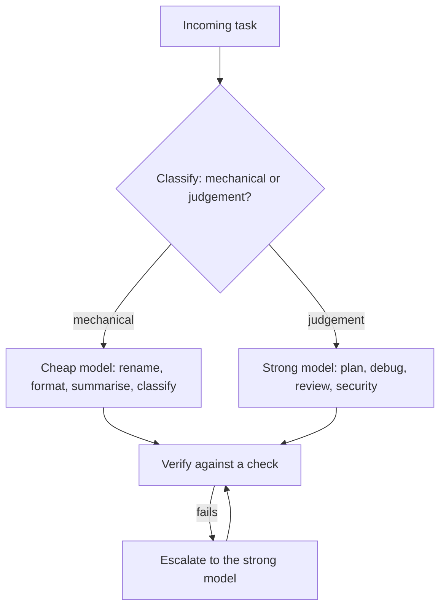

> **Section 01 · Lesson 6** · Level: beginner · ~10 min · Prereq: [How LLMs work](01-How-LLMs-Work-For-Coders)

## Why this matters

Model names change every few months, so memorising the current best one is wasted effort. What does not change is the trade you are making: how much reasoning and tool-use reliability you need, against how much you are willing to pay in money and waiting. Get the trade right and you spend less for better results; get it wrong and you either overpay for simple edits or wreck a feature with the cheapest model available.

## What a capability tier buys you

Providers sell tiers rather than a single model, and the tiers differ along five axes you can feel:

- **Reasoning quality** — how well it handles multi-step problems and unfamiliar code.
- **Tool-use reliability** — how often it emits a valid tool call instead of malformed output or prose where a call was expected.
- **Latency** — how long you wait per turn, which compounds over a twenty-step loop.
- **Price** — usually quoted per million input and output tokens, and output usually costs more.
- **Context size** — how much fits in the window, which matters less than it sounds once you have read [A taxonomy of context](01-Taxonomy-Of-Context).

These are not one dial. A small model can be excellent at classification and hopeless at architecture; a large one can be slower and only marginally better at a mechanical edit. As of 2026, published per-million-token prices span from a fraction of a dollar for small models to tens of dollars for the largest — a wide enough spread that the choice matters to a budget. Treat that as a shape, not a quote: pricing and model names change constantly, so check the provider's own page.

## Routing: cheap by default, strong where it counts

Routing means classifying the request first, then sending it down the cheap path or the strong path. Anthropic describes it as a standard pattern: send easy, common questions to a smaller model and hard or unusual ones to a more capable model.



A real example from our notes: a multi-agent pipeline routed each stage to a different tier. A small, cheap model acted as a scope guard and a classifier, a mid-size model reformulated search queries, a larger one wrote the final synthesis, and a separate mid-tier model judged a sample of answers. Each stage used the smallest model that could do its job, and the measured cost stayed low while the reasoning-heavy steps kept the capable model.

A practical workflow for one developer looks the same:

- Mechanical edits, renames, formatting, commit messages, docstrings: cheap model.
- Test writing and small bug fixes with a clear repro: cheap model, with the tests as the check.
- Planning, architecture, tricky debugging, code review, security-adjacent code: strong model.
- Anything you cannot check: strong model plus a human, or not at all.

## Hosted or local

A hosted model sends your code to someone else's server. A local model runs on your machine — private, offline, and free per token, but usually smaller and slower.

Choose local when the code cannot leave the machine (client code under contract, personal data, anything regulated), or when you are offline, or when volume makes per-token cost dominate. Choose hosted when you need the strongest reasoning or tool use, or when you want no ops work.

A middle position is common: local for classification, summarising, and anything touching sensitive text; hosted for planning and the final review. Whatever the split, the security consideration is constant — a model is a place your data goes. See [Threat-modeling your AI workflow](09-Threat-Modeling-Your-Workflow).

## Benchmarks are not your workload

Leaderboard scores measure a benchmark's tasks, not yours. A model that tops a coding leaderboard may be worse than its cheaper predecessor at your framework, or better — you cannot tell from the score. Our notes learned the same lesson about tooling: documented availability did not prove something worked, and the only reliable check was to run it.

Build a small eval (evaluation — a repeatable set of tasks with a pass/fail signal) before you switch. It does not need to be elaborate: ten tasks from your own repository, each with a way to tell whether the answer is right.

```python
"""eval_tasks.py — score a candidate model on your own tasks."""
TASKS = [
    "Add a failing test for parse_amount, then fix it.",
    "Rename UserRepo to AccountRepo across the repo; tests must pass.",
    "Explain why the retry loop in jobs.py can double-submit.",
    # ...seven more real tasks from your project
]

def score(results) -> float:
    passed = sum(1 for r in results if r["tests_pass"] and r["review_ok"])
    return passed / len(results)
```

Run both models, compare cost and pass rate, and only then switch. The same principle applies to prompts and skills: a change is a hypothesis until something measures it.


## Try it

1. Take five tasks you did last week and label each mechanical or judgement.
2. Run one mechanical task with your cheapest available model and one judgement task with your strongest. Compare the output and the cost, if your tool reports it.
3. Write the ten-task eval above, using real tasks from your own repository.
4. Run it against your current model, then against a candidate. Switch only if the pass rate holds and the cost drops.

## Common mistakes

- **Using the biggest model for everything** — slower and pricier, and it cannot save a task with no check.
- **Using the cheapest model for planning or review** — a weak plan is paid for at every later step.
- **Choosing from a leaderboard** — benchmark tasks are not your repository. Measure your own ten tasks.
- **Assuming the docs prove a model works** — availability and capability differ. Test it on your task first.

## Key takeaways

- Tiers trade reasoning, tool reliability, latency, price, and context size — not one dial.
- Route mechanical work to a cheap model and judgement work to a strong one.
- Use the smallest model that can do the job, with a check on the result.
- Local wins on privacy and marginal cost; hosted wins on capability and zero ops.
- Build a ten-task eval from your own repo before you switch models.

## Further learning

- [Building effective agents](https://www.anthropic.com/engineering/building-effective-agents) — routing as a pattern, including sending easy and hard questions to different tiers.
- [Evaluation best practices](https://developers.openai.com/api/docs/guides/evaluation-best-practices) — how to build and score the small eval this page recommends.
- [Anthropic's courses](https://github.com/anthropics/courses) — free, hands-on material for prompt and model work.
