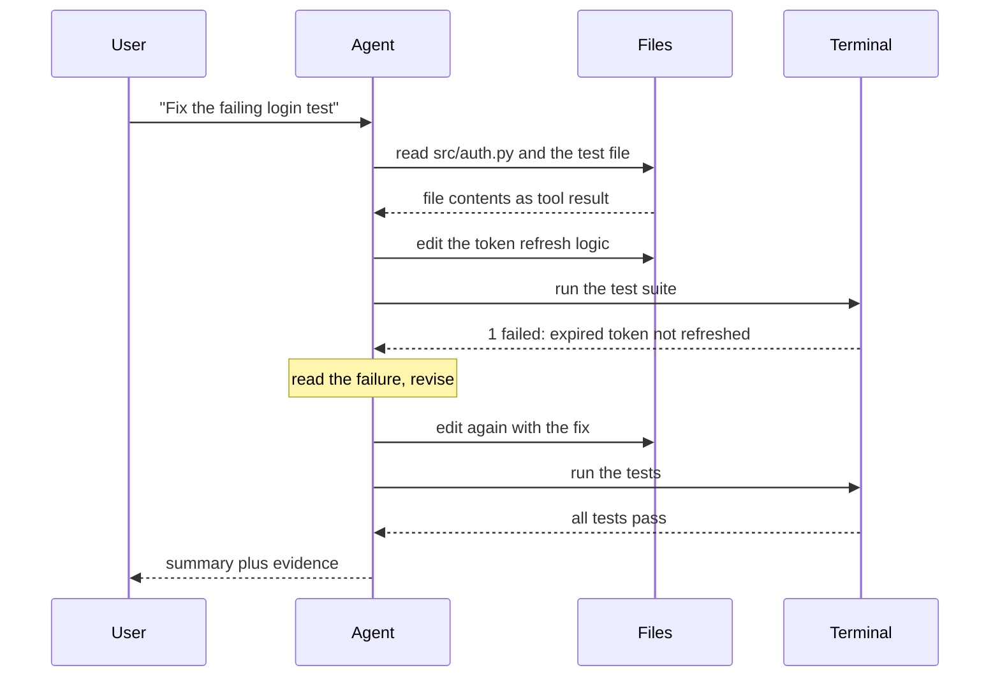

> **Section 01 · Lesson 2** · Level: beginner · ~10 min · Prereq: [How LLMs work](01-How-LLMs-Work-For-Coders)

## Why this matters

Autocomplete finishes your line. An agent finishes your task. The difference is not a bigger model — it is that the model is now allowed to read your files, run commands, and look at what happened. That one change turns a text generator into something that can do multi-step work, and it introduces two failure modes a chat window never had.

## Tool calling is the hinge

A chat model can only return text. An agent is a chat model plus a harness: the program that owns the tools. When the model wants to know something, it does not guess — it emits a structured request, "read `src/auth.py`". The harness runs that, captures the output, and appends it to the conversation as a tool result. The model sees the result on its next call and decides what to do next.

That round trip is tool calling, and it is why context still matters: every read, every command, every error message lands in the same window described in [How LLMs work](01-How-LLMs-Work-For-Coders). The harness is what makes the loop safe or unsafe. It decides which tools exist, what they can touch, and whether a human approves each call.

## What a completion engine cannot do

Autocomplete has no state beyond the buffer in front of it. It cannot notice that a test fails, open the file defining the failing function, change it, and run the test again. An agent can, because each of those steps is a tool call whose result feeds the next decision. The sequence below is the canonical shape of the difference.

Read it as a loop, not a script: read, decide, act, observe, repeat. The loop is the subject of the next page, [The agent loop](01-The-Agent-Loop).

## Two failure modes to expect

Anthropic draws a useful line between workflows, where code paths are fixed in advance, and agents, where the model directs its own steps. That freedom buys flexibility and costs predictability, and two failures follow from it.

**Confident wrongness.** The agent states a cause without evidence. It says the bug is in the cache when the failing line is in the parser, and because its tone never changes, you cannot tell a verified claim from a guess. The defence is to require evidence in the same breath — test output, a command and its result, a diff — and to treat a claim with no output as unverified. Our own notes arrived at the same rule from the security side: a confident finding with no pasted output is where teams get burned, so every claim needs either proof or an explicit "unresolved".

**Context loss.** After many tool calls the window fills with file dumps and logs, and the agent quietly forgets the constraint you set at the start ("do not touch the migration files"). Long-horizon work makes this worse. Anthropic's answer is to compact the transcript, keep notes outside the window, or hand side work to a subagent with a clean window — all covered in [A taxonomy of context](01-Taxonomy-Of-Context).

## Autonomy and reviewability move together

The more steps an agent takes alone, the more you need gates that do not depend on you watching. Every project we looked at converged on the same rule: work is delegable in proportion to how cheaply you can check it. A rename you can verify by reading the diff. A payment refund you cannot verify at all, so it should not be autonomous.

Practical gates, cheapest first: a test the agent must make pass, a type check, a lint rule, a required pull-request review, a permission prompt before a destructive command. Pick the gate to match the blast radius, then widen autonomy only when a gate exists. That is how the next page frames the loop's stop conditions.

## Try it

1. In any repository, ask an agent: "Read `README.md` and list the three files most likely to contain the app entry point. Do not edit anything." Watch the tool calls it makes to answer.
2. Ask a chat-only session the same question. Notice that it must guess, because it cannot read.
3. Now ask: "Add a failing test for the smallest function in the repo, run it, then make it pass. Show the test command output." Confirm you see a real failure before a real pass.
4. Deliberately break a test — rename one function it imports — then ask the agent to fix the tests. If it deletes or weakens the test instead, you have just seen why gates matter.

## Common mistakes

- **Trusting a diagnosis with no output** — an agent's causal claim is a hypothesis until a command result backs it. Ask for the error text.
- **Jumping straight to a wide edit** — a large one-shot change hides mistakes. Small, verified steps catch them early.
- **Forgetting that the loop costs tokens** — every read and command re-enters context. Long loops get slower and less accurate as they fill.
- **Letting the agent be its own referee** — if the same run writes and grades the change, you are missing a gate that does not depend on it.

## Key takeaways

- Tool calling is what separates an agent from a chat: the model asks, the harness runs, the result returns.
- Agents win where the task needs read-decide-act-observe, not one fluent paragraph.
- Expect confident wrongness and context loss; require evidence and keep instructions visible.
- Autonomy is safe in proportion to how cheaply you can check the result.
- Add a gate before you add autonomy.

## Further learning

- [Building effective agents](https://www.anthropic.com/engineering/building-effective-agents) — workflows versus agents, and when a simple chain beats an autonomous loop.
- [Best practices for Claude Code](https://www.anthropic.com/engineering/claude-code-best-practices) — the explore-plan-code-commit habit in practice.
- [Glossary](00-Glossary) — plain-language definitions for agent, harness, and tool call.
