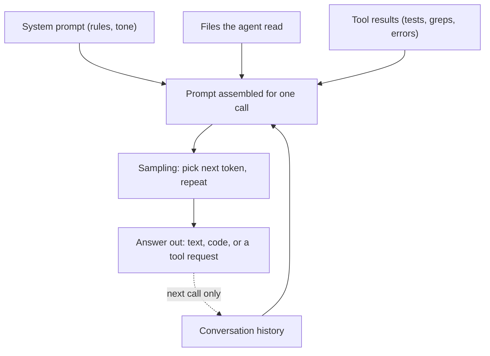

> **Section 01 · Lesson 1** · Level: beginner · ~12 min · Prereq: [Glossary](00-Glossary)

## Why this matters

When you ask an agent to add a feature, you are not talking to a mind that held a meeting about your codebase. You are sampling from a text predictor that has never seen your repository and forgets everything the moment the call ends. Knowing that changes how you prompt, how much you paste, and how much you trust the answer.

## A model call is next-token prediction

A large language model (LLM — the text engine behind every coding assistant) does one job per call: given the text so far, it predicts a probability for every possible next token, picks one, appends it, and repeats. That is the whole loop. An "answer" is just a long series of those picks.

Because each pick is a sample from a distribution, the same prompt does not always produce the same code. Ask twice and you may get two different function names, two different orderings, two different bug fixes. This is not a bug you can switch off. It is why you should treat a single generation as a draft, not a verdict, and why running the code matters more than reading it.

Here is what actually goes into one call — see the diagram below.

Nothing in that box persists between calls. The "memory" you feel in a long session is just the transcript being re-sent.

## Tokens are the unit of everything

Models do not read words. They read tokens: chunks of roughly three to four characters of English, so about 0.75 words per token. `unbelievable` might be three tokens; `getUserById` might be four. Code and non-English text cost more tokens per character than prose.

Tokens are the meter for three things at once: what you pay, how fast the answer streams, and how much fits in the window. A 500-line file is a few thousand tokens. A full test-suite log can be tens of thousands. When an agent feels expensive or slow, it is usually because you fed it a large amount of low-value text.

## The context window is working memory

The context window is the maximum number of tokens the model can consider in a single call — system prompt, your instructions, the conversation so far, every file it has read, and every tool result. Think of it as a desk, not a filing cabinet. Everything the model can reason about must be on the desk right now.

Two consequences follow. First, when the window fills, something must be dropped or summarised, and it is often the instruction you cared about most. Anthropic reports that model recall degrades as context grows — they call it context rot — so a bigger window is not a free upgrade. Second, if you want the model to know a fact, you must put it in the window. It cannot look something up unless a tool puts the result back on the desk.

## Why models invent APIs and packages

A model that has read millions of code samples will happily complete a plausible-looking import that does not exist. It has learned the shape of a library call, not the library. The result is a hallucination: `from payments import charge_card` looks right, may even type-check, and fails at runtime — or worse, points at a package name an attacker has registered. That failure has a name, slopsquatting, and it is a supply-chain attack that starts with one confident, wrong `pip install`.

The habit that protects you is boring and reliable: never trust an API you have not run. Ask the agent to show the import, the version, and the command output. Install nothing without checking the package exists and is the one you meant. One project in our notes learned this the hard way — a callback printed `ok` while doing nothing for weeks, and an inherited proof-of-concept turned out to be theatre because nobody ran it. In both cases the fix was the same: make the code prove itself with output you can read.

## Try it

1. Count tokens roughly yourself. Run `echo "def add(a, b): return a + b" | wc -c` to get characters, then divide by about four for a token estimate.
2. Ask any chat model: "Write a Python function that reads a CSV and emails a summary." Then ask the identical prompt again in a new session. Diff the two answers and note what changed.
3. Ask for a function that almost exists: "What is the `pandas.read_sql_async` signature?" It will often invent one. Check the real docs.

## Common mistakes

- **Treating one answer as the answer** — sampling means a rerun can succeed where the first attempt failed. Regenerate or re-prompt before concluding a task is impossible.
- **Pasting the whole repository** — most of it is noise. It burns tokens and buries the one file that matters.
- **Trusting an import you never ran** — an invented package name is a real install and a real risk. Run the code and check the package on a registry first.
- **Assuming the model remembers yesterday** — each call starts blank unless the transcript or a rules file is re-sent.

## Key takeaways

- A model call predicts the next token over and over; the same prompt can give different answers.
- Tokens, not words, set your cost, speed, and context limit — roughly 0.75 words each.
- The context window is working memory for one call; nothing persists unless you put it there.
- Recall degrades as context fills, so curate instead of dumping.
- Models hallucinate APIs and package names; running the code is the only reliable check.

## Further learning

- [Effective context engineering for AI agents](https://www.anthropic.com/engineering/effective-context-engineering-for-ai-agents) — the attention-budget mental model and what to do when the window fills.
- [Prompt engineering interactive tutorial](https://github.com/anthropics/prompt-eng-interactive-tutorial) — hands-on exercises for getting consistent output.
- [Slopsquatting and hallucinated packages](https://www.aikido.dev/blog/slopsquatting-ai-package-hallucination-attacks) — how invented imports become a supply-chain attack.
