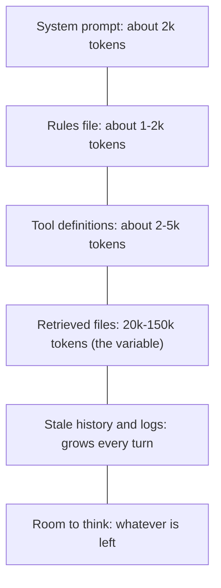

> **Section 01 · Lesson 5** · Level: intermediate · ~12 min · Prereq: [The agent loop](01-The-Agent-Loop)

## Why this matters

Two agents on the same model, given the same task, can produce a working change and an unusable mess. The difference is almost never the model. It is what was in the window when they started. Once you can name the five sources of context and see which one you control, "the agent is being dumb" becomes a specific, fixable problem.

## The five sources of context

Every token in a call comes from one of five places:

1. **Your instructions** — the rules file (`AGENTS.md`, `CLAUDE.md`) the harness loads at startup, plus your prompt. You control this completely.
2. **The conversation** — everything said so far, including your corrections and the agent's summaries. You control it by what you send and when you clear.
3. **Repository files it reads** — whatever the agent opened this session or the harness preloaded. You control it by naming files and scoping tools.
4. **Tool results** — test output, command logs, grep hits, API responses. The agent triggers these, but you set the tools and how much they return.
5. **Retrieved external docs** — content pulled from a documentation source or an MCP server. You control it by deciding which servers to attach.

The stack below shows a nominal 200k-token window. Only the last slice is discretionary, which is the point.

## Who controls what, and the cheapest lever

For each source there is one lever that costs you the least effort.

| Source | Cheapest lever |
|---|---|
| Your instructions | Edit the rules file once; it applies to every future session |
| The conversation | Clear or compact the session rather than arguing with it |
| Repository files | Name the files, or let the agent grep instead of preloading |
| Tool results | Narrow the tool: `grep` over `cat`, a test filter over the full suite |
| External docs | Attach a documentation server instead of pasting pages |

The rules file is the most valuable item on the list, because it is the only one you write once and benefit from forever. Anthropic's filter for it is a good one: for each line ask "would removing this cause mistakes?" If not, cut it. A bloated instruction file gets ignored, and the fix is usually to shorten it rather than to add emphasis. A skill library is the escape hatch for domain knowledge that only sometimes applies; Anthropic's design loads only a skill's name and description at startup and reads the rest on demand, so the library can be large without costing context.

## Context is a budget, not a bucket

Anthropic's framing is exact: context is a finite resource with diminishing marginal returns, and models draw on an "attention budget" as they parse it. Performance degrades as the window fills — the phenomenon called context rot — so every token you spend on noise is a token not spent on the task.

That has a counter-intuitive consequence. Raising the limit does not rescue you; a window twice the size full of twice the noise is not obviously better. The goal is the smallest set of high-signal tokens that makes the right outcome likely. Our own measurements agree from a different direction: in a research assistant we built, cost tracked the length of the answer and the size of the retrieval context, not how hard the question looked — a one-sentence answer cost less than a synthesis, whatever the topic.

## Progressive disclosure beats reading everything

"Just read the whole repository" fails for three reasons. It spends the budget before work starts. It buries the file that matters among files that do not. And it goes stale the moment someone edits a file — a preloaded index is a snapshot, while a grep is a live read.

The fix is progressive disclosure: keep lightweight pointers and load detail only when it is needed. Skills use it (name and description first, body on demand, bundled files last). Agentic search uses it (the agent holds file paths and greps, then reads the hit). Human memory works the same way — we do not memorise the corpus, we keep a file system and retrieve. Anthropic's guidance is to let the agent find what it needs, because file names, folder structure, and timestamps are themselves signals about what matters.

For work longer than one window, three techniques keep the signal high: compaction (summarise the transcript and restart from the summary), structured notes stored outside the window, and subagents that burn tens of thousands of tokens exploring and return a short summary. All three belong to [Agent memory and session hygiene](03-Agent-Memory-And-Session-Hygiene).

## Try it

1. Start a session and ask the agent to report its current context fill, if the tool exposes it.
2. Ask it to read three large files you do not need, then check the fill again. Note the jump.
3. Clear the session and re-ask your real question, this time naming exactly one file. Compare the answer quality and the fill.
4. Write one line into your rules file that prevented a real mistake. Count the tokens it costs — usually under twenty — and note what it saves every session.

## Common mistakes

- **Dumping the repository to "be safe"** — it spends the budget before work starts and buries the relevant file.
- **Arguing with a full session** — once the window is full of stale logs, a correction competes with noise. Clear and restate instead.
- **Letting unfiltered tool output in** — a full test log is often thousands of low-value tokens. Filter to the failing case.
- **Writing a long rules file** — length dilutes the rules that matter. Cut anything a competent reader would infer.

## Key takeaways

- Five sources fill the window: instructions, conversation, repo files, tool results, retrieved docs.
- Each has one cheap lever — the rules file is the only one you write once and reuse.
- Context is a budget with diminishing returns, not a bucket to fill.
- Progressive disclosure — pointers first, detail on demand — beats reading everything.
- For long work, compact, take notes outside the window, or delegate to a subagent.

## Further learning

- [Effective context engineering for AI agents](https://www.anthropic.com/engineering/effective-context-engineering-for-ai-agents) — the attention budget, context rot, compaction, and subagents.
- [Equipping agents for the real world with Agent Skills](https://www.anthropic.com/engineering/equipping-agents-for-the-real-world-with-agent-skills) — progressive disclosure in a concrete format.
- [Rules files: AGENTS.md and CLAUDE.md](02-Rules-Files-AGENTS-and-CLAUDE-md) — how to write the file this page keeps pointing at.
