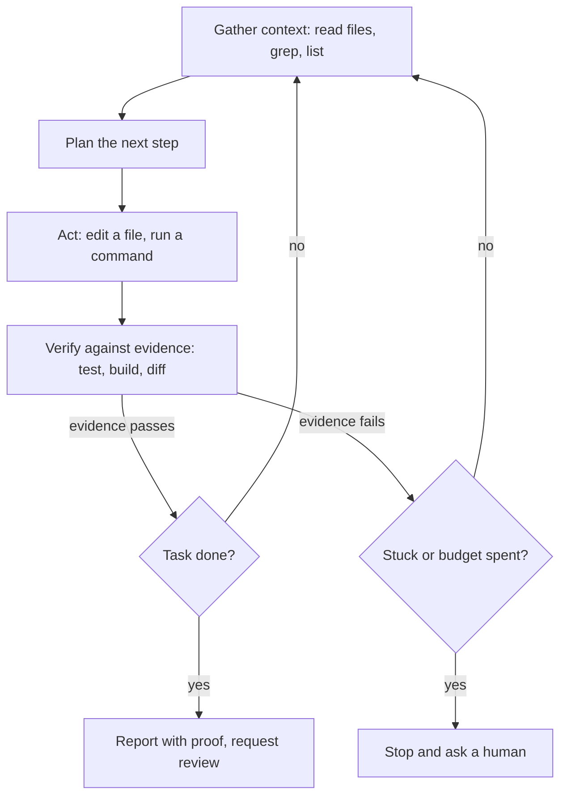

> **Section 01 · Lesson 3** · Level: beginner · ~12 min · Prereq: [From autocomplete to agents](01-From-Autocomplete-To-Agents)

## Why this matters

An agent that finishes in one shot is the exception. Real work is dozens of small steps, and the difference between a session that ends in a green test and one that ends in a confident mess is whether each step is checked before the next begins. The loop is the machine; verification is what keeps it honest.

## The five beats of the loop

Every agent session, whether it looks like magic or chaos, moves through the same beats: gather context, plan, act with a tool, verify, then repeat or stop. The diagram is the whole idea.

Anthropic describes agents simply as LLMs using tools in a loop, and recommends a four-phase habit for coding: explore, plan, implement, commit. The plan step matters more than it looks. Their guidance is to let the agent read before it writes, because a plan you approve is cheaper than a diff you reject — but also to skip planning when the change fits in one sentence.

## Verification must be a tool result

The loop only closes if "verify" produces something the model can read that is not its own opinion. A test suite that prints `2 passed` is a signal. A build that exits non-zero is a signal. The agent saying "this should now work" is not.

Anthropic's coding guidance is blunt about this: the check is anything that returns a pass or fail the model can read in the conversation — a test, a build exit code, a linter, a script that diffs output against a fixture, or a screenshot compared to a design. Without one, "looks done" is the only signal available, and you become the verification loop: every mistake waits for you to notice it.

Our own notes repeat the lesson from the other direction. A callback that returned a literal `ok` looked like success for weeks while doing nothing. An inherited proof-of-concept turned out to be theatre because nobody ran it. In both cases the fix was the same: demand the raw output. A related rule is that the agent doing the work should not be the only one grading it — a fresh reviewer, a second model, or an adversarial pass catches what the author's own reasoning missed, which is the same reason human code review exists.

## Stop conditions you can name

A loop without a stop condition either stops too early or runs up a bill. Name the conditions before you start:

- Tests pass, and you have seen the output.
- Types or the build check clean.
- A review is requested, because you — not the agent — decide the change is right.
- A budget is exhausted: a step limit, a time limit, or a token limit.

Some tools let you set the condition explicitly. Claude Code's `/goal` runs a separate evaluator after each turn, and a Stop hook can block the turn from ending until your script passes — trading setup for the attention you would otherwise spend watching. If the agent stalls with the goal unmet, the run stops, which is the correct outcome. A stuck loop is a signal, not something to push through with more tokens.

## Steering a loop that has gone wrong

When the loop drifts, you have four levers, in order of how much they cost you.

1. **Interrupt.** Stop the run and correct course early. Anthropic's advice is to course-correct early and often; a wrong assumption repeated for twenty steps is twenty times harder to unwind.
2. **Re-scope.** Shrink the task to one verifiable change, then re-enter the loop. A task you cannot state in one sentence has a spec problem, not a model problem.
3. **Add a rule.** If the agent keeps making one mistake, write the rule into the project's instruction file so every future session starts with it — and prune rules that no longer matter, because a bloated file gets ignored.
4. **Raise the gate.** When a mistake got through, tighten verification: require a failing test first, block the turn on a hook, or require a review before the change lands.

Steering is also a context skill. Correcting in the conversation fixes this session; correcting in the rules file fixes the next one too. That is the argument of [A taxonomy of context](01-Taxonomy-Of-Context).

## Try it

1. Give an agent a task with a built-in failure signal: "Write a `slugify` function with three tests, run them, and show the output." Confirm you see a real failure before the fix.
2. Repeat the task with the tests removed. Notice that the same model now reports success with no evidence behind it.
3. Add one rule to your project's instruction file based on a mistake you just saw, then start a new session and check whether the agent follows it.

## Common mistakes

- **Accepting "done" as evidence** — a status claim without output is unverified. Ask for the command and its result.
- **Letting the agent grade itself** — an author is a poor reviewer. Add a fresh check or a second opinion.
- **Running with no stop condition** — unbounded loops burn tokens and confidence. Set a step or budget limit.
- **Fixing a drifted loop with more turns** — if it is going wrong after several steps, interrupt and re-scope; volume will not repair a bad assumption.

## Key takeaways

- The loop is gather, plan, act, verify, repeat or stop — not a single generation.
- Verification must be a tool result: test output, exit code, or diff, never the agent's opinion.
- Name your stop conditions before you start.
- Steer with four levers: interrupt, re-scope, add a rule, raise the gate.
- Plan for multi-file or unfamiliar work; skip it when the diff fits in one sentence.

## Further learning

- [Best practices for Claude Code](https://www.anthropic.com/engineering/claude-code-best-practices) — the explore-plan-code-commit workflow, hooks, and verification gates.
- [Building effective agents](https://www.anthropic.com/engineering/building-effective-agents) — the pattern catalogue, including the evaluator-optimizer loop.
- [GitHub Actions documentation](https://docs.github.com/en/actions) — where a loop's checks should eventually run for real.
