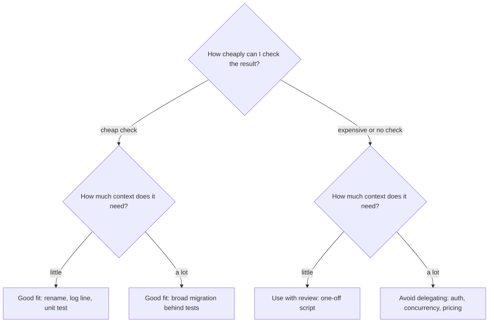

> **Section 01 · Lesson 4** · Level: beginner · ~12 min · Prereq: [The agent loop](01-The-Agent-Loop)

## Why this matters

Delegating the wrong task wastes more time than doing it yourself. An agent will attempt anything you ask with identical confidence — a rename and a payment reconciliation get the same calm tone. Sorting tasks by how cheaply you can check the result is the most useful skill in this section, and it is what separates people who get value from agents from people who get burned.

## Strong where the work is verifiable

Agents are at their best when a machine can tell them they are wrong. The strongest fits share one property: a cheap, automatic pass or fail.

- Boilerplate and scaffolding: project setups, config files, CRUD endpoints that follow an existing pattern.
- Tests: writing unit tests for a function that already exists, especially from a described behaviour.
- Refactors with a test harness: renaming, extracting a function, moving a module, as long as the suite covers it.
- Reading an unfamiliar codebase: "where does authentication happen?" becomes a handful of greps and a summary.
- Repetitive migrations: the same edit applied at 40 call sites, which is exactly where a human gets tired and skips one.
- Documentation: turning a module into a README, or a diff into release notes.

The common thread is a verification signal. Anthropic calls this out as a reason coding agents work so well: code solutions are verifiable through automated tests, agents can iterate using test results as feedback, and output quality is measurable. When a task has that property, autonomy is mostly a speed question.

## Weak where the signal is missing

The failures cluster where you cannot write the pass/fail cheaply.

- Ambiguous product decisions: "make onboarding better" has no test. The agent produces something plausible and confident, and you cannot tell whether it is right.
- Novel architecture: design has few clean examples in the training data and no automatic check. You get a reasonable-sounding design, which is not the same as a good one.
- Subtle concurrency: race conditions and ordering bugs often pass every test you have and fail under load. Green tests are a weak signal here.
- Security-critical logic: authentication, authorisation, crypto, and money movement. A human reviewer is not optional and the agent's confidence is worthless.
- Anything without a verification signal: if you cannot describe how you would know the result is correct, you cannot delegate it safely.

One pattern from our notes is worth naming. A confident claim with no evidence is the most dangerous output an agent produces, precisely because it reads like every other sentence it writes. The rule our notes landed on was to give every candidate finding exactly one verdict — confirmed with pasted output, needs validation with the single unresolved fact, or rejected — and to treat severity on an unresolved claim as a red flag. You can apply the same discipline to a single function.

## The verification-signal rule

State it once and use it constantly: **work is delegable in proportion to how cheaply the result can be checked.** A cheap check with a high context need is often the best delegation of all, because the context is the part you would rather not assemble. An expensive check with a high context need is where projects get hurt.

The two axes give the grid below.

Note what changes between the top and bottom rows. It is not difficulty — a 40-file migration is harder than an auth change and still safer to delegate. It is the presence of a check.

## When not to use an agent at all

Some actions sit outside the loop entirely, regardless of model quality:

- Writing or handling secrets. An agent should read credentials from the environment, never author them or print them.
- Deploying to production. Build the artifact, then let a human or a pipeline with an approval gate release it.
- Irreversible data operations. Migrations that drop columns, records that cannot be restored.
- Moving money. Payments, refunds, payouts — the blast radius exceeds any test.
- Legal, medical, or financial judgements. These need an accountable human, not a completion.

This is the territory of [Threat-modeling your AI workflow](09-Threat-Modeling-Your-Workflow), and it maps to the OWASP categories of excessive agency and improper output handling.

## Try it

1. List five tasks you did this week. For each, write one sentence: "I would know it is correct because ___." If you cannot finish the sentence, mark it hard to verify.
2. For each task, mark context need low or high. That is its quadrant.
3. Pick one good-fit task and delegate it. Then delegate a poor-fit task with a mandatory human review step and measure how much of your time the review actually costs.
4. Write one project rule: "I do not delegate tasks whose result I cannot check in under five minutes."

## Common mistakes

- **Delegating by difficulty instead of by checkability** — a hard-but-checkable migration is safer than an easy-but-uncheckable judgement call.
- **Accepting a confident answer to an ambiguous question** — the model cannot feel uncertainty the prompt does not give it. Ambiguity needs a human decision.
- **Treating green tests as proof for concurrency or security** — your suite likely does not cover the failure mode. Use a specialist review.
- **Letting an agent touch secrets or production** — no gate makes that safe. Keep it out of the tool list entirely.

## Key takeaways

- Delegate in proportion to how cheaply you can check the result.
- Strong fits: boilerplate, tests, checked refactors, codebase reading, repetitive migrations, docs.
- Weak fits: ambiguous product calls, novel architecture, concurrency, security-critical logic, anything uncheckable.
- A hard task behind a good test suite is often a better delegation than an easy task with no check.
- Never delegate secrets, production deploys, irreversible data operations, or money movement.

## Further learning

- [Building effective agents](https://www.anthropic.com/engineering/building-effective-agents) — why code is a good agent domain and where compounding-error risk sits.
- [OWASP Top 10 for LLM applications](https://genai.owasp.org/llm-top-10/) — excessive agency and improper output handling in plain terms.
- [Reviewing agent output](03-Reviewing-Agent-Output) — turning the check into a habit.
