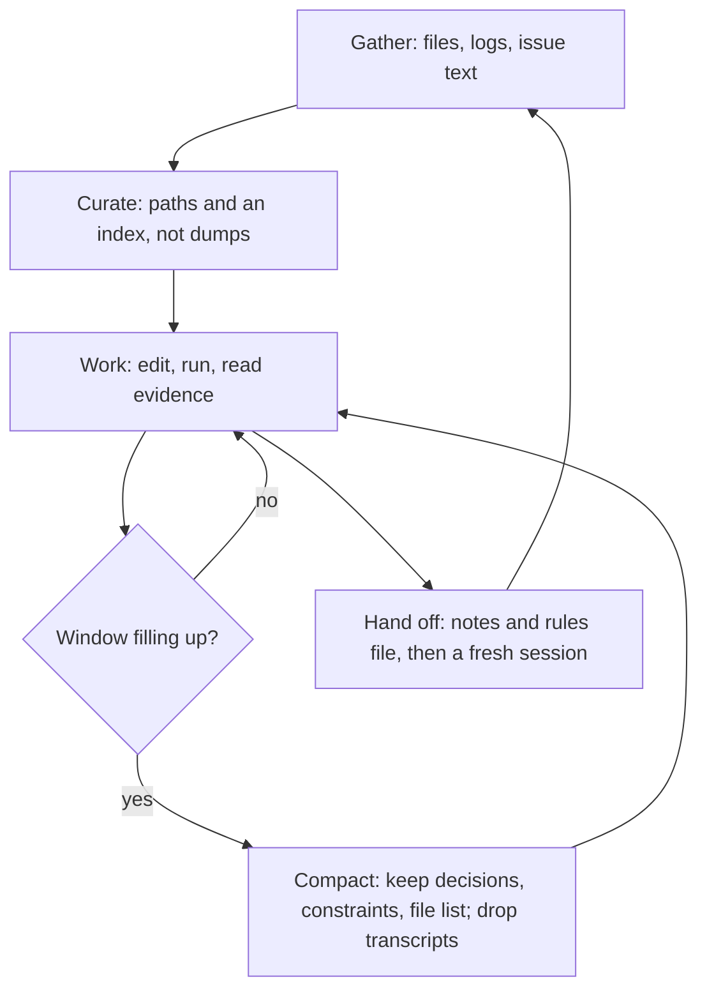

> **Section 02 · Lesson 5** · Level: intermediate · ~15 min · Prereq: [A taxonomy of context](01-Taxonomy-Of-Context)

## Why this matters

The context window is the resource you actually manage. Every file the agent reads, every command output, every tangent you take stays in it and costs attention. Fill it and the agent gets worse at the thing you are asking about — not because it ran out of space, but because it ran out of focus.

## Context rot is real

Benchmarks that hide a fact in a long document found the same pattern across models: as the token count grows, the ability to recall a specific detail drops. Researchers call it context rot. It is not a cliff at the window limit; it is a slope that starts early.

The cause is structural. In a transformer, every token can attend to every other token, so doubling the context quadruples the relationships the model has to weigh. Anthropic's [context engineering guidance](https://www.anthropic.com/engineering/effective-context-engineering-for-ai-agents) describes it as an attention budget: each new token spends some of it. The goal is not "fill the window", it is the smallest set of high-signal tokens that gets the outcome you want.

## Give an index, not a dump

The instinct is to paste everything relevant up front. Resist it. Agents with filesystem and search tools can fetch what they need — a file path is a pointer, and the path itself carries meaning. `tests/test_utils.py` implies something different from `src/core_logic/test_utils.py`.

In practice:

- Point at files and directories; let the agent read them. "Look at how existing widgets are implemented on the home page" beats pasting three of them.
- For big logs, ask for a targeted query or a `head`/`tail`/`grep` rather than the whole file.
- Keep an index — a short README or rules file that says where things live. That index is the map; exploration fills in the detail.

This is sometimes called just-in-time retrieval: hold lightweight identifiers, load the content at the moment it is needed.



## Compaction: keep decisions, drop transcripts


Compaction is summarising the conversation and continuing with the summary instead of the whole history. Done well, it keeps architectural decisions, unresolved bugs, constraints and the list of modified files, and discards raw tool output nobody will re-read.

Tools do some of this automatically, and most let you steer it. If yours supports a custom compaction instruction, write one:

```text
When compacting, always preserve: the full list of modified files,
the exact test command, every constraint I gave, and any decision
we made. Drop raw command output and abandoned approaches.
```

The danger is over-compressing. A detail that looked irrelevant an hour ago — the one field the wire format requires, the reason an approach was rejected — is exactly what gets dropped and then re-litigated. Err toward keeping decisions.

## Sub-agents and fresh sessions are context isolation

A sub-agent runs in its own context window. It can burn tens of thousands of tokens reading files, then hand back a short summary to the main session. Anthropic reports sub-agent summaries landing in the low thousands of tokens, which is the whole point: the mess stays outside your working context.

Decide like this:

- **New session** when the next task shares nothing with this one. Start clean; fewer wasted tokens, less noise. Correcting the same problem twice in one session is the signal to reset.
- **Continue** when the work depends on what you just learned — a bug you are mid-way through, a schema you just read.
- **Sub-agent** for investigation: "use a subagent to investigate how token refresh works and whether we already have OAuth utilities to reuse". Read-only research is the ideal delegation.

## The rules file is the anchor

Compaction and session resets all lose things. The rules file does not: it is loaded at the start of every session, so constraints that live there survive every summarisation and every new session.

That is why the split matters. Anything that must always be true — money is stored in integer cents, never edit the migrations folder, the test command is `pytest -q` — goes in the file, not in a prompt. Anything task-specific stays in the session. Next lesson: [Rules files](02-Rules-Files-AGENTS-and-CLAUDE-md). For the day-to-day hygiene, see [Agent memory and session hygiene](03-Agent-Memory-And-Session-Hygiene).

## Try it

1. Open a session and ask the agent to count roughly how full its context is, or use your tool's context display. Read one file and watch the number move.
2. Before your next long task, write the compaction instruction above into your tool's settings or your rules file.
3. Run your tool's clear command between two unrelated tasks, then compare the answer quality of the second task with and without the reset.
4. Delegate your next investigation to a sub-agent and watch how little of your own window it uses.

## Common mistakes

- **Pasting the whole repo.** It costs money, it costs attention, and the relevant part gets harder to find, not easier.
- **Reading files you never use.** Every speculative file read is spend with no return.
- **Treating a bigger window as a fix.** A million-token window still rots. Curation beats capacity.
- **Compacting too aggressively.** Summaries that drop constraints force you to restate them — usually after the agent has already broken one.
- **Keeping one session alive all day.** Unrelated tasks accumulate as noise. Reset between them.
- **Only keeping rules in chat.** They die with the session, at the exact moment you need them.
- **Investigating in your main session.** A scoped sub-agent query keeps the file reads out of your window.

## Key takeaways

- Context is a budget, not a bucket. Quality degrades as it fills, so curate from the start.
- Point at files and give an index; let the agent fetch content just in time.
- Compaction should preserve decisions, constraints and the file list, and drop raw transcripts.
- Sub-agents and fresh sessions are context isolation tools — use them deliberately.
- The rules file is the only memory that survives every compaction and every reset.

## Further learning

- [Effective context engineering for AI agents](https://www.anthropic.com/engineering/effective-context-engineering-for-ai-agents) — context rot, just-in-time retrieval, compaction and sub-agents.
- [Best practices for Claude Code](https://www.anthropic.com/engineering/claude-code-best-practices) — managing context aggressively, subagents for investigation and common failure patterns.
- [Equipping agents for the real world with Agent Skills](https://www.anthropic.com/engineering/equipping-agents-for-the-real-world-with-agent-skills) — progressive disclosure, the idea that context can be loaded only when it is needed.
