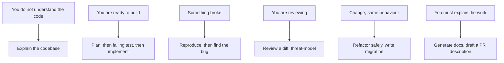

> **Section 02 · Lesson 7** · Level: beginner · ~15 min · Prereq: [Prompting fundamentals](02-Prompting-Fundamentals)

## Why this matters

Most of your prompts are one of fourteen kinds. Naming them means you stop inventing prompts from scratch at 11pm and start reaching for a shape you already know works. Copy these, edit the specifics, keep the skeleton.



## The patterns

**1. Explain the codebase.** When you just cloned it.
```text
Explain how <area> works: entry point, main files, data flow.
Cite file:line for every claim. List what you could not find.
```
Looks right when the file names are real and it flags gaps. Trap: a confident tour invented from filenames — demand citations.

**2. Plan a feature.** When the change spans files.
```text
Plan only, no edits. Name the files, the order, the risks,
and the open questions. Do not write code yet.
```
Looks right when it asks a real question. Trap: a plan that is the implementation, approved unread.

**3. Write the failing test.** Before any implementation. Grounded in [TDD with agents](03-TDD-With-Agents).
```text
Write a test for <behaviour> that fails now. Cover <edge case>.
Run it and paste the failure output. Do not change source files.
```
Looks right when the failure matches the feature you want. Trap: a test that passes because it asserts nothing.

**4. Implement.** After the test is red.
```text
Make the failing test in <file> pass. Smallest honest change.
Do not modify the test. Run the full suite and paste the output.
```
Looks right when the diff is small and scoped. Trap: it edits the test, or the assertion, to get green.

**5. Review a diff.** Always, before you merge.
```text
Review the diff for real bugs: injection, missing authz,
unhandled errors, race conditions. Report file:line,
the problem and the fix. Correctness only, no style notes.
```
Looks right when findings are specific. Trap: a compliment sandwich with no actionable item.

**6. Find the bug.** When you know something is wrong but not where.
```text
<form: symptom, error text, what you expected>
Read the relevant files, then list up to three candidate
root causes ranked by likelihood, each with the evidence.
Do not fix anything yet.
```
Looks right when it names evidence. Trap: the first plausible guess, fixed before the cause is confirmed.

**7. Reproduce.** Before any fix, and before any bug report.
```text
Write the smallest command or test that reproduces this
deterministically. Paste the exact output. Tell me if you cannot.
```
Looks right when you can run it and get the same failure. Trap: a reproduction that only fails sometimes and is called "the bug".

**8. Refactor safely.** When nothing should change except the shape.
```text
Refactor <target>. No behaviour change, no API change,
no new dependencies. Run the full suite before and after
and paste both results.
```
Looks right when tests are untouched and green twice. Trap: "while I was here" improvements mixed into the diff.

**9. Write a migration.** Schema changes only, always idempotent.
```text
Add migration <NNNN>_<name>.sql that adds <change>, idempotent,
no destructive statements. Say what existing rows do.
Show me the file, do not run it.
```
Looks right when it is safe to re-run. Trap: a data change hidden inside a schema statement.

**10. Generate docs.** When the work is done and undocumented.
```text
Read <paths> and write <doc>. Only what the code does today —
no aspirations. Every claim must be checkable in a file.
```
Looks right when it names real endpoints and flags uncertainty. Trap: documentation of the intended design rather than the shipped one.

**11. Critique an architecture.** Before you build on a design.
```text
Critique this design. Steelman it first, then list failure
modes, coupling, and what breaks at 10x load. Rank by risk.
Suggest the smallest change that removes the top risk.
```
Looks right when it names a specific failing scenario. Trap: generic layering advice that would apply to anything.

**12. Threat-model.** Before anything touches money, identity or user data. See [Threat-modeling your workflow](09-Threat-Modeling-Your-Workflow).
```text
Threat-model <component>. Enumerate assets, entry points,
trust boundaries and who can reach them. For each threat:
likelihood, impact, one mitigation. Cite the code it applies to.
```
Looks right when entry points are real. Trap: a generic OWASP list with nothing project-specific.

**13. Summarise a log.** When the file is bigger than your context.
```text
Read the first 200 and last 200 lines of <log>. Group errors
by message, count them, give the first timestamp of each.
Ignore noise lines that appear once.
```
Looks right when counts and timestamps are exact. Trap: a summary that loses which error came first.

**14. Draft a PR description.** When the branch is ready.
```text
Read the diff and the commits. Write a PR description:
what changed, why, how I can verify it, what is not included.
One paragraph maximum for the why.
```
Looks right when it names the verification step. Trap: a description that claims more than the diff does.

## Try it

1. Copy the whole list into `prompts/cookbook.md` in your repo.
2. Pick two patterns you use weekly and rewrite the skeletons with your own file names and test command.
3. Use pattern 3 and pattern 4 in order on a small real feature. Note where you had to intervene.
4. Delete whichever pattern you never reached for. Keep the file short enough to stay useful.

## Common mistakes

- **Copying a pattern without the constraints.** The skeleton is the structure; your stack, your test command and your "do not touch" list are the substance.
- **Using pattern 4 without pattern 3.** Implementation without a failing test gives you nothing to verify against.
- **Skipping pattern 5 because the diff looks small.** Small diffs hide the worst bugs.
- **Using pattern 11 to get validation.** If you want critique, ask for failure modes, not a score.
- **Treating the cookbook as a ritual.** Two patterns that fit your work beat fourteen you skim.

## Key takeaways

- Fourteen prompt shapes cover almost all day-to-day agent work.
- Build in order: plan, failing test, implement, review. Skipping a step is what makes the diff unreviewable.
- Every skeleton includes where the evidence comes from — that is the part to keep when you adapt one.
- Storage for prompts you reuse: the repo, not your clipboard.

## Further learning

- [Best practices for Claude Code](https://www.anthropic.com/engineering/claude-code-best-practices) — before/after prompt tables, workflows for debugging, testing and PRs.
- [Building effective agents](https://www.anthropic.com/engineering/building-effective-agents) — why chaining small prompts beats one large one.
- [Understanding Spec-Driven-Development](https://martinfowler.com/articles/exploring-gen-ai/sdd-3-tools.html) — what a good spec-first workflow looks like, and when it is too heavy.
