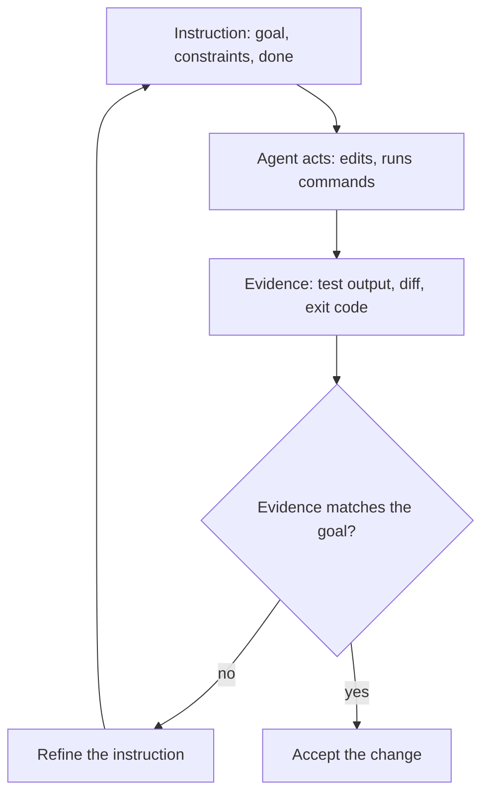

> **Section 02 · Lesson 1** · Level: beginner · ~12 min · Prereq: [Choosing a model](01-Choosing-Models)

## Why this matters

"Fix my code" gets you a guess. The agent cannot see your terminal, your intent, or the constraint that the old endpoint has to keep working. All it has is what you typed and what it can read. A better prompt is the difference between a diff you merge and a diff you throw away after twenty minutes of review.

## The four moves that fix most bad answers

1. **Be specific.** Name the file, the function, the symptom. "`src/auth/session.ts` returns 401 after a token refresh" beats "login is broken".
2. **Give the goal, not just the ask.** "Add a POST /payments endpoint" is an ask. "Let a merchant pay an invoice without leaving the dashboard" is the goal. With the goal in hand the agent makes sensible choices when the ask is ambiguous.
3. **State the constraints.** Stack and versions, "no new dependencies", "do not touch the migrations folder", "keep the existing response shape".
4. **Say what done looks like.** The command that must pass, the file that must exist, the screen a user must see.

| Weak | Strong |
|---|---|
| "add tests for foo.py" | "write a test for foo.py covering the logged-out edge case. no mocks. run pytest and paste the output." |
| "why is this API weird?" | "read the git history of ExecutionFactory and summarise how its API got this way." |
| "make the dashboard look better" | "[paste screenshot] implement this design, screenshot the result, list the differences, fix them." |

## Ask for evidence, not assurance

"Are you sure?" invites a sentence. "Show me the test output" invites a fact. An agent that claims the tests pass without running them is guessing, and confident guessing is the expensive kind.

This is the highest-value habit in the section: give the agent a check it can run. A test suite, a build exit code, a linter, a script that diffs output against a fixture. Anthropic's [Claude Code best practices](https://www.anthropic.com/engineering/claude-code-best-practices) say it plainly — the agent stops when the work looks done. Without a check it can run, "looks done" is the only signal available and you become the verification loop.

If step C is missing, step D is a vibe.

## One task per prompt

Three unrelated tasks in one prompt produce one diff with three unrelated changes, which you then review as a single blob. Split them. Separate planning from doing too: "read the auth flow and tell me what would have to change" is a different request from "make those changes". A plan surfaces a wrong assumption while it is still cheap to fix. The explore, then plan, then code rhythm is what Anthropic's guide recommends.

Vague prompts still have a place. "What looks risky in this file?" is a fine prompt when you want ideas rather than edits. Exploration is the one job where under-specifying helps.

## Iterating means refining, not repeating

When the answer misses, an instruction was missing something. Repeating it louder gives you the same answer with more confidence. Pin the correction to a fact:

- "It's still wrong" becomes "the failure is in the refresh path in `src/auth/refresh.ts`; ignore the login handler."
- "No, do it properly" becomes "use the existing `requireMerchant` middleware instead of writing a new check."

If you have corrected the same thing twice in one session, stop. The context is now full of failed attempts, and the guidance is blunt: a fresh session with a better opening prompt beats a long session full of corrections.

## Try it

1. Pick a prompt you actually sent this week and paste it into a file.
2. Rewrite it using the four moves: specificity, goal, constraints, definition of done. Add one evidence request.
3. Send both prompts, each in a fresh session, on the same task.
4. Compare the diffs and count the corrections each version needed. Keep the winning version in your rules file — see [Rules files](02-Rules-Files-AGENTS-and-CLAUDE-md).

## Common mistakes

- **Treating the agent as a mind reader.** It cannot see your terminal output, your issue tracker, or the chat thread where you decided on the approach. If it matters, paste it.
- **Asking for confidence instead of evidence.** "Are you sure?" produces reassurance. "Run the test and paste the output" produces a fact you can check.
- **Packing three tasks into one prompt.** You get one diff that mixes them, and a review that has to untangle them.
- **Escalating with emphasis instead of information.** Capitals and "IMPORTANT" add no missing fact. Add the file name, the error text, or the constraint you left out.
- **Believing "done" with nothing green behind it.** If no check ran, nothing was verified.

## Key takeaways

- Four moves fix most bad answers: be specific, give the goal, state constraints, define done.
- Ask for evidence, never assurance. A check the agent can run closes the loop without you.
- One task per prompt; keep planning and doing in separate turns.
- Refine the instruction when output misses. Do not repeat the same instruction louder.
- After two failed corrections on one issue, start a fresh session with a better prompt.

## Further learning

- [Best practices for Claude Code](https://www.anthropic.com/engineering/claude-code-best-practices) — verification loops, explore-plan-code-commit, rules files and context management.
- [Anthropic's prompt engineering tutorial](https://github.com/anthropics/prompt-eng-interactive-tutorial) — a hands-on, exercise-driven walk through the core prompting techniques.
- [Effective context engineering for AI agents](https://www.anthropic.com/engineering/effective-context-engineering-for-ai-agents) — why the context window, not the wording, is the resource you manage.
