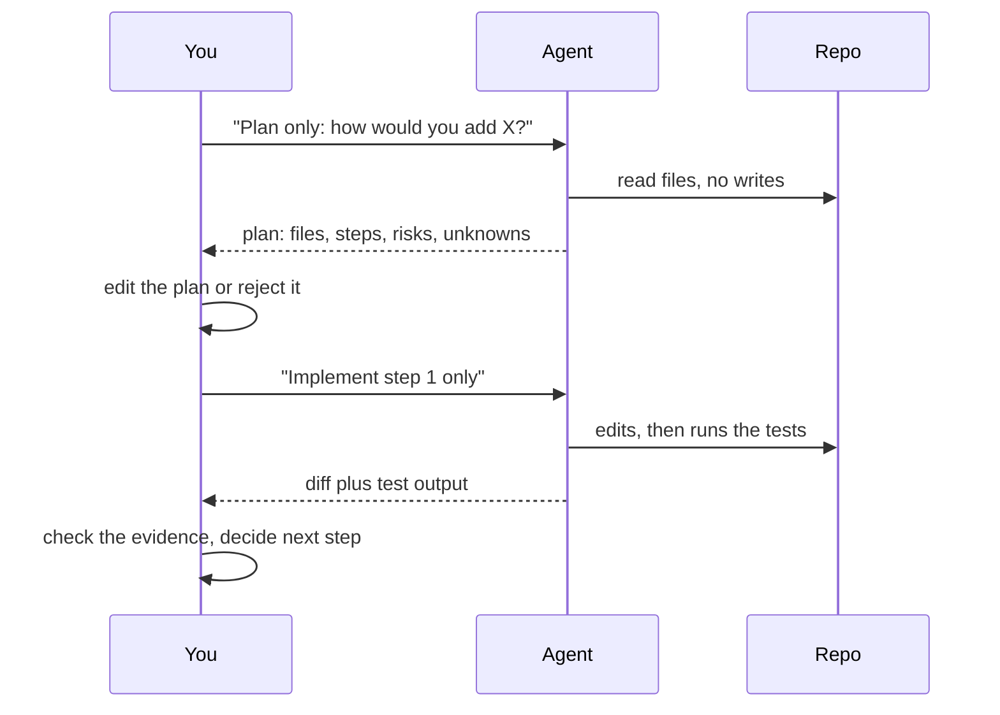

> **Section 02 · Lesson 4** · Level: intermediate · ~12 min · Prereq: [Showing examples](02-Showing-Examples-Few-Shot)

## Why this matters

An agent that starts editing on the first sentence spends your review budget on the wrong problem. Asking for the plan first is the cheapest checkpoint in agentic work: a plan costs a paragraph, a wrong implementation costs a branch. This lesson is about when reasoning helps, when it just burns tokens, and how to review work without grading your own homework.

## Ask for a plan before code

Plan mode separates exploration from execution. In a plan turn the agent reads files and answers questions without writing anything:

```text
Plan only, no edits. How would you add rate limiting to
the public API? Name the files you would change, the
middleware order, and what could break. Flag anything
you are unsure about.
```

Two things you learn from the answer: whether it understood the codebase, and whether it understood you. Both are cheaper to fix now.

Planning is not always worth it. If you could describe the diff in one sentence — rename a variable, add a log line, fix a typo — ask for the change directly. Planning earns its cost when the change spans files, when you are unsure of the approach, or when you do not know the code yet.



## When step-by-step reasoning helps, and when it burns tokens

Explicit reasoning helps when the task has a correct answer that requires several dependent steps: debugging from a stack trace, designing a migration order, working out why a test is flaky. Listing the steps makes the assumptions visible, and you can catch a wrong premise in line two rather than in the diff.

It hurts when the task is mechanical. "Write the docstring", "format this file", "add this import" — asking for deliberation adds latency and tokens and changes nothing about the result.

Extended reasoning changes the shape of the request. As of 2026 most model providers expose a thinking or reasoning budget: a cap on tokens the model may spend reasoning before it answers. Raise it for hard debugging, multi-file design and tricky data migrations. Leave it low for formatting, renames and routine edits. If the budget is high and the answer is still shallow, more budget will not fix it — your prompt is missing the fact the model needs.

## Plan, approve, execute

The highest-value pattern in agentic work is a hard checkpoint between plan and execution. You approve the plan, not the diff.

The sub-pattern worth stealing is the writer/reviewer split. A fresh session reviewing the work is not biased toward the code it just wrote, so it evaluates the result on its own terms. Anthropic's guidance recommends an adversarial review step before calling a task done, and warns about the failure mode: a reviewer told to find gaps will usually find some, even when the work is sound. Tell it what counts as a finding.

```text
Use a subagent to review the rate limiter diff against PLAN.md.
Check every requirement is implemented, the listed edge cases
have tests, and nothing outside the task's scope changed.
Report gaps that affect correctness, not style preferences.
```

That last line is what keeps an adversarial review from turning into over-engineering.

Anthropic's [Building effective agents](https://www.anthropic.com/engineering/building-effective-agents) calls the generate-and-critique loop the evaluator-optimizer workflow. It works when you have clear evaluation criteria and the feedback is genuinely actionable.

## Self-review without self-deception

Three rules keep self-review honest:

- **Separate the reviewer from the author.** A new session, or a subagent, with only the diff and the criteria — not the reasoning that produced it.
- **Review against the plan, not against "quality".** "Does this meet the three requirements we agreed on?" is checkable. "Is this good?" is not.
- **Cap the findings.** Ask for the ones that affect correctness. Chasing every stylistic suggestion produces defensive code and tests for cases that cannot happen.

Spec-driven workflows formalise this by writing the requirements down before the code. Martin Fowler's survey of these tools is a useful counterweight: heavy workflows can be a sledgehammer for a small bug, and one researcher watched a spec tool turn a small fix into four user stories with sixteen acceptance criteria. Use enough of a spec to name files, interfaces, out-of-scope items and the end-to-end check. Skip the ceremony.

## Try it

1. Pick a change that touches at least two files.
2. Ask for a plan only, no edits. Read it and edit one thing before approving.
3. Approve one step, not the whole plan.
4. When it reports done, open a second session and run the review prompt above against the diff.
5. Note whether the review found something you missed. That number is your reason to keep doing this.

## Common mistakes

- **Approving a plan you have not read.** The checkpoint only works if you actually spend the two minutes.
- **Letting the same session grade its own work.** It will defend its choices. Use a fresh context or a subagent.
- **Plan mode for one-line changes.** You pay the overhead for nothing.
- **Asking for "step by step reasoning" on every prompt.** Mechanical tasks get slower and no more correct.
- **Reviewing with no criteria.** "Make it better" produces churn. Review against the plan and the stated requirements.
- **Chasing every reviewer finding.** An adversarial reviewer will always find something. Correctness first; the rest is optional.

## Key takeaways

- Plan first when the change spans files or the approach is unclear; skip it when you could describe the diff in one sentence.
- Explicit reasoning pays for debugging and design, and wastes tokens on mechanical edits.
- Thinking budgets exist and are worth raising for hard problems — and useless when the prompt lacks the key fact.
- Review in a fresh context, against the plan, with a correctness filter.
- Write the requirements down before the code; keep the spec as small as the change.

## Further learning

- [Building effective agents](https://www.anthropic.com/engineering/building-effective-agents) — prompt chaining, evaluator-optimizer and when to add complexity.
- [Best practices for Claude Code](https://www.anthropic.com/engineering/claude-code-best-practices) — plan mode, adversarial review steps and common failure patterns.
- [Understanding Spec-Driven-Development: Kiro, spec-kit and Tessl](https://martinfowler.com/articles/exploring-gen-ai/sdd-3-tools.html) — an honest survey of spec-first tooling and where it gets heavy.
