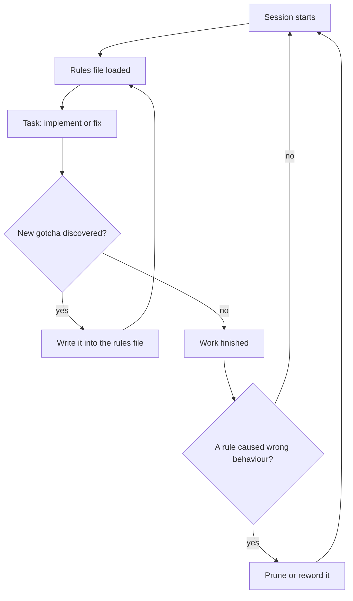

> **Section 02 · Lesson 6** · Level: beginner · ~15 min · Prereq: [Structuring instructions](02-Structuring-Instructions)

## Why this matters

Every session you re-explain the same three things: how to run the tests, which folder is off-limits, and the convention that is not in the code. A rules file — `AGENTS.md`, `CLAUDE.md`, or whatever your tool calls it — is read at the start of every session, so you explain once. It is the cheapest sustained quality improvement in this whole wiki, and the easiest to ruin by making it too long.

## What a rules file is

A plain markdown file at the repo root that the agent loads automatically at session start. `AGENTS.md` is the cross-tool convention and the safest filename; specific tools also read their own, and some read both. Treat it as durable, session-independent instruction — the part of your prompt you should never have to type again.



That loop is the whole maintenance model: the file grows when the agent gets something wrong, and shrinks when a rule stops earning its place.

## What belongs, and what does not

The test for each line is one question: if I delete this, will the agent start making mistakes? If not, cut it.

| Include | Exclude |
|---|---|
| The commands that actually work — test, lint, migrate, local run | Anything the agent can derive by reading the code |
| Conventions that differ from the language default | Standard idioms it already knows |
| Environment quirks — required env vars, a service that must run first | Detailed API docs; link to them instead |
| Repo etiquette — branch naming, PR rules, what never to commit | Information that changes weekly |
| Project-specific architectural decisions | Tutorials and long explanations |
| Gotchas that cost someone an afternoon | "Write clean code" and other self-evident advice |

A starter file is short:

```markdown
## Commands
- Test: `pytest -q`   Format: `ruff format .`
- Local run: `docker compose up db` first, then `uvicorn app.main:app --reload`

## Conventions
- Money is integer cents; never float.
- Migrations are idempotent and every change is a new numbered file.

## Never
- Edit `migrations/` by hand.
- Deploy to production from a laptop.
```

## The gotchas are the valuable part

Generic advice is worthless; hard-won specifics pay for the whole file. Real entries from shipped projects, generalised:

- **Wire format.** "Responses are camelCase; return the raw database row and the client's parser throws."
- **Positional placeholders.** "The database client numbers placeholders by textual position — the WHERE key must be the last one."
- **Silent zero-row updates.** "A webhook handler once reported success while zero rows changed. If a write affects zero rows, that is a bug, not a no-op."
- **Acknowledgement format.** "The payment gateway expects a literal text acknowledgement, not JSON, or it re-delivers the same event five times."

None of those are derivable from reading the code. Each one cost somebody an afternoon. That is what belongs in the file.

## Size discipline

A lean file that is actually read beats a two-thousand-line file that is skimmed. Long rules files make important rules get lost in the noise; when one rule keeps getting ignored, the usual cause is that the file around it is too long for it to stand out. If you must emphasise one instruction, emphasise that one. Emphasise ten and none of them registers.

Three habits keep it small:

- **Point, do not paste.** "API conventions: see `docs/api.md`" instead of inlining them.
- **Push detail into skills.** Skills load on demand, so long procedures live there without costing every session — see [What are Agent Skills?](04-What-Are-Agent-Skills) and [AGENTS.md that actually works](12-AGENTS-md-That-Works).
- **Split by scope.** Applies to every task: rules file. Applies to one kind of work: skill.

## The documentation rule

Make the file self-maintaining. In a feature checklist, the docs step is not optional — "update the relevant doc, and add a line to `AGENTS.md` if this is a notable capability or gotcha". A change that taught you something and left no trace will teach the next session the same lesson at your expense. The general form of the rule: every change updates the file that would have prevented it. More on that in [Documentation per feature](11-Documentation-Per-Feature) and [Lesson banks and retros](11-Lesson-Banks-And-Retros).

Keep the file in git so the team contributes to it, and review it when behaviour goes wrong rather than adding a new line on top of a stale one.

## Try it

1. Generate a starter rules file — many tools have an init command that drafts one from your project — or write the five sections above by hand.
2. Confirm it is loaded: most tools show which context files are in context. Fix it if it is not.
3. Add one gotcha you have debugged in the last month. This is the entry that proves the file works.
4. Ask the agent to do something that violates a convention, and check whether the rule holds.

## Common mistakes

- **Writing a tutorial.** Two thousand lines of prose nobody reads. Commands and constraints only.
- **Stating what the language already does.** "Use meaningful variable names" wastes a line and dilutes the specific rules beside it.
- **No verification entry.** If the file does not say which command proves the work, the agent will pick one, or none.
- **Stale rules nobody prunes.** A rule that describes an architecture you abandoned actively misleads. Review the file after incidents.
- **Secrets or credentials in the file.** It goes into git. Use `os.environ["SERVICE_API_KEY"]` and nothing else. See [Secrets hygiene](09-Secrets-Hygiene).
- **Duplicating a long doc inside it.** Link to the doc. The file is a router, not a library.
- **Never checking it loaded.** A rules file in the wrong directory is silently ignored, and you conclude the technique does not work.

## Key takeaways

- One rules file at the repo root, loaded every session, saves you re-explaining the same three things.
- Keep what the agent cannot guess: working commands, non-default conventions, gotchas, definition of done.
- Cut anything the agent can derive from the code; a long file dilutes the rules that matter.
- Point at docs and push long procedure into skills so the file stays short.
- Every surprise becomes a line: the documentation rule keeps the file from drifting.

## Further learning

- [Best practices for Claude Code](https://www.anthropic.com/engineering/claude-code-best-practices) — a concrete include/exclude table for rules files and how to prune them.
- [Effective context engineering for AI agents](https://www.anthropic.com/engineering/effective-context-engineering-for-ai-agents) — why context is a finite budget and how rules files anchor it.
- [Steering agents: rules, skills, hooks and subagents](https://claude.com/blog/steering-claude-code-skills-hooks-rules-subagents-and-more) — which mechanism to reach for when a rule is not enough.
