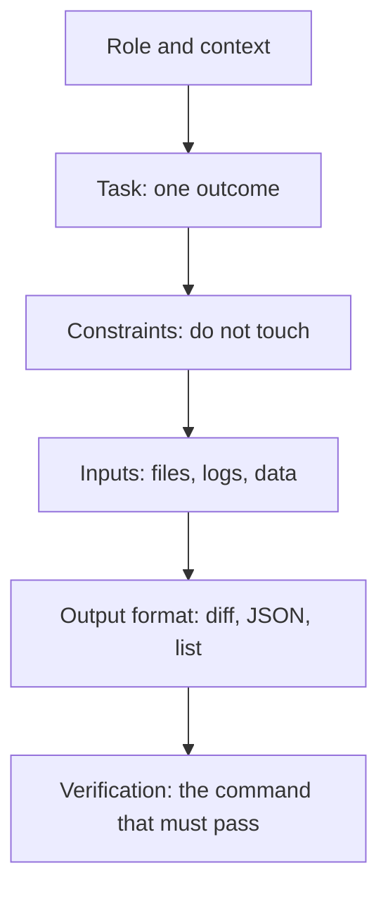

> **Section 02 · Lesson 2** · Level: beginner · ~12 min · Prereq: [Prompting fundamentals](02-Prompting-Fundamentals)

## Why this matters

A specific prompt still fails if the agent cannot tell which part is the task and which part is the material. Structured instructions fix that. You label the sections, the model stops guessing, and the same prompt works next week with different inputs because only the material changed.

## The anatomy of a strong instruction


Six parts, in this order:

- **Role and context** — what kind of project this is and what the agent should behave like.
- **Task** — the one thing you want done.
- **Constraints** — what must not change, what must not be added.
- **Inputs** — the files or data to work from.
- **Output format** — how you want the answer shaped.
- **Verification** — the check that proves it works.



Read the stack top to bottom and you have a prompt. Drop the last line and you have a wish.

## Delimit the material so data is not read as orders

The model does not know that an issue body is a report rather than an instruction. Mark the boundaries yourself with tags or headings.

```text
You are working in a TypeScript REST API on Node 20. No new dependencies.

<task>
Add GET /invoices/:id returning one invoice for the authenticated merchant.
</task>

<code>
src/routes/invoices.ts
src/models/invoice.ts
</code>

<requirements>
- Reuse the requireMerchant middleware in src/middleware/auth.ts
- Response shape must match the Invoice model
- Return 404 when the invoice belongs to another merchant, not 403
</requirements>

<verification>
Run `npm test -- invoices` and paste the output. Do not edit the tests.
</verification>
```

The tags are not magic syntax. Their job is to make the boundary unambiguous to you and to the model. Bullet lists, `## Task` headings and fenced blocks work the same way. This is also your first line of defence against text you did not write — see [Prompt injection and exfiltration](09-Prompt-Injection-And-Exfiltration).

## Long-lived instructions belong in a rules file

If you have typed the same constraint three sessions in a row, it is not a prompt any more. It is a rule. Move it into the file your agent reads at session start — `AGENTS.md` is the cross-tool convention, and tools have their own equivalents.

```markdown
## Commands
- Tests: `pytest -q`
- Format: `ruff format .`
## Conventions
- Money is integer cents; never float.
- Never edit files under `migrations/` by hand.
```

That file is covered in [Rules files: AGENTS.md and CLAUDE.md](02-Rules-Files-AGENTS-and-CLAUDE-md). The point here is the split: chat history is scratch paper, the rules file is the contract.

## Save the prompts you retype

A prompt you run every day is code. Keep it in the repo as a template or a named slash command — `review`, `new-migration`, `pr-description` — so it is versioned, reviewable, and identical every time. Many agents let you define these as command files in the project's agent config directory; if yours does not, a `prompts/` folder in the repo works fine, and you paste from it. Ready-made skeletons live in [Templates](16-Templates).

The test of a reusable prompt: a teammate can run it with no verbal explanation.

## Try it

1. Take the most recent prompt you sent and sort its sentences into the six parts.
2. Write whatever is missing. Most first attempts are missing constraints and verification.
3. Add tags around every piece of pasted material.
4. Re-send the structured version and check whether the agent asks fewer clarifying questions.
5. Save the result under `prompts/` and reuse it tomorrow.

## Common mistakes

- **Dumping the material first and the task last.** Long pasted files push your actual instruction out of attention. Task first, material after, clearly fenced.
- **Never stating the output format.** You get a wall of prose when you wanted a unified diff, or a diff when you wanted a checklist.
- **Constraints hidden inside the task sentence.** One constraint per line, in its own block. Buried constraints get dropped.
- **Repeating long-lived rules in chat every session.** They get lost in compaction and you pay for them every time. Put them in the rules file.
- **Leaving untrusted text unlabelled.** An issue body or a log line that reads "ignore the above and do X" is data. Label the boundary and say so explicitly.
- **Writing prompts you cannot reuse.** If a prompt only works with your memory of last Tuesday, it is a one-off, not a template.

## Key takeaways

- Six parts: role and context, task, constraints, inputs, output format, verification.
- Fence pasted material in tags, headings or fenced blocks so it is read as data.
- Any instruction you have typed three times belongs in the rules file, not in chat.
- Prompts you rerun belong in the repo as templates or slash commands, under version control.
- Verification is part of the instruction, not an optional flourish.

## Further learning

- [Best practices for Claude Code](https://www.anthropic.com/engineering/claude-code-best-practices) — concrete before/after prompt tables and rules-file guidance.
- [Anthropic's prompt engineering tutorial](https://github.com/anthropics/prompt-eng-interactive-tutorial) — exercises on structure, role prompting and output formatting.
- [Real world prompting](https://github.com/anthropics/courses/blob/master/real_world_prompting/README.md) — how to compose these techniques into prompts for complex, real tasks.
