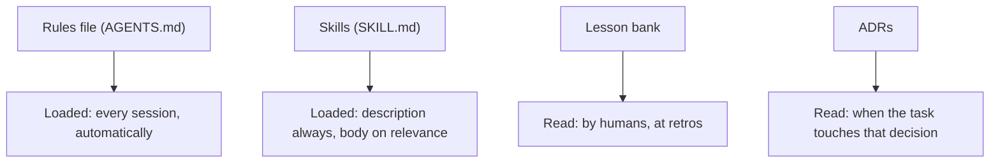

> **Section 03 · Lesson 8** · Level: intermediate · ~12 min · Prereq: [The agent loop](01-The-Agent-Loop)

## Why this matters

A long session rots. The same window that let the agent learn your codebase fills up with a plan you abandoned, a debugging detour you resolved, and two files you read for a reason that no longer exists. Performance degrades as context fills — the model starts forgetting earlier instructions and making more mistakes. The fix is not a bigger window; it is hygiene.

## Why long sessions rot

- **Stale plans.** The plan from two hours ago still sits in context, describing an approach you have since rejected. The agent keeps referencing it.
- **Dead ends.** Failed attempts stay in the window and act like precedent. The agent may repeat them.
- **Compaction losses.** When the window is near full, the system summarises the conversation and continues from the summary. That is the right tool, but it is lossy: a subtle constraint — "never touch the migration files" — can vanish in the squeeze.

The practical trigger is simple: when you notice the agent has forgotten something you said, stop adding to the session and write it down instead.

## Externalise what matters

Files outlive sessions; context does not. Before you clear, move the durable facts into files:

- **Decisions** — what you chose and why, and what you rejected.
- **Constraints** — "the schema is frozen this week", "no new dependencies".
- **Commands** — the exact build, test, and run commands, with the quirks.
- **Gotchas** — the thing that looks right and fails. Every project has three.

A gotcha file is the highest-value document you can keep, because a gotcha is knowledge you paid for with an afternoon. Write it the moment you learn it: the symptom, the cause, the fix. That is one entry, and it saves the next session the whole afternoon.

## Starting fresh well

Clearing without a hand-off note trades a bloated session for a confused one. Before you clear or open a new session, write a short hand-off:

1. **Goal** — the feature, in one sentence.
2. **State** — what works, what does not, what is committed.
3. **Next step** — the single next action, concretely.
4. **Pointers** — the files and the gotcha entries to read first.

Four lines, three minutes. The next session then starts with a target instead of a re-derivation, and the agent asks fewer questions you have already answered. Then `/clear` or start fresh — the note carries the state, not the window.

## The memory tiers

Not all durable knowledge should be loaded the same way. Match the storage to how often it is needed:

- **Rules file** — always loaded, so it must stay short. Conventions, commands, and hard constraints. Anything long belongs elsewhere.
- **Skills** — progressive disclosure in action: only the name and description sit in the prompt until the agent reads the body on relevance. Put procedures here, not rules.
- **Lesson bank** — a human-read file. Append one dated entry per lesson, one to five lines. This is for you and your team, not the agent's prompt.
- **ADRs** — architecture decision records. Loaded when a task touches the decision they describe.

Two consequences: keep the always-loaded tier small, and put the rarely-needed detail where it costs nothing until needed.

## Try it

1. In your rules file, add one line for each of: the exact test command, one hard constraint, and one gotcha.
2. Pick the next session boundary and write a four-line hand-off note (goal, state, next step, pointers) in a scratch file.
3. Clear the session. Start fresh and paste only the hand-off note.
4. Note how many questions you did *not* have to re-answer.
5. Append one lesson from this session to a lesson-bank file, dated, one to five lines.
6. If a decision was architectural, write a short ADR; if a procedure repeated, write a skill.

## Common mistakes

- **One session for the whole day** — the window fills, compaction throws away the constraint you need, and the agent "forgets". Write the note and start fresh at natural boundaries.
- **A rules file that is a novel** — it is loaded every session, so a long one costs you on every turn. Move detail to a skill or the lesson bank.
- **Re-deriving instead of re-reading** — a new session re-explores the codebase because nobody wrote down what was learned. The gotcha file exists exactly for this.
- **Clearing with nothing written down** — you lose the reasoning and keep only the code. Write the hand-off first.
- **Trusting a compaction summary as complete** — it is a summary, chosen to preserve important details and drop the rest. Restate hard constraints after a reset.
- **Appending to a lesson bank nobody reads** — a retro is what makes it a lesson instead of a log. Read it, and fold the good entries into rules or skills.

## Key takeaways

- Long sessions rot: stale plans, dead ends, and lossy compaction.
- Externalise decisions, constraints, commands, and gotchas into files.
- Before clearing, write a four-line hand-off: goal, state, next step, pointers.
- Keep the always-loaded rules file short; put procedures in skills and detail in the lesson bank.
- Record a gotcha the moment you pay for it.
- Match the memory tier to how often the information is actually needed.

## Further learning

- [Effective context engineering for AI agents](https://www.anthropic.com/engineering/effective-context-engineering-for-ai-agents) — context rot, compaction, and structured note-taking.
- [Equipping agents for the real world with Agent Skills](https://www.anthropic.com/engineering/equipping-agents-for-the-real-world-with-agent-skills) — progressive disclosure and the three levels of a skill.
- [Managing a skill library](04-Managing-A-Skill-Library) — where procedures live once they outgrow a rules file.
