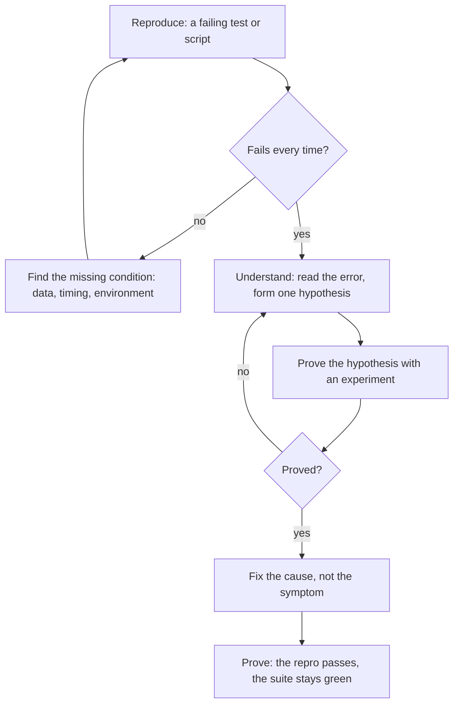

> **Section 03 · Lesson 5** · Level: intermediate · ~18 min · Prereq: [TDD with agents](03-TDD-With-Agents)

## Why this matters

An agent debugging without a reproduction is speculating in code form. It reads a stack trace, guesses a cause, edits a file, and asks you to try again. Sometimes it works. The times it does not, you have a new bug on top of the old one and no idea which edit was which.

Debugging with an agent has one rule that fixes most of this: **make it fail first, on purpose, in a way you can run again.**

## Reproduce first

A reproduction is any command that fails deterministically: a failing test, a script that hits the endpoint, a fixture that replays a real payload. Its value is that it turns "fixed" from an opinion into a fact.

The four phases:

Do not move to "understand" until the reproduction is reliable. An intermittent bug that fails one time in five is not reproduced; it is witnessed.

## Root-cause discipline

Read the error before editing anything. The message usually names the file, the line, and the failing condition. Then form *one* hypothesis — a sentence that could be wrong: "the `updated_at` column does not exist yet, so the UPDATE throws". A hypothesis is useful because it is falsifiable. You can test it.

A useful pattern is to make the agent prove the hypothesis before it fixes anything:

> "The callback marks an event as processed with `UPDATE ... SET updated_at = NOW()`. The error is `42703` (undefined column). Confirm the column is missing in the schema before proposing a fix."

A common real outcome: the column was added to the code but the migration did not add it, so the write rolled back, the event stayed `processed = false`, and the handler silently retried. The symptom looked like "the callback does not work". The cause was a missing column in a migration. Fixing the callback would have hidden it.

The rule: fix the cause, not the symptom. Suppressing an error (a broad `catch`, a retry, a default value) makes the failure quieter and the bug older.

## Give the agent the evidence

Agents cannot read your screen. Paste, in the prompt:

- **The exact command** you ran, with arguments.
- **The full error**, including the stack trace. Trim noise, not the middle.
- **The environment difference** that matters: local versus staging, which branch, which database, whether a variable is set.
- **The data** that triggers it, with secrets and personal data removed.

Compare bare and rich prompts:

| Weak | Strong |
|---|---|
| "the login is broken, fix it" | "login fails after the session timeout. Command: `curl -i -X POST /auth/login`. Response: `401 invalid_token`. It works before I wait 15 minutes. Check the token refresh path in `src/auth/`." |
| "the build is failing" | "`dart test` fails with `Test failed: expected 5000, got 4999` in `fee_test.dart`. Reproduce it, fix the root cause, do not suppress the error." |

## Loud errors, not silent ones

Swallowed exceptions are the debugging tax you pay for weeks. Two habits cure it:

- **Never `catch` and continue silently.** Log the error with context, or let it propagate. A handler that catches and returns "ok" will look like success for a month.
- **Make the failure visible in the system.** When a swallowed exception did exist, a flag like `webhook_events.processed = false` is the only trace left — add that kind of durable marker, and a query that surfaces it, so a failure leaves a scar you can find.

Everything that can hang should fail. An HTTP client with no timeout looks like "the request is slow" or "no response"; a 20-second timeout surfaces a real `E_TIMEOUT` in seconds. Ask the agent to add the timeout, not to add a spinner.

## Try it

1. Find a bug report you can read (yours or an issue tracker's).
2. Prompt: *"Write a failing test that reproduces this exact behaviour. Run it. Paste the output. Do not fix anything yet."*
3. Confirm the reproduction fails reliably. If it passes, ask why — the reproduction is wrong or the bug is elsewhere.
4. Prompt: *"State one hypothesis for the cause. Prove it with a single command or read. Then fix the cause, not the symptom."*
5. Run the reproduction, then the full suite. Both must be green.
6. Add a test that locks the fixed behaviour so it cannot regress silently.

## Common mistakes

- **Fixing from the stack trace alone** — the trace shows where it threw, not why. Reproduce and confirm the cause.
- **Suppressing the error** — an empty `catch` block turns a crash into a mystery. Log it or propagate it.
- **Debugging without data** — "restart it and check" wastes a turn when you could paste the exact payload that failed.
- **Chasing an intermittent failure as if it were deterministic** — collect the condition that makes it fail (timing, an expired token, one record) before you fix anything.
- **Leaving the reproduction as a throwaway script** — it is your regression test. Commit it.
- **Reading a stale artifact** — a cached dump, an old log, or a session you thought was fresh. Regenerate the evidence before trusting it; a stale dump has sent people debugging the wrong process.

## Key takeaways

- No reproduction, no fix. A failing test or script beats any amount of speculation.
- One hypothesis at a time, and prove it before editing.
- Fix causes, not symptoms; suppressing an error makes it older, not gone.
- Hand the agent the command, the error, the environment, and safe sample data.
- Make errors loud; add timeouts to anything that can hang.
- Turn the reproduction into a committed regression test.

## Further learning

- [Best practices for Claude Code](https://www.anthropic.com/engineering/claude-code-best-practices) — describing the symptom, and addressing root causes rather than suppressing errors.
- [Debugging discipline](10-Debugging-Discipline) — the wider habits that make bugs cheap to find.
- [TDD with agents](03-TDD-With-Agents) — where the failing test that becomes your reproduction comes from.
