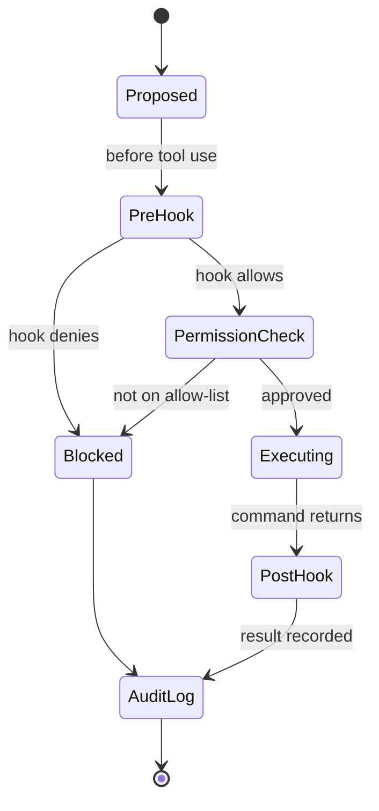

> **Section 03 · Lesson 9** · Level: advanced · ~15 min · Prereq: [Agent memory and session hygiene](03-Agent-Memory-And-Session-Hygiene)

## Why this matters

A rule in a prompt is a request. A hook is a mechanism. When you tell an agent "never commit secrets", you are hoping. When a pre-commit hook runs a secret scanner and fails the commit, you are enforcing. Hooks are the layer where policy stops being advice.

## Hooks: deterministic code around agent actions

A hook is a script that runs at a fixed point in the agent's lifecycle — typically before or after a tool call. It does not ask the model for permission; it runs, and it can block.

The tool-call lifecycle:

The key property: pre-hooks and permission checks sit *in front of* execution. A denied action does not happen and does not need a retry to be undone. Post-hooks cannot prevent an action — they clean up and record, which is why destructive operations belong on the pre side.

## What to enforce mechanically

Enforce only what a script can decide. The five that pay for themselves first:

- **Block edits to protected paths.** Migrations, generated files, lockfiles, `.github/workflows/`. A path allow-list is cheap and catches the most expensive mistakes.
- **Secret scanning before commit.** A scanner that walks the staged diff and fails on a credential pattern. If a secret ever *is* pushed, rotate it — assume it is public.
- **Run the tests after edits.** A post-tool hook that runs the fast suite turns "I ran the tests" into a fact with output.
- **Format on write.** Removes the whole class of "the formatter disagrees" review noise and the drive-by reformat that buries a real change.
- **Log tool calls.** An append-only record of what the agent ran, when, and with what result. When something unexpected happens, this is the only honest timeline.

Two design rules: keep hooks fast (a hook that takes a minute gets disabled), and make blocking hooks explain themselves ("blocked: path is a migration file; propose a new migration instead") so the agent can correct course instead of looping.

## Permissions and sandboxes

Hooks are one layer; permissions are another. The model of the system is:

- **Allow-lists.** The commands and paths an agent may touch without asking. Everything else prompts or is refused.
- **Read-only modes.** Explore sessions that cannot write at all. Use plan mode for the exploration phase, where the agent reads files and answers questions without changing anything.
- **No network, or a network allow-list.** An agent that can reach any host can send data anywhere. If the task is code editing, it usually does not need the open internet.
- **No production credentials.** This is the one that matters most. The agent's environment should never hold the keys to prod; a staging role with read access is usually enough.

Layer these. Permissions decide what is reachable; hooks decide what is acceptable; both are stronger than a sentence in a prompt. This is also the mitigation for the OWASP "excessive agency" risk — an agent with a narrow, bounded toolset has less it can do wrongly.

## Guardrails for the mistakes you will actually make

Build guardrails for the failures you had, not the ones you imagine. Keep a short incident list and mechanise only those: a secret staged for commit, a hand-edited migration, a reformatted file, a push straight to `main` — that is four hooks, each demanded by reality. A hook for a mistake nobody has made is maintenance with no return, and it teaches you to bypass hooks. Where a rule is a judgment call, keep it in the rules file; prompts are for ambiguity, hooks for the unambiguous.

## Try it

1. Write a one-line list of the last five things that went wrong in your repo. Circle the ones a script could decide.
2. Add a pre-commit hook that blocks edits to one protected path. Verify it blocks: make the edit, try to commit, read the refusal.
3. Add a secret-scanner hook on the staged diff and confirm it fires on a dummy value you immediately delete.
4. Add a post-edit hook that runs your fast test suite. Time it; if it is slow, narrow the scope.
5. Add a local pre-push hook that refuses a push to `main`.
6. Write down what each hook is for, in one line, next to it. Delete any hook you cannot justify that way.

## Common mistakes

- **Hooks that only warn** — a warning in a log nobody reads is not enforcement. Blocking is what changes behaviour.
- **Slow hooks** — if the suite takes two minutes, every edit stalls and you turn the hook off within a day. Run a fast subset on write and the full suite on commit or push.
- **Clever hooks whose failure you cannot debug** — a hook that fails without saying why burns an hour. Make every refusal name the rule and the fix.
- **Guardrails for imagined mistakes** — you build four hooks, none of them fire, and you stop trusting the system. Start from your incident list.
- **Prod credentials in the agent environment** — the strongest permission in the world does not help if the key is already there. Remove the access; do not rely on a rule.
- **No audit trail** — when something unexpected did happen, there is no record of which command ran. Log tool calls before you need them.

## Key takeaways

- Prompts ask; hooks enforce. Use hooks for the rules that must not be broken.
- Pre-hooks and permission checks prevent; post-hooks clean up and record.
- Start with: protected paths, secret scan, tests after edits, format, audit log.
- Layer permissions over hooks, and keep production credentials out of the environment entirely.
- Mechanise the mistakes you actually made, not the ones you imagine.
- A hook that is slow or opaque will be bypassed; keep it fast and explicit.

## Further learning

- [Best practices for Claude Code](https://www.anthropic.com/engineering/claude-code-best-practices) — permissions, hooks, and giving the agent a check it can run.
- [OWASP Top 10 for LLM applications](https://genai.owasp.org/llm-top-10/) — excessive agency and the other named risks this lesson mitigates.
- [Secrets hygiene](09-Secrets-Hygiene) — what to do before and after a credential is exposed.
