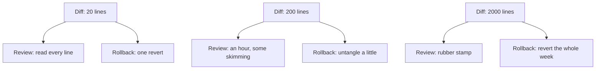

> **Section 03 · Lesson 4** · Level: beginner · ~12 min · Prereq: [The feature loop](03-The-Feature-Loop)

## Why this matters

Small diffs are not an aesthetic preference. A diff is the unit of review, the unit of rollback, and the unit of blame. If a change touches nine files to fix one bug, you cannot review it properly, you cannot revert it cleanly, and when something breaks next week the history will not tell you which of the nine caused it.

## Blast radius scales with diff size

Every line you change is a line that can break something. That is the blast radius. Two forces make it worse as the diff grows:

- **Review confidence falls.** A 20-line diff gets read line by line. A 2,000-line diff gets a skim and a "looks good". The reviewer's attention runs out long before the diff does.
- **Rollback cost rises.** Reverting one commit is trivial. Untangling one commit that mixed a fix, a refactor, and a formatting pass is manual surgery.

Read the diagram as a prediction, not a rule: as size goes up, confidence goes down and rollback cost goes up, at the same time. The window where "small and trustworthy" lives is the top row.

## Techniques that keep diffs small

- **One concern per commit.** A fix and a refactor are two commits, full stop. If you cannot name the commit in one sentence without "and", split it.
- **Forbid drive-by formatting.** A re-indent of an untouched file buries the three real lines. Tell the agent: *"do not reformat code you are not changing."*
- **Ask for the minimal patch.** *"Show me the smallest change that fixes this. Do not improve anything else."* Agents default to helpfulness, and helpfulness produces unrelated edits.
- **Split by file or layer.** Data layer, then service, then route. Each is a commit with its own test.
- **Stage deliberately.** `git add -p` lets you commit the part you reviewed and leave the rest. Unstaged changes stay visible instead of hiding inside a big commit.

## Read the diff properly

Reading a diff is three questions, in order:

1. **What changed?** The lines added and removed. Did the agent modify an existing branch of logic, or add a new one? New code is usually safe; modified conditions are where bugs hide.
2. **What does it touch?** Open the file list. If a file appears that the plan never mentioned, stop and ask why.
3. **What does it now do that it did not before?** Behaviour, not lines. A one-line change to a default value is small in the diff and huge in production.

The diff view hides the third question, which is why "it's only two lines" is how a small change takes down a service. Read the changed lines in the context of the function that contains them.

## "While I was in there"

This phrase is how a one-line fix becomes an outage. The agent fixes the reported bug, then tidies the neighbouring function, updates a dependency, and renames a variable. Each change is individually reasonable. Together they mean:

- The reviewer approves a bug fix and unknowingly approves a rename.
- The revert that fixes the outage also removes the bug fix.
- `git bisect` lands on a commit that changed eleven things.

The rule is simple: when you notice something else worth fixing, write it down and fix it in the *next* commit. You lose nothing — the note survives — and you keep every commit reversible and explainable.

## Try it

1. Take any recent agent session and run `git diff --stat`. Note the file count.
2. Ask the agent: *"Split this change into one commit per concern. For each commit, give me a one-sentence message and the files in it."*
3. Commit them one at a time, checking `git diff --stat` is small for each.
4. For the next task, add one line to your rules file: *"One concern per commit. Do not reformat code you are not changing."*
5. Review one diff using the three questions above, and write your answers in the PR description.

## Common mistakes

- **Approving the stat, not the diff** — the file list looks right, so you merge. The changed condition inside one of those files is the bug. Read the changed lines, not the summary.
- **Committing a failed experiment with the fix** — the dead code stays in `main` because it was in the same change. Revert the experiment before committing the fix.
- **Letting the agent tidy** — "I also improved the error handling in three other functions" is a second unplanned change. Reject it and file it as its own task.
- **A diff too big to read** — if you cannot read it, you cannot review it, and an unreviewed diff is untested code in production clothes. Ask for a split instead.
- **Squashing a messy branch into one opaque commit** — you get one line in `git log` and no way to bisect. Keep the meaningful commits, tidy their messages.

## Key takeaways

- One concern per commit; if it needs "and", it is two commits.
- Forbid drive-by formatting and unrelated cleanup.
- Ask for the minimal patch, explicitly.
- Read the diff for behaviour, not just lines.
- Treat "while I was in there" as a signal to file a task, not to keep typing.
- If you cannot read the diff in one sitting, it is too big.

## Further learning

- [Best practices for Claude Code](https://www.anthropic.com/engineering/claude-code-best-practices) — scoping tasks and giving the agent precise instructions.
- [Reviewing agent output](03-Reviewing-Agent-Output) — the check that runs after you have kept the diff small.
- [Branching and pull requests](05-Branching-And-Pull-Requests) — turning small commits into a reviewable pull request.
