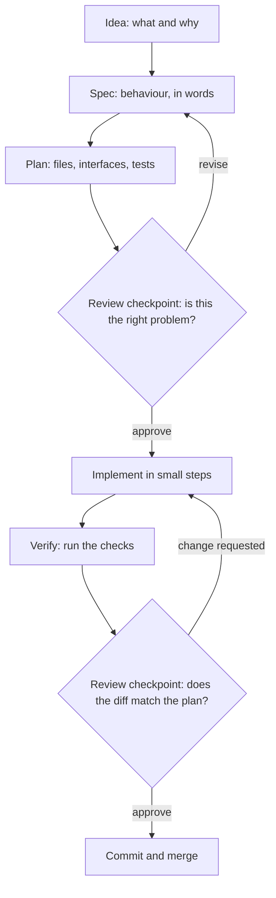

> **Section 03 · Lesson 2** · Level: intermediate · ~15 min · Prereq: [The feature loop](03-The-Feature-Loop)

## Why this matters

A plan is the cheapest artifact in software. Ten minutes of planning can save a day of implementation, because you review a short document instead of a large diff. Plan mode is the phase where you separate research from execution; spec-driven development is what happens when the plan is written down well enough to outlive the session.

## What a good plan contains

Ask for a plan and require five things, in writing:

- **Files touched** — every file that will change, and every file that must *not* change.
- **Interfaces** — the function signatures, request/response shapes, or schema changes the change introduces.
- **Tests** — the specific tests you will add or change, named, before any code exists.
- **Risks** — what could break, what is hard to reverse, what you are unsure about.
- **Rollback** — how you undo it: revert a commit, flip a flag, restore a branch.

A plan that lists only "steps" is a to-do list wearing a plan's clothes. If the interfaces and the rollback are missing, the plan cannot be reviewed, only admired.

## Spec-driven development

Spec-driven development (SDD) means writing a spec before writing code with AI, so the spec becomes the source of truth for both the human and the agent. Martin Fowler's survey of the current tools splits the idea into three levels worth knowing by name:

- **Spec-first** — write a spec, use it for this task, then discard it.
- **Spec-anchored** — keep the spec and evolve it as the feature evolves.
- **Spec-as-source** — the spec *is* the file you edit; code is generated from it.

All current approaches are spec-first; few reach the other two. The honest caveat from that same survey is worth internalising: elaborate spec toolkits can produce a lot of markdown to review, and reviewers regularly report that they would rather read code. Use a full toolkit when the change is large and shared; skip it when it is not. GitHub's spec-kit and similar tools give you the structure, but "your role isn't just to steer — it's to verify" at every phase.

The shape is the same either way:

## When a plan is mandatory

Some changes deserve a written plan every time, regardless of size:

- **Schema changes and migrations** — they run against real data in one direction.
- **Money** — balances, fees, rounding, idempotency. Floating-point arithmetic on currency is a bug waiting for a plan.
- **Auth and permissions** — who can call what. A quiet widening of access is invisible in a diff that "works".
- **Anything you cannot easily undo** — a deploy, a data backfill, a rename across a public API.

For a typo, a log line, or a rename inside one file, planning is overhead. If you could describe the diff in one sentence, skip the plan and do it directly.

## Reviewing a plan is cheaper than reviewing code

A plan is 200 words; the code it produces is 400 lines and one test suite. Reviewing the plan takes two minutes and catches a wrong approach before it is expensive. Reviewing the code takes an hour and catches a wrong approach only after it is written, merged into your mental model, and possibly deployed.

That asymmetry is the whole argument. Spend the cheap review early. When the plan says "I will add a new table" and your instinct says "that belongs in the existing one", you have just saved a migration.

## Try it

1. Choose a feature you would normally start coding immediately.
2. Send this prompt: *"Do not write code. Read the relevant files, then produce a plan with five sections: files touched, files that must not change, interfaces, tests, risks. End with a rollback plan. Ask me questions about anything ambiguous."*
3. Read the plan. Reject it once, in writing, naming the weakest assumption.
4. For a money, auth, or migration change, also write a two-line spec first: the behaviour in plain words, with no implementation detail. Make the agent implement against that spec, not against the plan alone.
5. Keep the approved plan in the repo (a `docs/` or `.scratch/` folder is fine) so the next session starts from it instead of re-deriving it.

## Common mistakes

- **Plan mode as theatre** — you ask for a plan, skim it, approve it, and never compare the diff to it. Use the plan as the review checklist; if the diff touches a file the plan never mentions, stop.
- **The mega-plan** — a plan for a five-line change arrives as four user stories and sixteen acceptance criteria. Match the ceremony to the risk; say no to workflow that costs more than the change.
- **Trusting the plan's test list without names** — "add tests" is not a plan item. Require the test names, so a missing test is visible before implementation.
- **No rollback in the plan** — "we will fix forward" is not a rollback. If the plan cannot say how to undo the change, you have not finished planning.
- **Spec and code drifting apart** — a spec-anchored document that you never update becomes a lie. Either keep it current or delete it; a stale spec is worse than none.

## Key takeaways

- A reviewable plan names files, interfaces, tests, risks, and rollback.
- Write the spec first when the change is shared, risky, or unclear; skip it when you could describe the diff in one sentence.
- Schema, money, auth, and migrations always get a plan.
- Reviewing a plan is minutes; reviewing the code it produces is hours. Review early.
- Spec-first is valuable and cheap; spec-as-source is a bigger bet with real trade-offs. Choose deliberately.

## Further learning

- [Understanding spec-driven development: Kiro, spec-kit, and Tessl](https://martinfowler.com/articles/exploring-gen-ai/sdd-3-tools.html) — the three levels of SDD and where each tool lands.
- [Spec-driven development with AI: get started with a toolkit](https://github.blog/ai-and-ml/generative-ai/spec-driven-development-with-ai-get-started-with-a-new-open-source-toolkit/) — the GitHub toolkit and its verify-at-each-phase workflow.
- [Best practices for Claude Code](https://www.anthropic.com/engineering/claude-code-best-practices) — plan mode, and when planning is not worth the overhead.
