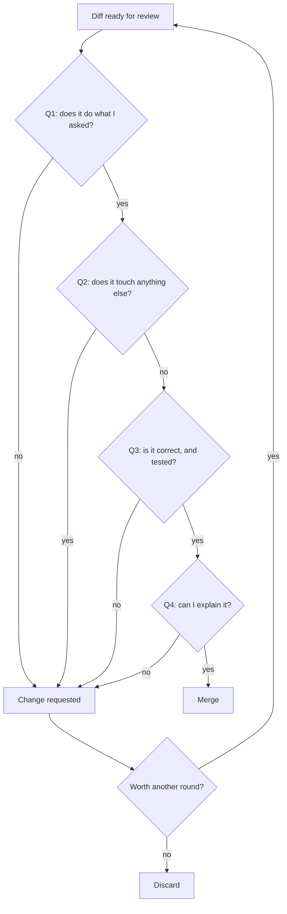

> **Section 03 · Lesson 10** · Level: intermediate · ~15 min · Prereq: [Keeping diffs small](03-Keeping-Diffs-Small)

## Why this matters

An agent's output is a claim until you check it. The failure mode is not obvious breakage — it is plausible, competent-looking code that does something subtly different from what you asked, with one test quietly weakened. Review is where you turn a claim into a fact, or send it back.

## The five-question review

Ask these in order, and stop at the first "no":

1. **Does it do what I asked?** Compare against the request, not against the summary. If you asked for a fee cap and got a fee warning, that is a no.
2. **Does it touch anything else?** Read the file list. Any file the plan never mentioned needs an explanation.
3. **Is it correct?** Read the changed logic in context. Does the new branch handle the empty case, the negative case, the concurrent case?
4. **Is it tested?** Diff the test file before the code file. Did an assertion get looser?
5. **Can I explain it to a colleague?** If you cannot describe the change without the agent's notes, you do not own it yet.

Note the last branch: a diff built on a wrong approach is cheaper to revert than to fix in a third round.

## Evidence over claims

A green check is not proof you read the change. Run the thing yourself:

- Run the command the agent claims passes and read the output.
- Exercise the feature by hand — the endpoint, the CLI flag, the UI path.
- Check the build, not just the tests.

Reviewing evidence is *faster* than re-running the verification yourself, so ask for evidence in the first place: the command, the output, the screenshot. Then verify the evidence is real by running the cheapest of the checks again.

A green pipeline proves the tests you already had still pass. It says nothing about the code you just added.

## Classic agent tells

Each tell has a cause and a fix:

- **Unused imports** — the agent edited by pattern, not by need. Remove them; they signal the change was not reasoned through.
- **Speculative abstraction** — a private helper used once, a base class with one child. Ask for the inline version.
- **TODO comments** — "// TODO: handle the error case". That is an unfinished change wearing a finish. Either finish it or file it.
- **Dead code** — a branch that can never run, a parameter never read. Delete it.
- **Weakened tests** — assertions made looser, or replaced with a mock of the thing under test. The most important tell on this list.
- **Docs not updated** — a changed interface with an unchanged README. Cheap to fix now, expensive when someone follows the old doc.
- **Invented APIs** — a method, option, or *package* that does not exist. Hallucinated packages are a real supply-chain risk, not just a compile error; verify every new dependency actually exists and is one you meant to add.

## Second-opinion review

The author's context hides their own mistake. A fresh reviewer — a different agent with no memory of writing the diff, or a colleague — sees what the author's session cannot.

Give the reviewer one job and no history: *"Here is a diff and the requirement it should satisfy. List every way it fails that requirement. Do not fix anything."* A reviewer asked to "check everything" checks nothing; a reviewer asked to refute one claim is useful. Do this for anything touching money, auth, or the schema, where the cost of a missed error is highest.

## The accountability rule

Your name is on the commit. "The agent wrote it" is not a defence in a postmortem — nor to your own future self at 2am. You approved it; you own it. The OWASP catalogue names the risk this guards against — excessive agency is the failure of letting an agent act beyond the review you actually performed.

If that feels heavy, the answer is not to review less. It is to keep diffs small so that reviewing everything is cheap.

## Try it

1. Take an agent-produced diff and run the five questions in order, writing the answer to each.
2. Diff the test file and the code file separately. Note any assertion that changed.
3. Run one of the checks yourself and paste the output next to the agent's claim.
4. Hunt the tell list: search the diff for `TODO`, `unused`, and new dependencies. Verify each dependency exists.
5. Ask a fresh agent reviewer to *refute* the requirement, with no context from the session.
6. Write your answers into the PR description. If Q5 was "no", do not merge.

## Common mistakes

- **Reviewing the summary instead of the diff** — the summary is written by the author. Read the changed lines.
- **Trusting the green check** — the pipeline passed because the tests were fine before. Run the new path yourself.
- **Reading only the code file** — the assertion was loosened and the diff looks clean. Test diff first.
- **Accepting a new dependency without checking** — an invented package name is both a build failure and a supply-chain risk. Confirm it exists.
- **Fixing everything rather than discarding** — a diff on a wrong approach will not get better with a third round. Revert and re-prompt.
- **Letting the author review their own output** — no second opinion means the shared blind spot survives. Get a fresh reader.

## Key takeaways

- Five questions, in order; stop at the first no.
- Run the check yourself; a green tick is not a review.
- Diff the tests before the code.
- Watch for the tells: unused imports, speculative abstraction, TODOs, dead code, weakened tests, stale docs, invented APIs.
- Get a second, context-free opinion on risky changes.
- Your name is on the commit. Approving is owning.

## Further learning

- [Best practices for Claude Code](https://www.anthropic.com/engineering/claude-code-best-practices) — evidence over assertions, and verification as part of the loop.
- [OWASP Top 10 for LLM applications](https://genai.owasp.org/llm-top-10/) — excessive agency and other named risks in agentic systems.
- [Keeping diffs small](03-Keeping-Diffs-Small) — the practice that makes five-question review fast enough to always do.
