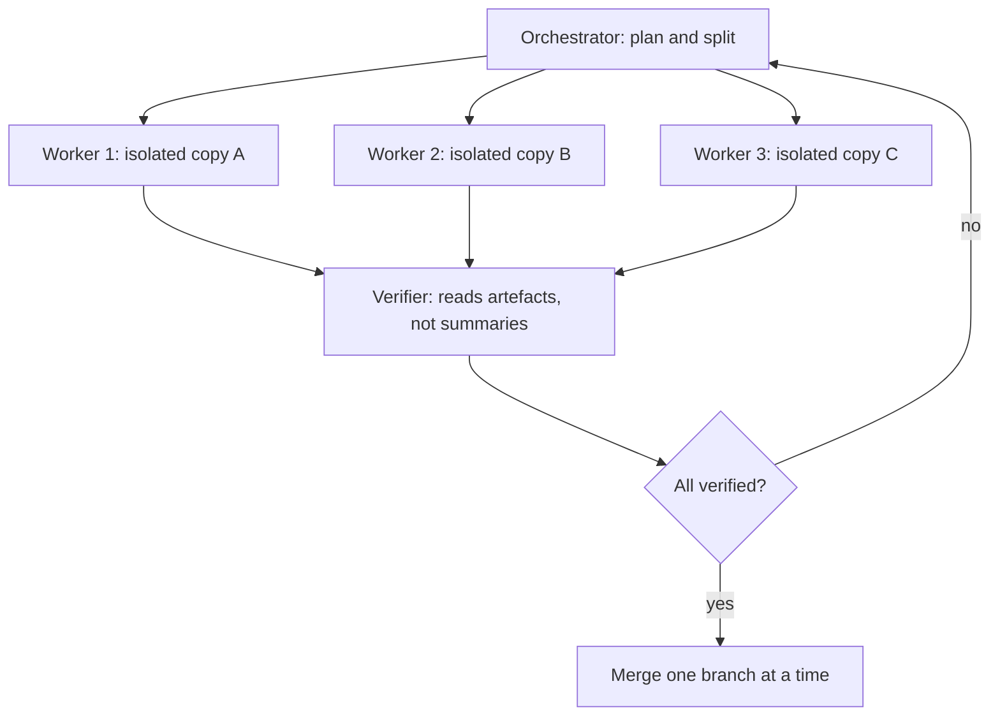

> **Section 03 · Lesson 7** · Level: advanced · ~18 min · Prereq: [Context engineering](02-Context-Engineering)

## Why this matters

One agent doing everything works until the task outgrows its context window — and by then it has forgotten the constraint you gave it at the start. Splitting work across subagents fights that directly: each worker gets a focused job and a clean context, and the lead agent only sees the distilled result instead of tens of thousands of tokens of exploration.

## Why decompose

Three reasons, and they are independent:

- **Context isolation.** A subagent can search extensively, reading dozens of files worth tens of thousands of tokens, then return a condensed summary — often only a few thousand tokens. The lead agent's attention budget stays intact.
- **Parallelism.** Three independent investigations finish in the time of the slowest, not the sum. This is the orchestrator-workers pattern: a lead agent splits the task, delegates, and synthesises.
- **Independent verification.** A fresh agent grading the work is not the agent that did the work. The author of a mistake is the worst reviewer of it; a verifier with no investment in the diff catches more.

## Fan-out patterns

The shape that pays off most often is N implementers plus one verifier:

Two other shapes worth knowing: **research sweepers** (several agents each explore a different part of a codebase and return a map, before any code is written), and **independent reviewers** (two agents review the same diff from different angles — correctness and security — and you act on the union).

## Isolation mechanics

Parallel agents editing the same file is not parallelism; it is a race with extra steps. Give each worker its own working copy:

- A separate branch per worker, ideally a separate `git worktree` so two agents are not sharing a checkout.
- A clear ownership boundary: this worker owns `src/billing/`, that one owns `src/notifications/`. No shared files, and no "just a small edit" to someone else's module.
- A merge order decided before the work starts, so conflicts are resolved by design rather than by whoever gets there first.

Ask each worker to return a bounded result, not prose to re-verify by hand. A structured record — files changed, command run, output observed, remaining uncertainty — is faster to check than a paragraph claiming success.

## The cost

Subagents are not free, and pretending otherwise causes the failures below:

- **Duplicated context.** Every worker re-reads shared files. Three workers exploring the same repo pay three times for the same reading.
- **Merge conflicts.** Independent work converges on the same helpers and the same tests. The merge is where the real cost shows up.
- **Summaries that must be verified, not trusted.** A subagent's "done" is a claim. The only evidence is the artefact: the file, the diff, the test output. Read it.

Take a summary as a pointer to where to look, never as the finding itself.

## Anti-patterns

- **Ten agents on one hot file.** They will conflict, and the conflicts will be semantic (both edited the same function's intent), not textual. One owner per file.
- **Trusting "done".** A worker reports success and the file is unchanged, or the tests were not run. Open the artefact.
- **Delegating a one-line change.** Coordination costs more than the work. Use subagents when the task exceeds a single context, not when it feels sophisticated.
- **Widening the verifier's job.** A verifier asked to "check everything" checks nothing. Give it one criterion — "does this diff match the spec" — and let it return a verdict.
- **Fan-out without fan-in.** Three branches, no merge plan, and a week of untangling. Decide the merge order first.

## Try it

1. Pick a task with three genuinely independent parts (three separate endpoints, three unrelated modules).
2. Write the ownership boundary explicitly: which paths each worker owns and which are off-limits.
3. Create one branch or worktree per worker. Confirm no two point at the same files.
4. Launch the workers with a shared, short brief: the task, the files they own, the check to run, and the shape of the answer you want back.
5. Have a fresh agent verify each result against its artefact — the diff and the test output — not against the worker's summary.
6. Merge one branch at a time, running the suite after each.

## Common mistakes

- **Shared working directory** — two agents overwrite each other's edits and neither notices. Use separate branches or worktrees.
- **No interface freeze** — three workers each invent a different shape for the same shared object. Freeze the interface before fan-out.
- **Accepting the summary** — the worker says "implemented and tested" and you never look. Open the diff.
- **The verifier writes the fix** — verification and authoring become one role again, and the independent check disappears. Keep them separate.
- **Fanning out to look busy** — coordinating four agents on a task that fits in one context roughly quadruples the overhead. Match the technique to the size.
- **Forgetting the cap** — agents can loop. Set a budget and a stop condition before you launch several, or you will pay for the exploration twice; see [token and cost discipline](03-Token-And-Cost-Discipline).

## Key takeaways

- Decompose when the task exceeds one context, not when it feels impressive.
- Each worker gets a clean context and one owner's worth of files.
- Subagents return summaries; you verify artefacts.
- Keep the verifier separate from the author.
- Decide the merge order before fan-out.
- A "done" from a subagent is a claim until you read the file.

## Further learning

- [Effective context engineering for AI agents](https://www.anthropic.com/engineering/effective-context-engineering-for-ai-agents) — context rot, compaction, and sub-agent architectures.
- [Building effective agents](https://www.anthropic.com/engineering/building-effective-agents) — orchestrator-workers, parallelisation, and evaluator-optimizer patterns.
- [Create custom subagents](https://code.claude.com/docs/en/sub-agents) — the mechanics in Claude Code.
