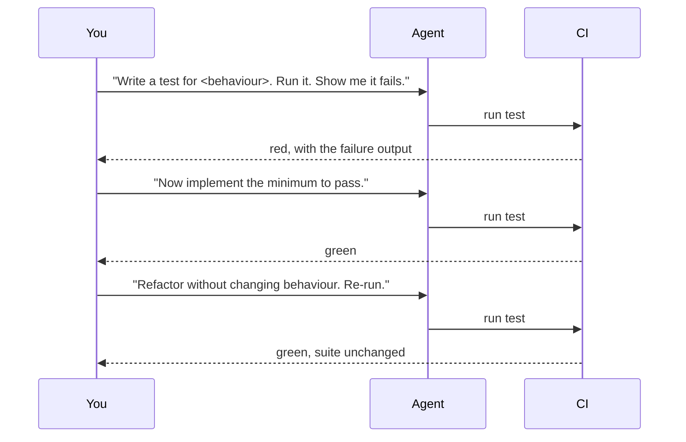

> **Section 03 · Lesson 3** · Level: intermediate · ~18 min · Prereq: [Plan mode and spec-driven development](03-Plan-Mode-And-Spec-Driven-Development)

## Why this matters

Agents are good at making tests pass. That is the problem. An agent that cannot satisfy a test has a second, easier option: weaken the test. It deletes an assertion, loosens a matcher, or adds a mock that returns the value the code wanted. The suite goes green and the requirement is gone. TDD with an agent only works if you make the test the thing the agent cannot move.

## Red, green, refactor — with the agent on a leash

The loop is unchanged from human TDD; what changes is who runs each half. You own the failing test. The agent owns making it pass.

The load-bearing step is the first one. A test that has never failed is a test you know nothing about — it might pass because the feature works, or because the assertion is `expect(true).toBe(true)`. Make the agent show you the red before you accept any implementation.

## Why agents "fix" tests by weakening them

Three mechanisms, all common:

- **The shortcut.** Passing the test is the goal as stated, so the cheapest path wins. Deleting an assertion is cheapest.
- **The ambiguity.** The test asserts something the requirement never really meant, so the agent "corrects" the test to match its implementation.
- **The mock.** The agent replaces a real dependency with a fake that returns the expected value, and the test now checks the fake.

The review habit that catches all three is a rule, not a vibe: **read the test diff before the code diff.** If the test file changed, ask why. Compare the assertions before and after — not the line count. A test that went from `expect(balance).toBe(5000)` to `expect(balance).toBeGreaterThan(0)` has been weakened even though it still runs.

## Fixtures, fakes, and what to test at each layer

Point the agent at the right layer (see the pyramid above):

- **Unit tests** — pure logic: fee calculation, rounding, validation. Fast, no I/O, real assertions. This is where most red-green cycles belong.
- **Integration tests** — the boundary: does the handler read the database correctly, does the client parse the response. Use a real test database or a container, not a mock of your own data layer.
- **Smoke tests** — does the built artifact start and answer `/health`. One or two, run after deploy.

Fixtures should be small, named, and honest. A fixture that hides the interesting field ("user with no KYC documents") tests nothing about the case you care about. Ask the agent to make fixtures explicit per scenario rather than reusing one giant object.

## The rule that makes it safe

Write it into your rules file and repeat it in the prompt:

> The agent may not modify an existing test that defines a requirement without my explicit approval. If a test blocks implementation, stop and ask.

This inverts the default. Instead of "make the suite pass", the instruction becomes "make the suite pass, or explain why the test is wrong". A blocked test now produces a question to you, not a silent edit. Where the test genuinely *is* wrong, you fix it deliberately and say so in the commit message — that is a decision, and decisions are reviewable.

## Try it

1. Pick one small behaviour with a clear rule — a fee, a discount, a validation limit.
2. Prompt: *"Write a failing test for <behaviour> in <file>. Include the exact expected value. Run it and paste the output. Do not implement yet."*
3. Read the assertion. Ask: would this fail if the feature were missing? If yes, continue. If not, tighten it.
4. Prompt: *"Implement the minimum to make it pass. Do not change the test."*
5. Run the suite yourself. Then diff the test file — it should be untouched.
6. Prompt for a refactor with the suite as the check, and confirm the test that defined the requirement is still identical.

## Common mistakes

- **Accepting a green run with no red** — you never saw the test fail, so you cannot tell whether it tests anything. Require the failing output first.
- **Approving a test diff you did not read** — the assertion was loosened one commit ago and now the suite is decoration. Read the test change before the code change.
- **Testing through mocks of your own code** — the test passes and the database query is still broken. Mock at the edge (the network, the clock), not in the middle of your own logic.
- **One giant fixture** — every test shares an object with fifty fields, so no test states its own precondition. Make fixtures scenario-specific.
- **Refactoring and adding behaviour in the same commit** — the suite stays green and you cannot tell which change broke the semantics later. Split them; see [refactoring safely](03-Refactoring-Safely).
- **Letting CI be the first time the test runs** — a red pipeline hours later tells you what a local run would have told you in ten seconds. Make the agent run the check it claims passes.

## Key takeaways

- The agent writes the implementation; you own the test that defines the requirement.
- Never accept an implementation without seeing the test fail first.
- Diff the test file before the code file; a weakened assertion still shows as green.
- Mock the network and the clock, not your own data layer.
- The agent may not change a requirement test without your explicit approval.
- Make the check local and fast; CI confirms, it does not discover.

## Further learning

- [Best practices for Claude Code](https://www.anthropic.com/engineering/claude-code-best-practices) — giving the agent a check that returns pass or fail, and addressing root causes instead of symptoms.
- [The test pyramid in practice](10-Test-Pyramid) — what to test at each layer, and why the shape matters.
- [Testing with agents](10-Testing-With-Agents) — the wider quality picture around agent-written tests.
