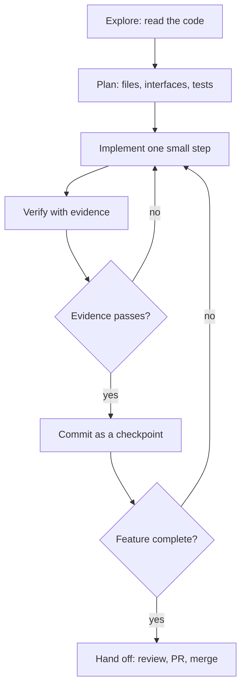

> **Section 03 · Lesson 1** · Level: beginner · ~15 min · Prereq: [Plan and chain of thought](02-Reasoning-And-Chain-Of-Thought)

## Why this matters

An agent writes a working feature and a broken one with exactly the same confidence. The difference is not the model; it is the loop you make it run. The feature loop turns "ask for a feature and hope" into six short phases, each small enough that a wrong turn costs you one revert instead of an afternoon.

## The six phases

The loop is: explore, plan, implement in small steps, verify with evidence, commit, review. Anthropic's guidance is blunt about the failure it prevents — letting an agent jump straight to coding produces code that solves the wrong problem. The first message is therefore a question, not an instruction.

The inner cycle — implement, verify, commit — is the part people skip. See the loop above: you can re-enter it many times, but you never jump from "plan" to "merge".

## Explore before you write

Exploration is one prompt: *"read the auth module and tell me how sessions are validated. Do not edit anything."* The agent returns a map — files, functions, and the pattern the codebase already uses. This is the cheapest moment to catch the mistake that wastes the most time: adding a second way of doing something that already exists.

Why it works: an agent that has read the surrounding code copies its conventions (naming, error handling, test layout). An agent that has not invents its own, and you review a stylistic argument instead of a feature.

## Implement in small verified steps

"Implement the whole onboarding flow" is one giant unverified step. Split it: add the endpoint with a stubbed handler; wire the handler to the data layer; add validation; add the test. Each is a step you can run.

Verification must produce evidence the agent can read: a test suite, a build exit code, a linter, a script that diffs output against a fixture. Without something that returns pass or fail, "looks done" is the only signal available and you become the verification loop — every mistake waits for you to notice it.

## Commit as checkpoints

A commit is a bookmark you can return to. Commit after every verified step with a message that says what changed and why. If step four is wrong, `git revert` the last commit and you are back to a known-good tree. If you never commit, your only rollback is to ask the agent to undo its own work — which is how a small mistake becomes a rewrite.

## The hand-off

The agent's job ends when it hands you a diff, a test run, and a sentence on what it did *not* do. Your job starts there. Before merging you check four things yourself: does the diff do only what I asked; are the tests real; did anything outside the feature change; can I explain this change to a colleague without reading the agent's summary. That last one is the honest test — if you cannot explain it, you do not own it yet.

## Try it

1. Pick a small repo you know. Ask the agent: *"read the code and describe how a request flows from entry point to database. Do not edit."*
2. Read the answer against your own knowledge. Correct the map where it is wrong, in your own words.
3. Ask for a plan only: *"list the files you would change to add a `--dry-run` flag, and the test you would add."* Approve or reject before any code exists.
4. Let it implement step one. Run the check it claims passes, and read the output yourself.
5. `git add -p`, commit, and repeat for the next step. Stop when the feature is done, not when the agent says it is.

## Common mistakes

- **Skipping exploration** — you get a feature that duplicates an existing helper. Ask for a read-only summary first; treat "I already implemented it" as a signal you did not look hard enough.
- **One giant step** — a 600-line diff arrives with "all tests pass" and no way to tell which part broke. Split the request until each step has a single verifiable outcome.
- **Trusting the summary, not the evidence** — the agent says it ran the tests. Ask it to paste the command and the output, then run the command yourself.
- **Committing only at the end** — nothing to revert to when the last step regresses the first. Commit after each verified step.
- **Letting the agent grade itself** — the author of a mistake is the worst reviewer of it. [Keep diffs small](03-Keeping-Diffs-Small) so a second pair of eyes can read them fast, and [review the output](03-Reviewing-Agent-Output) before it reaches `main`.

## Key takeaways

- Run the loop in order every time: explore, plan, implement, verify, commit, review.
- The first prompt reads code; it does not write it.
- Give the agent a check that returns pass or fail, or you become the check.
- Commit after every verified step so any bad step is one revert away.
- Before merging, be able to explain the diff yourself; the agent's confidence is not evidence.
- If you cannot describe the change in one sentence, the step was too big.

## Further learning

- [Best practices for Claude Code](https://www.anthropic.com/engineering/claude-code-best-practices) — the explore/plan/code/commit workflow and verification criteria.
- [Building effective agents](https://www.anthropic.com/engineering/building-effective-agents) — workflows versus agents, and why simple loops beat elaborate ones.
- [Git essentials for the AI era](05-Git-Essentials) — branches, commits and reverts you will use as checkpoints.
