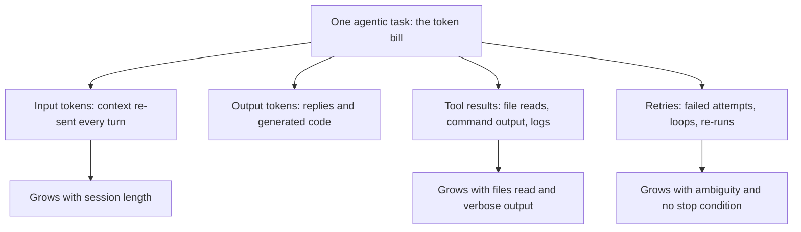

> **Section 03 · Lesson 11** · Level: intermediate · ~12 min · Prereq: [Context engineering](02-Context-Engineering)

## Why this matters

Agents cost money per token, and an agentic task spends tokens on things that are invisible in a chat: the context re-sent on every turn, the output of every command, the retries. Most bills are not mysterious. They are a small number of habits repeated a few hundred times.

## Where the bill comes from

The counter-intuitive part is the first box. In a conversational agent, the whole history is re-sent as input on each turn, so a long session pays for its own beginning again and again. Input tokens usually dominate. A measured probe on one production research service found a median cost of about `$0.0017` per uncached query (as of 2026) — and, more usefully, that cost tracked the *length of the answer* and the *size of the retrieved context*, not how difficult the question looked. Long answers and fat context are the levers. "Hard" is not.

Two pricing facts worth knowing (provider-dependent, as of 2026): cached input tokens can be discounted heavily — on the order of 90% on some providers — and batch APIs can halve the price for work that does not need an instant reply. Check your provider's current numbers; they change.

## Cheap habits

- **Smaller scope.** One feature, one session, one branch. A focused prompt reads three files; a vague one reads thirty.
- **Targeted reads.** Ask for the function, the file, or the diff — not "read the repo". Just-in-time retrieval beats pre-loading everything.
- **Cheaper models for mechanical work.** Formatting, renames, small edits, and classification do not need the most capable model. Route the cheap work to a cheap model; reserve the expensive one for design and debugging.
- **Caching and reuse.** Where a provider offers prompt caching and the work repeats a stable prefix, use it. Where a result repeats, cache the result — a cache hit that avoids a model call costs nothing.
- **End sessions.** A fresh session with a short hand-off note is almost always cheaper than a bloated one. See [agent memory and session hygiene](03-Agent-Memory-And-Session-Hygiene).
- **Stop conditions.** "Stop after three attempts and report" prevents the expensive failure mode: an agent looping on the same error until your budget is gone.

## Measure, do not guess

Guessing at cost produces two bad outcomes: you under-provision and get surprised, or you over-provision and pay for headroom you never used. Measure:

- **Usage dashboards.** Every provider exposes token and spend views. Read them weekly, not once.
- **A cost probe per feature.** Pick one representative task and record tokens in, tokens out, and cost. Repeat after a change. This is how you learn that answer length — not query difficulty — drives your bill.
- **A budget with a kill switch.** A spend limit that stops the work, not a dashboard that reports it after. Set it before you scale up, not after the first surprise invoice.

The tiering above is the point: most infrastructure cost tends to be flat monthly fees, and the usage-driven part is what moves when behaviour changes. Knowing which is which tells you where to optimise.

## The organisational lesson

A runaway agent in a retry loop can burn real money in a short window. It usually looks like this: a failing command, a fix that does not work, another attempt, and no ceiling. The loop is honest — the agent is trying — and expensive.

Guard against it before you scale:

- A per-task and per-day spend limit, enforced by the platform, not by intention.
- A retry cap in the prompt: three attempts, then report and stop.
- One person responsible for reading the bill. Shared responsibility means nobody looks.

Token cost is a design constraint, not an accounting afterthought. The same habit that keeps a session small — narrow scope, read what you need, stop when you are done — is also the habit that keeps the bill small.

## Try it

1. Run one small task and record tokens in, tokens out, and cost from your provider's dashboard.
2. Run the same task with a tighter prompt (named files, no exploration) and compare.
3. Pick a mechanical task (a rename, a format pass) and run it on a cheaper model. Compare quality and cost.
4. Set a spend limit on your account today, at a number that would annoy rather than bankrupt you.
5. Add "stop after three attempts and report what failed" to your rules file.
6. End every session at a natural boundary with a hand-off note; note the token drop.

## Common mistakes

- **One week-long session** — input tokens re-sent every turn dwarf everything else. End sessions.
- **"Read the whole repo and fix it"** — the exploration alone can cost more than the fix. Point at files.
- **The top model for everything** — formatting and renames do not need it. Route by task.
- **No spend limit** — the retry loop has no natural ceiling. Set the kill switch first.
- **Measuring once** — pricing and models change, and so does your code. Re-probe after significant changes.
- **Counting only output** — the visible reply feels like "the cost" while the invisible input dominates. Read both numbers.

## Key takeaways

- Input tokens dominate; the history is re-sent every turn.
- Cost tracks answer length and context size, not perceived difficulty.
- Smaller scope, targeted reads, cheaper models for mechanical work, and caching are the cheap wins.
- Use dashboards and per-feature probes; do not estimate.
- Set a spend limit and a retry cap before you scale up.
- Ending a session is a cost-control technique, not just a hygiene one.

## Further learning

- [Effective context engineering for AI agents](https://www.anthropic.com/engineering/effective-context-engineering-for-ai-agents) — why context is a finite resource and how to spend it well.
- [OWASP Top 10 for LLM applications](https://genai.owasp.org/llm-top-10/) — excessive agency, including the unbounded-action failure behind runaway cost.
- [Context engineering](02-Context-Engineering) — the upstream practice that makes most of these habits automatic.
