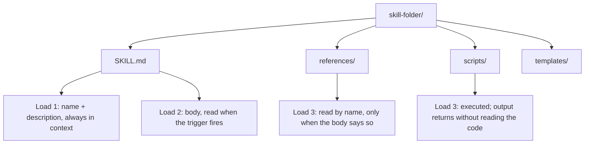

> **Section 04 · Lesson 2** · Level: beginner · ~12 min · Prereq: [What are agent skills](04-What-Are-Agent-Skills)

## Why this matters

A skill that fails almost always failed in one of two places. Either the frontmatter is wrong, so the agent never opened it, or the structure is wrong, so the agent read the half that did not help. This lesson takes the folder apart so you can write a correct skill from an empty directory in ten minutes, without copying a template you do not understand.

## Frontmatter is the trigger

The first thing in `SKILL.md` is a YAML block delimited by `---`. Two keys are required, `name` and `description`.

- `name` — lowercase letters, digits and hyphens; by convention it matches the folder name. `release-notes-from-git`, not `Release Notes`.
- `description` — one or two sentences, and the single most important line in the file. This is what the agent reads when deciding whether your task calls for the skill.

Write the description for retrieval, not for a human browsing a list. "Use when the user asks for release notes or a changelog" beats "A comprehensive guide to release management in modern projects". Front-load the words a user would actually type; the opening words do the most work, which [Writing Good Skills](04-Writing-Good-Skills) takes further.

## The body has five useful parts

The instructions below the frontmatter are read in full once the skill triggers. A short skill still covers five things, usually as headings:

1. **When to use** — restates the trigger and names what is out of scope.
2. **Procedure** — numbered, imperative steps, one action per line, with the real command.
3. **Pitfalls** — the specific ways this task goes wrong in *this* project.
4. **Verification** — how to prove it worked, rather than how to feel it worked.
5. **Examples** — one short worked case, or a pointer to a bundled file.

Anything that is reference material rather than a step can be pushed one level down. That is what the rest of the folder is for.

## Bundled files, and when the agent opens them

A skill folder may contain `scripts/`, `references/` and `templates/`:



The difference between `scripts/` and `references/` is worth remembering. A reference file is *read* — its text enters the context window. A script is *run* — the deterministic result comes back without the script or its input being pulled into context. If an operation must produce the same answer every time, put it in a script and tell the agent to run it.


## A complete worked example

Here is a small, correct skill. It does one thing, and the tree is flat:

```
release-notes-from-git/
├── SKILL.md
└── references/
    └── house-changelog-format.md
```

```markdown
---
name: release-notes-from-git
description: Use when the user asks for release notes, a changelog, or "what changed since the last release". Covers finding the last tag, grouping commits, and the house format.
---

# Release notes from git history

## When to use
Before tagging a release, or when asked what shipped since the previous one.
Not for writing a full pull-request description.

## Procedure
1. Find the last release tag: `git describe --tags --abbrev=0`
2. List the commits since it, one line each:
   `git log --oneline --no-merges "$(git describe --tags --abbrev=0)..HEAD"`
3. Group what you find into Added, Fixed, Changed. Drop merge commits and
   anything that only touches tests or CI configuration.
4. Write one line per change, past tense, with no internal ticket numbers a
   reader cannot open.
5. Follow `references/house-changelog-format.md` for ordering and style.

## Pitfalls
- "fatal: No names found" means the repository has no tags yet. Say that.
  Do not list the entire history as if it were a release.
- Commits named "wip" or "fix lint" are not user-facing. Leave them out.
- Do not claim a change shipped if its pull request is not merged into the
  branch you diffed.

## Verify before you finish
- Every bullet traces to a commit in the range you printed.
- No heading is empty. If a group has no changes, omit the heading.
```

Note what the file does *not* contain: project history, a primer on semantic versioning, a gallery of past changelogs. That material is either unnecessary or it belongs in `references/`.

## Try it

1. Create the folder and file above, adapted to your own project, under `skills/release-notes-from-git/`.
2. Check the frontmatter with no tools installed:

```bash
test "$(head -1 SKILL.md)" = "---" && echo "frontmatter opens correctly"
grep -qE '^name: [a-z0-9-]+$' SKILL.md && echo "name is lowercase with hyphens"
```

3. Ask a fresh session "what does this repo do?" and confirm the skill is not loaded.
4. Ask "what changed since the last release?" and confirm the agent runs the `git log` line from step 2 of your procedure rather than inventing one.
5. Rename the `references/` pointer in step 5 of the skill and re-run. The agent no longer goes looking for the file, because a bundled file only loads when the body names it.

## Common mistakes

- **A description written for a human catalogue** — "Notes about releases" will not be matched against "what changed in v2.1?". Lead with the trigger phrase.
- **Capitals or spaces in `name`** — `Release Notes` breaks folder-name matching and is not the documented convention.
- **A body that is documentation instead of instructions** — background reading belongs in `references/`, not in the half of the skill that always loads.
- **A referenced file that does not exist** — an orphan pointer sends the agent hunting through the repository, and it may then guess. Every path you name must resolve.
- **Everything at the top level** — a 400-line `SKILL.md` with no bundled files means the whole thing loads or nothing does.

## Key takeaways

- Frontmatter carries `name` and `description`; the description is the trigger the agent matches against.
- Structure the body as when-to-use, procedure, pitfalls, verification, examples.
- `references/` is read, `scripts/` is executed, `templates/` is copied.
- Bundled files load only when the body names them. A file nobody mentions is dead weight.
- Small and correct beats comprehensive. Push reference material down a level.

## Further learning

- [Equipping agents for the real world with Agent Skills](https://www.anthropic.com/engineering/equipping-agents-for-the-real-world-with-agent-skills) — how one skill keeps form-filling instructions in a separate file.
- [Agent Skills overview](https://agentskills.io/home) — the format specification, plus quickstart and best-practice pages.
- [anthropics/skills](https://github.com/anthropics/skills) — real skills to read for structure and naming.
