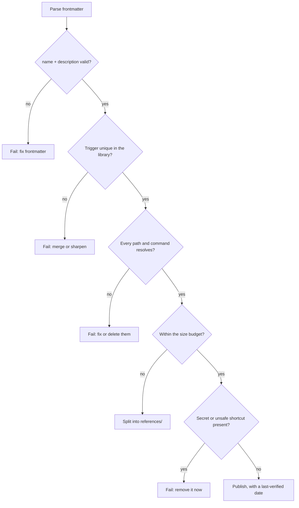

> **Section 04 · Lesson 4** · Level: intermediate · ~15 min · Prereq: [Writing good skills](04-Writing-Good-Skills)

## Why this matters

Skills are instructions that an agent follows with confidence. That makes a bad skill more dangerous than a missing one: the agent does not hedge, it executes. The failures are predictable and they cluster — a duplicated trigger that makes a load-order coin flip, a command that has not run since the last release, a bundled script that nobody read before it was installed. This lesson gives you a checklist and four automated checks that catch almost all of it.

## The seven smells

- **Duplicate skills.** Two skills whose descriptions could both match the same request. The agent picks one, and you cannot predict which. Merge them or sharpen the boundary until only one can fire.
- **Orphaned references.** The body points at `references/forms.md` and the file does not exist, was renamed, or lives in another folder. The agent goes looking and then improvises.
- **Stale commands.** The command worked when the skill was written and the tooling has since moved. This is the most common smell in a library older than a few months, and the least visible: nothing errors until someone follows the skill.
- **Unverifiable claims.** "This always completes in under a second." "The API never returns duplicates." Nobody can check it, so the agent treats it as fact.
- **Security guidance that teaches an unsafe shortcut.** A setup step that pipes a remote script straight into a shell, an instruction to disable TLS verification "for local testing", a suggestion to bypass a pre-commit hook with `--no-verify`, or a credential pasted into a command line. Link to the safe path instead — see [Secrets Hygiene](09-Secrets-Hygiene) and [Supply Chain Security](09-Supply-Chain-Security).
- **Bloat.** A body so long it is skimmed. If the always-loaded part is 900 lines, the agent reads what it recognises and guesses at the rest.
- **Tool-specific assumptions.** Steps that only work in one agent product, presented as though they were part of the format. Say which tool they assume, or keep them out.

## The 12-item audit

Run this over any skill folder before you publish it, and again before you trust someone else's:

1. Frontmatter parses, and `name` matches the folder name.
2. `name` is lowercase with hyphens, nothing else.
3. `description` opens with a trigger ("Use when ..."), not a topic.
4. No other skill in the library can match the same request.
5. Every path named in the body exists.
6. Every command in the body runs today. You ran them, not remembered them.
7. No number or version is stated as permanent truth without "as of <year>".
8. The always-loaded body is under your word budget; reference material lives in `references/`.
9. No secret, token, internal hostname or private path appears anywhere in the folder — check `scripts/`, examples and fixtures too.
10. Nothing in the folder teaches an unsafe shortcut.
11. No dependency is installed from a package name the author never verified.
12. Provenance is recorded: who wrote it, where it came from, when it was last verified.

## Automate what a machine can check



Four checks cover most of the ground:

```bash
# 1. Frontmatter shape and folder/name agreement
grep -qE '^name: [a-z0-9-]+$' SKILL.md || echo "bad or missing name"

# 2. Size budget: anything over 5,000 words is a split candidate
find skills -name SKILL.md -exec wc -w {} + | awk '$1 > 5000 {print}'

# 3. Dangling reference: a named file that is not there
grep -rhoE 'references/[A-Za-z0-9._/-]+' skills/ | sort -u | while read -r p; do
  find skills -path "*/$p" | grep -q . || echo "MISSING: $p"
done

# 4. Secret-shaped strings (this prints a pattern, never a value)
grep -rInE '(api[_-]?key|secret|password|token)[[:space:]]*[:=][[:space:]]*[A-Za-z0-9]{16,}' skills/
```

Check 4 produces false positives on documentation — that is fine. Read every hit; the cost of reading ten is smaller than the cost of publishing one. Wire checks 1 to 4 into the same pipeline that runs your tests, so a skill cannot be merged while it is failing them.

## Provenance over popularity

A popular skill repository is not a reviewed one. Star counts measure how many people copied something, not whether anyone read the bundled scripts or the instructions that tell your agent to fetch a file from a host you do not recognise. Before installing anything: read every file in the folder, not just `SKILL.md`. Check who wrote it and whether that identity is verifiable. Prefer a small, reviewed set of rules from a source you can name over a large unreviewed bundle, and prefer writing the twenty lines yourself when the capability is small.

## Try it

1. Pick the skill you wrote in the previous lesson and run the four checks above from inside its folder.
2. Walk the 12-item checklist and write one line per item: pass, fail, or not applicable. Do not skip the ones that are tedious — item 6, running every command, is the one that catches real breakage.
3. Fix exactly one fail, the highest-severity one, and re-run the check that caught it.
4. Record a verdict line at the bottom of the folder's entry in your library index: `verified: YYYY-MM-DD`.

## Common mistakes

- **Treating a green link check as a quality check** — links can all resolve while every command in the body is obsolete.
- **Auditing `SKILL.md` and ignoring the rest of the folder** — bundled scripts and fixtures are where credentials get left behind and where dependencies you never chose get pulled in.
- **Reading the star count instead of the files** — installed skills run with the same privileges as the agent you are steering.
- **Auditing once, at publish time** — a skill is verified on a date, not forever. Re-run the checks when the tooling it describes changes.

## Key takeaways

- Duplicate triggers, orphaned references, stale commands and unsafe shortcuts are the four failures that matter most.
- Run the 12-item checklist before publishing and before trusting a third-party skill.
- Automate frontmatter validation, a size budget, a dangling-reference check and a secret scan; wire them into CI.
- Popularity is not provenance. Read every file in the folder before installing it.
- A skill is verified on a date. Record that date.

## Further learning

- [Agent Skills overview](https://agentskills.io/home) — the specification, plus pages on best practices and evaluating skills.
- [Equipping agents for the real world with Agent Skills](https://www.anthropic.com/engineering/equipping-agents-for-the-real-world-with-agent-skills) — the security section on bundled code, dependencies and untrusted network sources.
- [OWASP GenAI Security Project](https://genai.owasp.org/) — the threat catalogues behind the unsafe-shortcut items on the checklist.
- [anthropics/skills](https://github.com/anthropics/skills) — read these as reference implementations, not as things to copy blindly.
