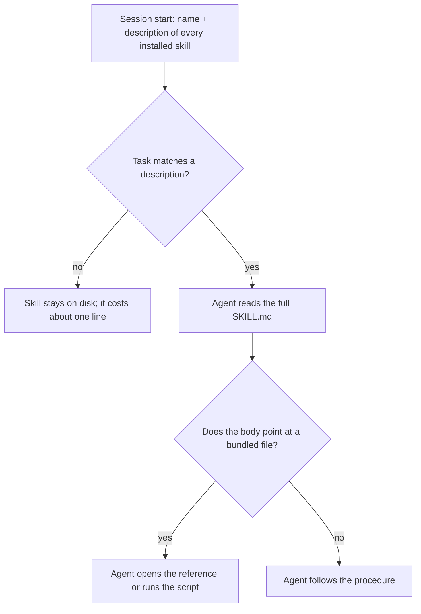

> **Section 04 · Lesson 1** · Level: beginner · ~10 min · Prereq: [Rules files](02-Rules-Files-AGENTS-and-CLAUDE-md)

## Why this matters

You have typed the same instruction to an agent twice before. "Run the tests with this exact command." "Send back the money amount as a string, never a float." "Do not hand-edit the generated client." The obvious fix is to add it to the rules file. That fix has a ceiling: a rules file is always on, so every word in it is paid for on every request whether the task needs it or not. Fill it with procedures and it grows, the constraints you actually care about end up buried in the middle, and renaming a variable starts costing you a re-read of the deployment runbook.

A skill is how you move one procedure out of the always-on pile and attach it to the task that needs it.

## A skill is a folder with a SKILL.md

At minimum, the whole format is this:

```
my-skill/
└── SKILL.md
```

`SKILL.md` begins with YAML frontmatter — the `---` block at the top of a file — holding two required keys, `name` and `description`. Everything below that is instructions: the procedure, the pitfalls, the command to run. A skill folder can also carry `scripts/`, `references/` and `templates/`; [Anatomy Of A SKILL.md](04-Anatomy-Of-A-Skill-File) walks through those properly.

The detail that matters is the description. It is not a summary for humans browsing a catalogue — it is the string an agent matches your task against when deciding what to open. A skill with a strong body and a vague description is a skill that never fires.

## Progressive disclosure

Skills work because they are read in stages, never all at once:



This is called progressive disclosure: metadata first, body second, bundled files third. Each level loads only when the level above it asks for it, so a skill folder can hold far more than you would ever paste into a prompt — an agent with a filesystem and a command tool does not need to read a whole skill to use one part of it.


## Skill, rule, hook — pick the right tool

Three mechanisms get confused constantly. They are not interchangeable:

- **A rule** is an always-on constraint. Short, absolute, cheap: "never commit secrets", "do not edit `migrations/` by hand". Rules live in the rules file and load every session.
- **A skill** is procedural knowledge loaded on demand: "here is how this project creates a database migration". It is guidance, and the agent decides whether it applies.
- **A hook** is a deterministic action taken by the tool itself at a fixed moment — a command that runs before a commit, a check that blocks a write. A hook does not depend on the model remembering anything, which is exactly why hard guarantees belong there rather than in prose. See [Hooks And Guardrails](03-Hooks-And-Guardrails).

A safety constraint the agent must obey *every time* does not belong in a skill, because a skill can simply not be loaded.

## An open format, several implementations

Agent Skills were released as an open standard in late 2025 and the format is documented at agentskills.io. The convention is deliberately small — a folder, a file name, two frontmatter keys — and that is what makes a skill portable: the same folder can be dropped into more than one agent product. Where the folder must live, and how a given product decides to activate a skill, is product-specific. Check the documentation for the tool you use instead of assuming another tool's path.

Skills come from three places: official collections published by an agent vendor, community repositories of varying quality, and your own repos. The last of those is worth the most, because it encodes your project's real commands and real traps.

## Try it

1. In any project, create `skills/dev-loop/SKILL.md` with frontmatter containing a `name` of `dev-loop` and a description that starts "Use when the user asks how to run this project locally...".
2. Add numbered steps under a `## Procedure` heading: install dependencies, start the database, start the server, run the tests. Use the real commands from your README.
3. Start a fresh agent session and ask something that does *not* match the description, such as "what does this function do?". Watch the skill stay closed.
4. Now ask "how do I run this project locally?" and confirm the agent reads your file and follows your steps instead of guessing.
5. Move one instruction you repeat every session out of the rules file and into the skill. Notice how much shorter the rules file gets.

## Common mistakes

- **The essay skill** — a page of background and philosophy before the first instruction. The agent needs the procedure, not the history.
- **A description that names a topic instead of a trigger** — "Database migrations" tells the agent nothing about when to open the file. "Use when the user asks to create or apply a database migration" does.
- **Safety constraints parked in a skill** — "never push to main" only works if the skill loads. Put it in a rule, or enforce it with a hook.
- **Skill sprawl on day one** — writing twelve skills the first afternoon, none of which has been used twice. Start with the one procedure you have already explained three times.

## Key takeaways

- A skill is a folder with a `SKILL.md`: a name, a description, and instructions loaded only when relevant.
- Progressive disclosure keeps the cost low: metadata always, body on trigger, bundled files on demand.
- Rule = always-on constraint. Skill = on-demand procedure. Hook = deterministic action. Do not mix them up.
- The description is a retrieval trigger, not a title. Write it as "use when ...".
- The format is an open convention; the install path and activation behaviour are product-specific.

## Further learning

- [Equipping agents for the real world with Agent Skills](https://www.anthropic.com/engineering/equipping-agents-for-the-real-world-with-agent-skills) — the original write-up, with a document-editing skill as the worked example.
- [Agent Skills overview](https://agentskills.io/home) — the open format's home page, specification and quickstart.
- [anthropics/skills](https://github.com/anthropics/skills) — official example skills worth reading for structure.
- [Steering Claude Code: rules, skills, hooks, subagents](https://claude.com/blog/steering-claude-code-skills-hooks-rules-subagents-and-more) — one product's account of how these mechanisms divide the work.
