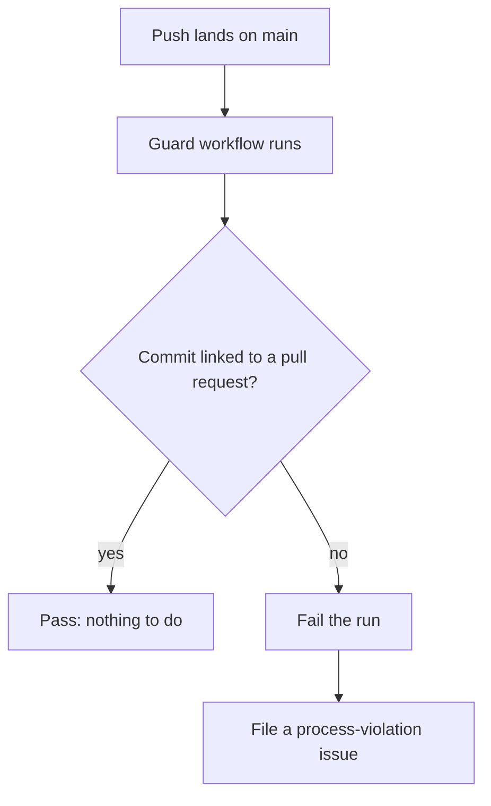

> **Section 05 · Lesson 8** · Level: intermediate · ~15 min · Prereq: [Checks that actually matter](05-Checks-That-Actually-Matter)

## Why this matters

A workflow file that nothing enforces is a suggestion. Branch protection is the repository setting that turns CI into a rule: the merge button stays grey until the checks you picked are green on the exact commit you are merging, and `main` cannot be rewritten or bypassed. Without it, "the tests pass" is a habit. With it, it is a gate that survives a bad day, a rushed Friday, and an agent that thinks it is done.

## What branch protection actually buys

Five controls do most of the work.

- **Required status checks** — named workflows must report success before a pull request can merge.
- **Required reviews** — at least one human approves, and you can require a fresh approval after new commits land.
- **No force-push** — history on `main` only moves forward, so `git push --force` is rejected.
- **Linear history** — one commit per change (squash or rebase), which makes reverting a change a one-line operation.
- **Restricted pushers** — an explicit allow-list of who, or which app, may push at all.

## Configuring it in the UI and via the API

In the browser: **Settings → Rules → Rulesets** (the newer view) or **Settings → Branches → Branch protection rules** (classic). You select the branch pattern — usually `main` — tick the controls, and pick your required checks.

Here is the first trap. **A required status check only appears in the picker after the workflow has run at least once on that repository.** GitHub learns check names from real runs, not from the YAML sitting on disk. The order is always: commit the workflow, push it, let it run green once, then go and mark it required.

The API edits the same object, which is handy for scripting a new repository. This sets up a classic rule that requires one check and one approving review:

```bash
cat > protection.json <<'JSON'
{
  "required_status_checks": { "strict": true, "contexts": ["test"] },
  "required_pull_request_reviews": { "required_approving_review_count": 1 },
  "enforce_admins": true,
  "restrictions": null
}
JSON

gh api -X PUT repos/{owner}/{repo}/branches/main/protection \
  -H "Accept: application/vnd.github+json" \
  --input protection.json
```

`strict: true` means "the branch must be up to date with `main` before merging". That one boolean stops the classic failure where two pull requests are each green against an older `main`, then break `main` together. Field names move as GitHub folds classic protection into rulesets, so check the docs before you paste this into a script you will keep.

## When the plan does not offer protection

On some plans, private repositories get no branch protection at all: you open Settings and the section is missing. (Limits shift — check your own repository; as of 2026 this is still common.) You want both workarounds below.

**1. A `main` guard workflow.** It fires on every push to `main`, asks the API whether the pushed commit arrived through a pull request, and fails the run plus files an issue if it did not:



```yaml
name: Main branch guard
on:
  push:
    branches: [main]
permissions:
  contents: read
  issues: write
  pull-requests: read
jobs:
  guard:
    runs-on: ubuntu-latest
    steps:
      - name: Check commit to pull request association
        env:
          GH_TOKEN: ${{ secrets.GITHUB_TOKEN }}
          REPO: ${{ github.repository }}
          SHA: ${{ github.sha }}
        run: |
          set -euo pipefail
          count="$(gh api "repos/$REPO/commits/$SHA/pulls" --jq 'length')"
          if [ "${count:-0}" -eq 0 ]; then
            gh issue create --repo "$REPO" \
              --title "Process violation: direct push to main" \
              --label process-violation \
              --body "Commit $SHA reached main without a pull request."
            exit 1
          fi
          echo "OK: $SHA arrived via $count pull request(s)."
```

Notice that this is a **detective** control, not a preventive one: by the time it fails, the commit is already on `main` and already deploying. That is exactly why you also need the second workaround.

**2. A local `pre-push` hook.** A git hook that refuses to push directly to `main` from your machine. Keep it in the repository at `.githooks/pre-push` and switch it on with `git config core.hooksPath .githooks`. It is the first line of defence, and it stops the accident before it becomes an incident.

## CODEOWNERS

`CODEOWNERS` is a plain text file, in the repository root, in `.github/`, or in `docs/`, that maps paths to owners. When a pull request touches a matching path, the named owner is requested automatically. Paired with "require review from code owners", it makes review routing deterministic instead of social.

The paths that deserve an owner are the ones where a mistake is expensive: `.github/workflows/` (CI config runs with your credentials), your migrations directory, and your auth or payments code.

```
# .github/CODEOWNERS
.github/workflows/  @your-org/platform
db/migrations/      @your-org/backend
services/auth/      @your-org/security
```

The workflows line is the highest-value one: a change to CI config can read every secret in the repository, so it should never merge on a single casual approval. [Team ownership and CODEOWNERS](13-Team-Ownership-CODEOWNERS) goes further.

## Rulesets versus classic protection

Classic branch protection is a per-branch rule with a fixed menu. **Rulesets** are the newer model: named, layered, able to target branches and tags with glob patterns, inheritable from the organisation, with a bypass list you can audit. Prefer them when available — "all release branches" is one object instead of five near-identical rules — and keep classic protection only where you need a control the ruleset does not expose. Both make the same promise: the merge button is blocked until the machine and a human both say yes.

## Try it

1. Push any workflow to a throwaway repository and let it run once, so the check name exists.
2. Open **Settings → Rules** (or **Branches**) and require that check. Add one required approval and turn on "dismiss stale approvals".
3. From your terminal, commit something trivial and run `git push origin main`. Read the rejection — that message is the gate working.
4. If your plan has no protection, add the `main-guard` workflow above and a `.githooks/pre-push` that exits non-zero when the current branch is `main`.
5. Add a `CODEOWNERS` file that owns `.github/workflows/`, then open a pull request touching a workflow and watch the reviewer get requested.

## Common mistakes

- **Requiring a check by the wrong name.** The name you pick is the *job or workflow name shown on the run*, not the filename. Rename the job later and the requirement silently points at a check that never runs — with `strict` on, merges block forever; without it, nothing is required at all.
- **Protecting `main` but merging into `release/*` or `staging`.** Protection is per pattern. Every branch that can deploy needs its own rule, or one path to production is wide open.
- **Leaving "require branches to be up to date" off.** Each pull request was green against an older `main` and the combination is red. Turn `strict` on for anything that deploys.
- **Putting `CODEOWNERS` where GitHub does not read it.** Only the root, `.github/`, and `docs/` are honoured. A file in `.config/CODEOWNERS` is ignored and you are never told.
- **Assuming a private free-plan repository is protected.** If the settings page has no protection section, it is not protected, and `main` is one `git push --force` from losing history.

## Key takeaways

- Branch protection is what turns CI from advice into a gate; without it, a green check is only a suggestion.
- Required status checks appear in the picker only after a workflow has run once, so merge the workflow before you require it.
- On plans without protection, pair a `main` guard workflow (detective) with a local `pre-push` hook (preventive).
- Give `.github/workflows/`, migrations, and auth code a `CODEOWNERS` entry — CI config runs with your credentials.
- Prefer rulesets over classic protection when they are available; they cover many branches and tags in one auditable object.
- Turn on "require branches to be up to date" for every branch that deploys.

## Further learning

- [Secure use reference — GitHub Docs](https://docs.github.com/en/actions/reference/security/secure-use) — the CODEOWNERS and token-permission guidance this page builds on.
- [GitHub Actions documentation](https://docs.github.com/en/actions) — workflows, events, and permissions, straight from the source.
- [Workflow syntax for GitHub Actions](https://docs.github.com/actions/using-workflows/workflow-syntax-for-github-actions) — the reference for `on:`, `permissions:`, and the job shapes used above.
