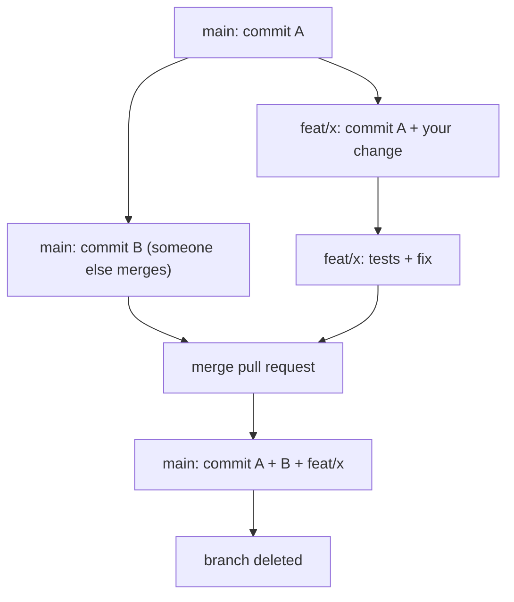

> **Section 05 · Lesson 3** · Level: beginner · ~15 min · Prereq: [GitHub CLI quickstart](05-GitHub-CLI-Quickstart)

## Why this matters

A branch plus a pull request costs you two minutes and buys four things: a diff someone else can review, a place for CI to run before the code reaches `main`, a record you can point to when something breaks, and a clean way to abandon work that turned out wrong. Solo projects need this as much as teams do — an agent on your own repo is still a second writer with no memory of yesterday.

## One feature, one short-lived branch, one pull request

Branch off the latest `main` and name it after what it does:

```bash
git switch main && git pull
git switch -c feat/health-endpoint
```

Name branches predictably: `feat/<issue>-<short-name>`, `fix/<issue>-<short-name>`, `docs/<short-name>`, `chore/<short-name>`. The issue number in the name ties the branch to a tracked item, so history later answers "why does this exist".

Keep the branch short-lived. A branch that lives for two days merges cleanly; one that lives for two weeks accumulates conflicts and stale context. The loop below shows the life of a short-lived branch meeting `main`.



When `main` moves while you work, pull it into your branch (`git pull origin main` or a rebase) and re-run your tests before you push. Resolving that small conflict on your branch is easier than untangling it at merge time. Delete the branch after merge; merged branches left lying around make `git branch` useless.

## One concern per pull request

A pull request is a review unit, not a project. If a change does two unrelated things, split it: two PRs, each reviewable on its own. Reviewers approve small, focused diffs quickly and scrutinise them properly; they rubber-stamp anything over a few hundred lines. Mixed PRs are also harder to roll back — reverting one removes the good change along with the bad.

## What a good pull request contains

A reviewer opening your PR should be able to start without asking you anything. Write the description in four parts:

- **Why.** The problem and the outcome, in one short paragraph.
- **What changed.** The shape of the diff, not a line-by-line tour.
- **How it was tested.** The exact commands you ran and their result, plus a manual check if relevant.
- **Risk.** What could break, what is out of scope, and what a reviewer should look at hardest.

Add logs or screenshots for anything visual or stateful. If CI runs a gate that matters, say which one. For an AI-assisted change, state that the code was generated and what you verified yourself — reviewers who know will read it more carefully.

## Direct pushes to main

Trunk-based teams commit often, but serious ones still gate `main`. It is usually what deploys, and an unreviewed commit to a deploy branch is a production change with nobody watching.

Two controls enforce this. A `main`-guard workflow runs on every push to `main`, asks GitHub whether the commit arrived with a pull request, and fails loudly if it did not — a detective control, since the commit already landed. Branch protection, where your plan allows it, is preventive: it refuses the push and can require passing checks first.

For agents the rule is absolute: **never let an agent push to `main`.** Point it at a branch. Generated code has no business bypassing review, and the failure mode — a broken `main` that autodeploys — is the expensive one.

## Merge strategies and bisecting

Two common choices, both fine:

- **Squash merge** collapses the branch into one commit on `main`. History reads as one change per feature, which makes `git log` and `git revert` clean. You lose the individual commits from the branch.
- **Merge commit** keeps every commit plus a merge node. History is truthful about the work that happened, and `git bisect` can land on the exact commit that introduced a bug — but the graph is noisier.

Pick one as a default and use it consistently. Squash suits agent-assisted work: the intermediate "fix the test" commits an agent produces are noise in permanent history. Merge commits are worth it when a long change deserves its own internal history. Either way, write the PR title as a conventional commit (`type(scope): subject`) so the squashed message is useful without editing.

## Try it

1. Branch: `git switch -c fix/readme-typo`.
2. Change one line, commit with a message that explains why.
3. Push and open the PR with a description containing *why*, *what*, *how tested*, and *risk*.
4. Read your own diff on the PR page before anyone else does — fix anything confusing.
5. Merge with `gh pr merge --squash --delete-branch`.
6. Repeat with a change that deliberately fails a test, and confirm CI blocks the merge.

## Common mistakes

- **Branching from a stale `main`.** You will fight conflicts that did not need to exist. Pull `main` before creating the branch.
- **Letting the branch live for weeks.** Reviewers lose context and conflicts multiply. Merge in days, or split the work.
- **Opening a PR with an empty description.** Reviewers then guess the intent, and guesses are wrong. Always include the why and the test evidence.
- **Force-pushing a branch under review after comments.** It invalidates the reviewer's place in the diff. Push a normal commit; squash only at merge time.

## Key takeaways

- Every change gets a short-lived branch and a pull request, even solo — it is what makes CI and rollback possible.
- One concern per PR; large mixed diffs do not get reviewed.
- A good description answers why, what, how it was tested, and what the risk is.
- Gate `main`: protect it, and never let an agent push to it directly.
- Choose squash or merge commit as a default, and write the PR title as a conventional commit.

## Further learning

- [GitHub Actions documentation](https://docs.github.com/en/actions) — how the checks that gate your pull request are built.
- [Workflow syntax for GitHub Actions](https://docs.github.com/actions/using-workflows/workflow-syntax-for-github-actions) — the `on: pull_request` trigger.
- [Issue-driven development](13-Issue-Driven-Development) — connecting branches to tracked work.
- [Code review for AI code](13-Code-Review-For-AI-Code) — what to look for in a generated diff.
