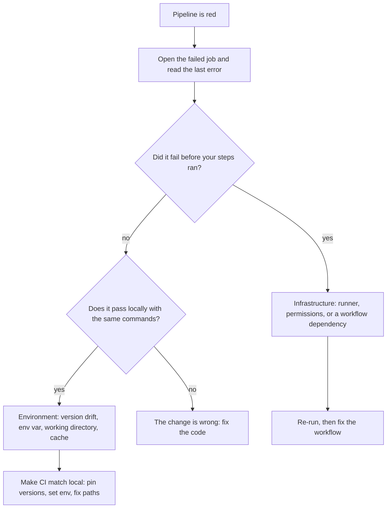

> **Section 05 · Lesson 13** · Level: beginner · ~15 min · Prereq: [Your first CI pipeline](05-Your-First-CI-Pipeline)

## Why this matters

A red pipeline is not a wall, it is a message: something you cannot yet see would have broken for a user. The trouble is that the message sits under a few hundred lines of setup output, and the temptation is to re-run until it goes green. This page is the routine that turns red into a fix — read the right line, decide which of three things it is, and change only that.

## Read the failing step, not the whole log

Open the failed run and click the **failing job**, then the **failing step**. Do not read from the top. The cause is almost always at the end of that step, in the last block before the non-zero exit: a stack trace's final frames, an assertion, a `command not found`, a `403` with a URL.

Three details explain a surprising share of failures:

- **Which step failed.** A failure in checkout or setup is configuration or infrastructure, not your code.
- **The exit code.** `exit 1` from a test runner is your code; `exit 127` is a missing command; `exit 137` usually means the process was killed for memory.

## Common causes

Once you know the step, the cause is usually one of these six:

- **A missing environment variable.** Local shells inherit `.env` or an exported variable; the runner has neither. The blank value then fails downstream and blames the wrong line.
- **The wrong working directory.** Each step starts in the repository root, and a step that `cd`s into a subdirectory does not move the *next* step.
- **Version drift between your machine and the runner.** You have Python 3.13 and the runner has whatever `python-version` you forgot to pin — different formatter output, different error messages.
- **A missing service.** Your tests assume a database or cache is running. On your machine it is; on a fresh runner it is not, so the first query fails. Add a service container.
- **Case-sensitive paths.** Your laptop may not care whether it is `Utils.py` or `utils.py`; the Linux runner does — a red run with `ModuleNotFoundError` is this.
- **A stale cache.** A cache keyed on something that does not include your lockfile hands you dependencies from an old build.

One more, in the same family: **ordering inside a step**. If a formatting or type check reads a generated file — a language-version marker, a lockfile — install dependencies *before* it. Reverse the order and the tool falls back to a default and reports differences that do not exist locally.

## Reproducing locally

Reproduce the failure on your machine before you change anything, using the **same commands in the same order** as the workflow. Copy them out of the YAML rather than remembering them.

When local and CI still disagree, remove the guesswork with a container matching the runner's OS and runtime: `docker run` the same image, mount the repository, run the same commands.

## Re-running, debug sessions, and logs for the post-mortem

- **Re-run failed jobs** when you suspect a flake — a network hiccup or a rate limit. Two clean re-runs with no code change means a flake, and a flake is a bug to file, not a button to press.
- **Enable step debug logging** by setting the `ACTIONS_STEP_DEBUG` secret to `true` for a run. It is noisy, so use it on a failing branch and turn it back off.
- **Open an interactive session** — an SSH-style debug session inside the job — to poke at the runner's filesystem hands-on. Reach for it when the log genuinely does not say enough, not first.
- **Upload artefacts on failure.** Capture logs and test reports with `actions/upload-artifact`, guarded with `if: always()` so it runs even when tests fail. Without the report, the evidence vanishes when the log rolls over.

```yaml
      - uses: actions/upload-artifact@<full-commit-sha> # v4
        if: always()
        with:
          name: test-reports
          path: reports/
```

## Fix the pipeline or fix the code

Not every red pipeline is the pipeline's fault:



The line to hold is the difference between *fixing* and *silencing*. Fixing removes drift — pinning a version, adding the missing variable, fixing a path. Silencing makes the failure go away without answering it: `continue-on-error`, `|| true`, disabling a test, lowering a threshold. Silencing buys an hour and costs an incident.

And the hard case deserves stating plainly: **a check that keeps failing is telling you something.** If the same test fails on every unrelated branch, the check is probably right and the code is probably wrong. Deleting it to get a green merge is the failure mode this section exists to prevent.

## Try it

1. Break a test on purpose on a branch, push, and read only the **last** error block in the failed step. Write down the exit code.
2. Copy the failing workflow's commands out of the YAML and run them in order locally. Note the first command where local and CI disagree.
3. Set `ACTIONS_STEP_DEBUG` to `true`, re-run the failed job, and find one detail the normal log hid.
4. Add an `if: always()` `upload-artifact` step, then fail a test and download the report from the run.
5. Re-run a failed job once: if it passes with no code change, write the flake down as a bug.

## Common mistakes

- **Reading the log from the top.** The first `error` you see is often a warning or an expected failure; the cause is the last non-zero exit.
- **Assuming green locally means green in CI.** The runner is a different OS, a different runtime version, and a case-sensitive filesystem, with no `.env` and no service running. Pin the version and set the variable.
- **`cd` in one step and expecting the next step to stay there.** Every step begins in the workspace root. Use `working-directory:` on the step instead.
- **Silencing instead of fixing.** `continue-on-error: true`, `|| true`, or deleting the failing assertion turns a red pipeline into a quieter, more expensive one.
- **A cache key that ignores the lockfile.** Include the lockfile in the key, or you keep installing yesterday's packages.
- **Treating a flake as fixed after one green re-run.** Two clean re-runs with no code change is a signal; one is a coin toss.

## Key takeaways

- Read the failing step and its last error, not the whole log; the exit code tells you what kind of failure it is.
- Work the six common causes in order: env var, working directory, version drift, missing service, path case, stale cache.
- Reproduce with the same commands in the same order, and use a container when parity matters.
- Re-run to test for a flake, enable step debug logging for detail, and upload reports on failure so the evidence survives.
- Fix drift, never silence a check — `continue-on-error` and deleted tests are how a bad change ships.
- A check that keeps failing on unrelated branches is usually right about the code.

## Further learning

- [GitHub Actions documentation](https://docs.github.com/en/actions) — run logs, re-running jobs, and debug logging, from the source.
- [Workflow commands for GitHub Actions](https://docs.github.com/en/actions/reference/workflows-and-actions/workflow-commands) — output, masking, and the commands that make step-level debugging possible.
- [Secure use reference — GitHub Docs](https://docs.github.com/en/actions/reference/security/secure-use) — why `if: always()` upload steps must not capture secrets into the artefact.
- [Fast and reliable checks](05-Fast-And-Reliable-Checks) — the caching and parallelism settings that cause, and prevent, most of the flaky runs above.
