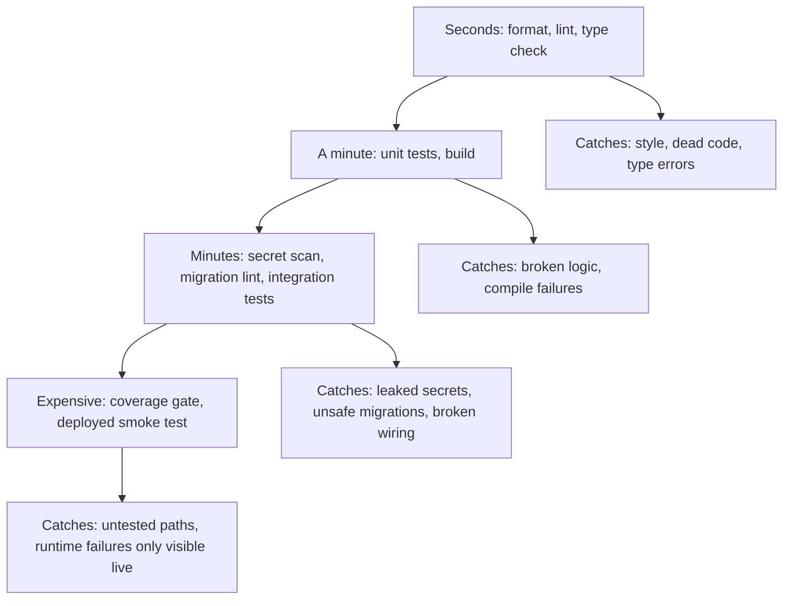

> **Section 05 · Lesson 6** · Level: intermediate · ~20 min · Prereq: [Your first CI pipeline](05-Your-First-CI-Pipeline)

## Why this matters

A pipeline can hold ten checks and still miss the bug that costs you a weekend. This lesson orders checks by how much pain they save per minute they cost, and which ones catch the failure modes of AI-generated code. The aim is a small set of gates you trust, not a long list you ignore.

## The gate catalogue

Ordered cheapest to most expensive; add from the top.

| Gate | Catches | Relative cost |
| --- | --- | --- |
| Format check | Style drift | Seconds |
| Lint | Dead code, unused imports | Seconds |
| Type check | Wrong shapes between functions | About a minute |
| Unit tests | Broken logic | Under a minute |
| Build | Code that will not compile | A minute or two |
| Migration lint | Bad filenames, destructive SQL | Seconds |
| Dependency and secret scan | Vulnerable packages, leaked credentials | A minute |
| Integration tests | Broken wiring | Minutes |
| Coverage threshold | Untested new paths | One suite run |
| Deployed smoke test | "Builds but will not run" | Minutes plus a deploy |

**In a brand-new repository**, add format, lint, and unit tests first. They are cheap, they run in under a minute, and they catch most of what you will break.

**Add the rest when you get burned.** A secret scan belongs in the pipeline the day after your first accidental commit, not before. Migration lint earns its place the first time a destructive statement slips into review. A deployed smoke test is worth it once you have a staging environment. Unneeded gates become noise that trains people to ignore red checks.

## Gates that catch AI-generated code problems

A generated diff fails differently from a human one:

- **Dependency scan** catches invented packages: a model can name a library that does not exist, or a squatted lookalike of a real one — an OWASP-catalogued supply-chain risk. A missing package fails the build; a lookalike installs cleanly and runs someone else's code.
- **Test integrity** catches weakened tests. An agent asked to make a failing test pass will sometimes delete the assertion, skip the test, or change the expectation to match the bug. Read the test diff first.
- **Lint and docs validation** catches dead code and drift. A dead-code rule flags helpers nothing calls; a script checking decision-record headings catches generated docs that ignore the repo's conventions.
- **Secret scan** catches a credential pasted into a fixture or config file. Never commit a secret; if one is pushed, rotate it rather than deleting the commit.

## Coverage is a smoke detector, not a target

A coverage number tells you which lines ran, not whether the assertions were right. Chasing a percentage produces tests that call functions and assert nothing. Use it as a smoke detector: a sudden drop means new code arrived untested; an unexplained change means tests disappeared.

The harder truth is that **"tests pass" can mean "the tests are wrong"**. A real example: a handler marked an event as processed while the row it should have updated was never written, because the SQL bound the wrong parameter and matched zero rows. The handler reported success, the test asserted on the success flag, and both agreed while the data was wrong. Guard against it as you would against a human bug: assert on outcomes, not on the value the code just set. If a function updates a row, read the row back.

## Make green a merge blocker

A check that does not block a merge is documentation. Configure branch protection or rulesets to require the checks you trust before `main` accepts a pull request. Required status checks make the pipeline a rule: `main` only holds commits whose tests passed.

Where branch protection is not available, a workflow on push to `main` can be a detective control — check whether the commit arrived with a pull request, open an issue if not, and fail. It catches the violation after it lands, so it is a backstop, not a substitute.

## Try it

1. List every check your pipeline runs and its cost in minutes.
2. Delete or defer any gate you have never seen fail for a real reason.
3. Add the one gate you have been burned by, at the cheapest level that catches it.
4. Write a test that asserts on an outcome you read back, not a variable the code set. Break the code and confirm the test fails.
5. Add a secret scan and commit a placeholder that trips it. Confirm it blocks.
6. Require your best two checks in branch protection and try to merge a red PR.

## Common mistakes

- **Adding a coverage threshold before you have tests worth measuring.** You get assertion-free tests that satisfy the number. Measure movement, not the number.
- **Trusting a green pipeline as proof the feature works.** Unit tests plus no integration test means the wiring is untested. That is what the deployed smoke test is for.
- **Letting a generated fix edit the test to match the bug.** Read test diffs first. A deleted assertion is a changed requirement.
- **Approving a new dependency because the build passed.** A lookalike package installs cleanly. Check the name character by character against the real library.

## Key takeaways

- Add gates cheapest-first; start with format, lint, and unit tests.
- Add expensive gates when you get burned — unused checks train people to ignore red.
- Watch for invented dependencies, weakened tests, dead code, docs drift, and leaked secrets.
- Coverage is a smoke detector; assert on outcomes you read back, not values the code set.
- A check that does not merge-block is documentation.

## Further learning

- [OWASP Top 10 for LLM Applications](https://genai.owasp.org/llm-top-10/) — the named risk catalogue, including supply chain.
- [OWASP Top 10 for Large Language Model Applications](https://owasp.org/projects/top-10-for-large-language-model-applications) — project home.
- [Secure use reference](https://docs.github.com/en/actions/reference/security/secure-use) — secrets and least privilege in CI.
- [The test pyramid in practice](10-Test-Pyramid) — how many of each test to write.
