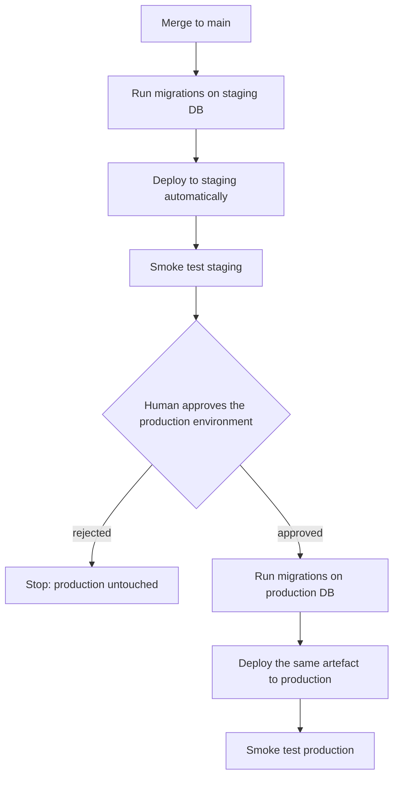

> **Section 05 · Lesson 12** · Level: advanced · ~20 min · Prereq: [Releases, tags and versioning](05-Releases-Tags-And-Versioning)

## Why this matters

A release workflow that builds one artefact does not yet tell you how it reaches users. The difference between a calm deploy and a bad night is sequencing: what runs first, what waits for a human, and what happens when the smoke test fails.


## Continuous delivery versus continuous deployment

**Continuous delivery** means every change that passes the pipeline is *ready* to deploy at any moment; a human decides when. **Continuous deployment** means it goes without asking. The hybrid that suits most teams is deploy-to-**staging automatically** on merge, with **promotion to production a deliberate, approved step**: staging catches the integration bug within minutes, and production gets a human who saw staging work. Fully automatic production is something you earn later, once rollback is fast and observability is real.

## Environment promotion

Promotion is the rule that the artefact you tested is the artefact you ship. The same build moves through environments; nothing is rebuilt along the way. Migrations land *before* the code that needs the new schema, in each environment:



That is two workflows and one environment: staging runs on every push to `main`, and promotion is triggered by hand and gated:

```yaml
name: Promote to production
on:
  workflow_dispatch:
jobs:
  promote:
    runs-on: ubuntu-latest
    environment: production          # required reviewer must approve
    steps:
      - name: Run migrations first
        env:
          DATABASE_URL: ${{ secrets.DATABASE_URL_PRODUCTION }}
        run: ./scripts/migrate.sh
      - name: Deploy the built artefact
        run: ./scripts/deploy.sh "${{ github.sha }}"
      - name: Smoke test
        run: ./scripts/smoke.sh https://your-production-host/health
```

Run it from the UI or with `gh workflow run "Promote to production" --ref main`. Staging and production must be *isolated* — separate databases and credentials, and a sandbox integration — because that isolation is the only reason a staging failure is cheap.

## Migration ordering and backward-compatible deploys

The most common incident here is code that reads a schema that is not there yet. "Migrations land before the code" is the rule, and it is not enough alone: deploy windows overlap, so the migration and the code consuming it must coexist. In steps:

1. Add the new column as nullable, or with a default; deploy nothing else.
2. Deploy code that writes **both** the old and the new column.
3. Backfill existing rows.
4. Switch reads to the new column.
5. Drop the old column in a later release.

Each step is independently deployable, so rolling back the code never needs a database rollback. Never run a destructive statement in the same deployment as the code that stops using the old shape.

## Credentials, smoke tests, and rollback

Deployment credentials belong in the pipeline as environment secrets, and the workflow should use the smallest credential that can deploy the one service. Right after the deploy, run a **smoke test**: hit a health endpoint and confirm the one flow you changed. A failing smoke test should fail the pipeline, which is what stops a bad deploy from becoming the new normal.

Have a rollback path before you need it — a previous image to redeploy, a database restore point, a previous worker version — and write down the trigger, such as "smoke test red". [Rollbacks and incidents](07-Rollbacks-And-Incidents) covers the procedure.

## The trap: an auto-deploy racing a gated pipeline

Here is the failure, generalised. A team's production API service was connected directly to the repository so it would auto-deploy on merge. The gated pipeline also deployed that API — but only after migrating the database and building the web app. So on every merge the service deployed **first** from the git trigger, ahead of the migration and the web build, and the three production layers drifted onto different versions: the API on one commit, the database one migration behind it, the web app thirteen commits behind.

There was a second symptom: the pipeline's deploy step appeared to hang for about ten minutes. The service had already picked up the change, so the pipeline's own deploy found nothing to build, skipped, and then polled the skipped deployment until a grep rescued it. The workflow had to treat "skipped, nothing to build" as success while still failing on real build errors.

The fix is a principle to adopt before you meet it: **a service should have exactly one deploy path.** Remove the repository trigger from the production service so the gated pipeline is the only thing that can deploy it, and verify it after any dashboard change. If a migration ends up ahead of production, the repair is to run the normal promotion again — migrate, redeploy, and catch the other layers up in one gated step — not to patch by hand.

## Environment-pinned builds

Never bake one environment's configuration into another environment's artefact: a staging API URL compiled into the production build is a bug that only shows up in production. Pass environment values from that environment's own variables and **fail the build when a required variable is empty** rather than silently defaulting, as in [Environments and promotion](07-Environments-And-Promotion).

## Try it

1. Create `staging` and `production` environments and add a required reviewer to `production`.
2. Write a promotion workflow with `workflow_dispatch` and `environment: production`, then trigger it and watch the approval pause.
3. Add a smoke-test step that hits your `/health` endpoint and fails the job on a non-200.
4. Open your production service's source settings and confirm there is no repository auto-deploy trigger.
5. Make a migration-only change and confirm the pipeline treats a skipped build as success but still fails on real build errors.

## Common mistakes

- **Leaving a git integration connected to the production service.** It auto-deploys on merge and races the gated pipeline, so the API, the database, and the front end land on different versions.
- **Deploying code before its migration.** New code reads a column that does not exist yet and returns 500s until the migration lands.
- **No smoke test after deploy.** You learn about the bad deploy from a user rather than from the pipeline.
- **Treating a legitimate no-op deploy as a failure.** A service that skipped because nothing changed should not fail the job — but a real build error must, so match the skip message rather than swallowing every non-zero exit.
- **Patching production by hand after a failed promotion.** Fix on a branch, let staging verify, then promote again.

## Key takeaways

- Default to automatic staging and gated production; earn fully automatic production later.
- Promote the same artefact through environments — never rebuild per environment.
- A service must have exactly one deploy path; a repo auto-deploy trigger racing your pipeline splits your layers.
- Migrations always land before the code that reads the new schema, and each step is backward compatible.
- Run a smoke test after every deploy, and define the rollback trigger before you need it.
- Never bake one environment's configuration into another environment's artefact.

## Further learning

- [Deploying with the CLI — Railway Docs](https://docs.railway.com/cli/deploying) — how one platform's CLI deploy fits into a pipeline step.
- [Railway CLI documentation](https://docs.railway.com/cli) — the full command surface, including service and environment selection.
- [Neon documentation](https://neon.com/docs/introduction) — branchable Postgres, which is what makes a separate staging database and instant restore cheap.
- [Environments and promotion](07-Environments-And-Promotion) — the platform-side view of the same flow.
