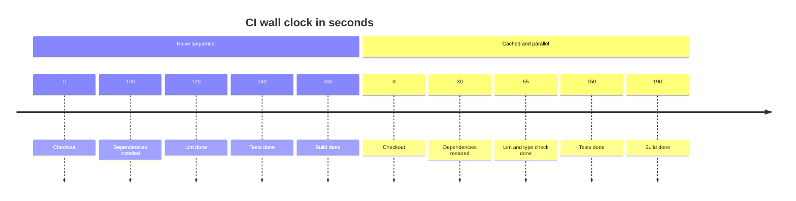

> **Section 05 · Lesson 7** · Level: intermediate · ~18 min · Prereq: [Checks that actually matter](05-Checks-That-Actually-Matter)

## Why this matters

A pipeline that takes twenty minutes will be bypassed. People stop waiting, merge on a hunch, and the checks become theatre. Speed is what keeps the gate in the loop. This lesson covers the levers that cut wall-clock time, the one thing worse than a failing test, and how to keep checks deterministic.


## CI time is a budget

Five levers, in order of payoff:

- **Caching.** Re-downloading dependencies every run is the biggest waste. Cache the download directory keyed on your lockfile hash.
- **Parallel jobs.** Jobs in one workflow run concurrently by default unless you chain them with `needs:`. Lint and unit tests need not wait for each other.
- **Matrix builds.** Test several runtime versions at once, with fail-fast off so one bad combination does not hide the others:

```yaml
    strategy:
      matrix:
        python-version: ["3.11", "3.12"]
      fail-fast: false
```

- **Path filters.** Skip a job when nothing it cares about changed:

```yaml
on:
  pull_request:
    paths:
      - "src/**"
      - "tests/**"
```

  Careful with required checks: if one is skipped because paths did not match, the pull request sits blocked with that check never reported. Use path filters on optional jobs only.
- **Cancel stale runs.** A new push makes the previous run worthless. `concurrency` with `cancel-in-progress: true` stops paying for it.

The same work, cached and parallel:



The naive run ends near 300 seconds; the cached parallel one finishes near 190 because lint, tests, and build overlap. Same checks, a third less waiting.

## Flaky tests are worse than failing tests

A failing test tells you something. A flaky test tells you nothing and teaches everyone to press re-run. Once "just run it again" is normal, a genuinely failing test gets re-run, passes for unrelated reasons, and merges.

Never fix flakiness with automatic retries — a retry hides the symptom and postpones the day it fails in production. Pick one of three options:

- **Quarantine it.** Move it out of the blocking suite and open an issue with an owner and a date.
- **Fix it.** Most flakiness is a shared resource, an unawaited async call, a time dependency, or an order dependency — all real bugs.
- **Delete it.** If it tests nothing meaningful, delete it rather than leaving it skipped forever.

## Deterministic environments

A test that depends on the clock, the network, or random ordering is flaky by design. Close the gaps:

- **Lockfiles.** `npm ci` installs exactly what the lockfile says. A floating range means two runs can install different code.
- **Pinned runtimes.** Match the version CI uses (`python-version: "3.12"`), because a formatter or compiler can produce different output on a different version.
- **Seeded randomness.** Set a fixed seed, or inject a fake random source in tests.
- **Frozen clocks.** Do not read the system clock in code you want to test; pass the time in so a test can supply a fixed value.
- **Fixed timezone.** Set `env: TZ: UTC` in CI and never depend on the machine's local time.

## Split the pipeline

Cheap checks belong on every push; expensive ones do not. Two tiers work well:

- **Fast smoke job** — format, lint, type check, unit tests. Runs on every push and every PR. Target under three minutes.
- **Full job** — integration tests, coverage, build, and a smoke test against a deployed environment. Runs on PRs into `main` and nightly.

For the deployed smoke test, probe a health endpoint after the deploy. The Railway CLI fits here: `railway up --ci` streams build logs and exits when the build completes, and a project token lets the workflow authenticate as `RAILWAY_TOKEN`. Fail the job on a non-200. A deploy that reports success while the service is unhealthy is exactly what this catches.

## Cost control

On a private repository, runner minutes are billed; public repositories are usually free on the standard runners. Check GitHub's current billing page — this changes. The practical controls are the ones above — caching, cancellation, path filters, and not running the same suite on both `push` and `pull_request`.

## Try it

1. Open a recent run and note the minutes spent per step. Find the largest one.
2. Add caching for that step's downloads and compare the next run.
3. Split your suite into a fast job and a full job; trigger the fast one on every push and the full one on PRs to `main`.
4. Run your suite twice in a row on an idle machine and look for a test that behaves differently.
5. Quarantine one flaky test with an issue and a date, then fix or delete it within the week.
6. Set `TZ: UTC` and a pinned runtime, then confirm the suite still passes.

## Common mistakes

- **Retrying flaky tests in CI.** It hides a real defect and makes red meaningless. Quarantine, fix, or delete.
- **Making a path-filtered job a required check.** The check may never report, leaving the PR blocked. Keep filters on optional jobs.
- **Caching without a lockfile-hash key.** The cache either never hits or serves stale dependencies. Key it on the lockfile.
- **Testing against the system clock or the network.** Both produce failures that look random. Inject the clock and fake the network.

## Key takeaways

- Caching, parallel jobs, path filters, and cancellation are the four biggest wins on CI time.
- Never retry a flaky test — quarantine, fix, or delete it.
- Determinism comes from lockfiles, pinned runtimes, seeded randomness, frozen clocks, and a fixed timezone.
- Split work into a fast job on every push and a full job on PRs to `main` and nightly.
- Minutes cost money on private repos, so run gates once, not twice, and cancel stale runs.

## Further learning

- [Deploying with the CLI](https://docs.railway.com/cli/deploying) — `railway up`, CI mode, and project tokens.
- [Railway CLI](https://docs.railway.com/cli) — the rest of the deploy command surface.
- [Secure use reference](https://docs.github.com/en/actions/reference/security/secure-use) — token scope and secret handling for deploy workflows.
- [CI troubleshooting](05-CI-Troubleshooting) — diagnosing a run that fails for no obvious reason.
