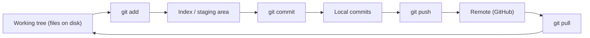

> **Section 05 · Lesson 1** · Level: beginner · ~20 min · Prereq: [Set up your workbench](00-Setup-Your-Workbench)

## Why this matters

An AI coding agent can rewrite forty files in ninety seconds. That speed is only safe because of one boring tool: git. Git is the undo button, the surface where you review what actually changed, and the audit trail that proves which human approved the diff. Without git you are trusting a very fast editor with no memory. With it, every agent move is a commit you can inspect, keep, or throw away.

## The four places a change lives

Most git confusion comes from mixing up four locations. See the loop below.

An agent edits the **working tree** directly. Nothing is saved until you stage it (`git add`) and commit it. The index is a holding area where you choose exactly what goes into the next commit. Commits are local history on your machine; the **remote** is the copy on GitHub that your team and CI can see. `git pull` brings remote commits back into your working tree.

## The twelve commands that cover most days

Learn these and you can ignore the other hundred.

| Command | What it does |
| --- | --- |
| `git init` / `git clone <url>` | Start or copy a repo |
| `git status` | What is changed or untracked |
| `git add <path>` | Stage a change |
| `git commit -m "..."` | Save a checkpoint |
| `git diff` | Show unstaged changes |
| `git log --oneline` | List history, one line each |
| `git branch` | List branches |
| `git switch -c <name>` | Create and switch to a branch |
| `git merge <branch>` | Fold a branch into the current one |
| `git pull` | Fetch the remote and merge it in |
| `git push` | Send your commits to the remote |
| `git restore <path>` | Discard changes to a file |

Run `git status` before you ask an agent to change anything and again before you commit. It tells you whether the agent touched files you did not expect.

## Commits are checkpoints an agent can be rolled back to

Commit small and often, with a message that says *why*. "fix callback signature check" is useful; "updates" is not. A good message lets you look at history in a month and know which change broke or fixed what.

Small commits also keep agent work reviewable. When a diff touches one concern you can read it in full and judge it. When it also touches a refactor and a formatting pass, you review none of it properly, and a wrong change costs five commits to untangle.

The habit that saves the most pain: **commit your own work before you let an agent start.** When the agent goes wrong, `git restore .` returns you to a known-good state in one command.

## Branches, remotes, and conflicts

A **branch** is a movable label pointing at the latest commit in a line of work, so a half-finished feature never touches the main line. The short version: `git switch -c feat/my-change`, work, commit, push, open a pull request. [Branching and pull requests](05-Branching-And-Pull-Requests) covers the full flow.

A **remote** is a named URL pointing at another copy of the repo, usually `origin` on GitHub. `git push` sends commits there; `git pull` brings others' commits back. It is the shared source of truth, not a backup you edit by hand.

A **merge conflict** happens when two branches change the same lines. Git marks the file with `<<<<<<<`, `=======`, `>>>`. Read both sides, delete the markers leaving valid code, then run your tests before committing the merge. Never commit a conflict resolution you have not tested.

## The safety net for agent work

Two rules cover almost every way an agent can hurt your repository. First, never let an agent force-push a shared branch (`git push --force`); it rewrites history others depend on and can erase commits. Second, keep the agent on a branch, never on `main`. A branch is a sandbox: if the work is bad, delete it and nothing shipped.

## Try it

1. In a scratch directory, run `git init` and create a file with three lines.
2. Run `git status`, then `git diff`. Notice the file shows as untracked, and `diff` is empty.
3. Run `git add .` and `git diff --staged`. The lines now appear.
4. Commit with a message that explains the change, then run `git log --oneline`.
5. Edit the file, then run `git restore <file>`. Confirm the edit is gone.
6. Have an agent change something in a real project, but only after you commit your own work.

## Common mistakes

- **Committing without reading the diff.** An agent can add a debug print, a stray import, or a weakened test. Run `git diff --staged` before every commit and read it.
- **Letting an agent commit with `git add -A` on a dirty tree.** That sweeps your unrelated changes into the agent's commit. Commit or stash your own work first, and review what is staged.
- **Force-pushing a shared branch.** It rewrites history others depend on. Push normally; if you must rewrite, do it on a branch nobody else has.
- **Treating the remote as a backup you edit by hand.** Hand-editing files on GitHub while your local branch diverges guarantees a conflict later. Change locally, push, then pull.

## Key takeaways

- Git is your undo button, your review surface, and your audit trail — the thing that makes fast agent edits safe.
- Working tree → index → commit → remote. An agent writes to the working tree; only you decide what gets committed.
- Commit before the agent starts so `git restore` always returns you to a known-good state.
- Small commits with clear messages are reviewable; mixed commits hide bugs.
- Keep agents on a branch and never let one force-push a shared branch.

## Further learning

- [Workflow syntax for GitHub Actions](https://docs.github.com/actions/using-workflows/workflow-syntax-for-github-actions) — where your commits go once CI exists.
- [Secure use reference](https://docs.github.com/en/actions/reference/security/secure-use) — why token and history hygiene matter in automation.
- [Keeping diffs small](03-Keeping-Diffs-Small) — the review habit that pairs with small commits.
- [Git cheat sheet](16-Git-Cheat-Sheet) — the same commands in one list.
