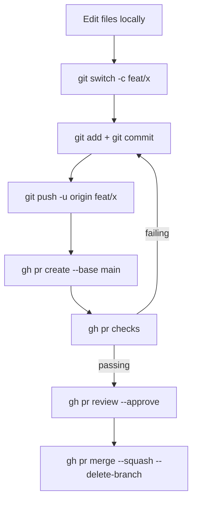

> **Section 05 · Lesson 2** · Level: beginner · ~15 min · Prereq: [Git essentials](05-Git-Essentials)

## Why this matters

Every task that sends you to a browser tab breaks your flow. The GitHub CLI (`gh`) puts issues, pull requests, and CI runs in the same terminal where you already work. That matters twice as much once an agent is driving: `gh pr checks` gives a scriptable yes/no answer about whether a change is safe, and an agent can run the same command you would. This lesson gets you from zero to a merged pull request without leaving the shell.

## Install and authenticate

Install `gh` with your package manager (`brew install gh`, `winget install --id GitHub.cli`, or your distro's package). Then log in:

```bash
gh auth login
# choose GitHub.com, then HTTPS, then authenticate in your browser
gh auth status
```

`gh auth status` prints which account you are logged in as and which scopes the token has. Scopes decide what the token may do. The default login covers repository work; add `workflow` if the CLI will push changes to files under `.github/workflows`, and `read:org` if you need organization data. Add a scope later with:

```bash
gh auth refresh -s workflow
```

Treat the token like a password. Never paste it into a file the repo can see, and never let an agent read it into context.

## The commands you will actually use

| Goal | Command |
| --- | --- |
| Create a repo | `gh repo create my-app --private --source=. --push` |
| Clone a repo | `gh repo clone owner/repo` |
| Open a repo in the browser | `gh repo view --web` |
| File an issue | `gh issue create --title "..." --body "..."` |
| List open issues | `gh issue list` |
| Open a pull request | `gh pr create --base main --title "..." --body "..."` |
| Check CI on your PR | `gh pr checks` |
| Read the diff | `gh pr diff` |
| Merge when green | `gh pr merge --squash --delete-branch` |
| Watch workflow runs | `gh run list`, `gh run watch` |
| Hit any REST endpoint | `gh api ...` |

`gh run view <run-id> --log-failed` prints only the logs from the steps that failed — the fastest way to see why a build is red.

## The proof: one change, end to end

The loop below is the whole workflow. Each step is a command you run.



In one block, for a change you already committed on a branch:

```bash
git push -u origin feat/add-health-endpoint
gh pr create --base main --title "feat: add health endpoint" \
  --body "Adds GET /health for deploy probes. Tested locally with curl."
gh pr checks          # waits, then prints pass/fail per check
gh pr merge --squash --delete-branch
```

`gh pr checks` exits non-zero when a check fails, so it is safe to use in a script. `--squash` collapses your branch into one commit on `main`; `--delete-branch` cleans up the branch and its remote copy.

## When the CLI has no command: gh api

The CLI wraps the common paths. For anything else, `gh api` calls the REST API directly and passes your login token automatically. Ask for a field and pipe it through `jq`:

```bash
# List the titles of open pull requests
gh api repos/OWNER/REPO/pulls --jq '.[].title'

# Get one field from the current repo
gh api repos/{owner}/{repo} --jq '.default_branch'

# Show rate limit remaining
gh api rate_limit --jq '.rate.remaining'
```

GitHub substitutes `{owner}` and `{repo}` from the current repository, so you can run these from inside a clone. `--jq` is built in, so you do not need `jq` installed separately for simple queries. For a POST, pass fields with `-f`:

```bash
gh api repos/OWNER/REPO/issues -f title="OpenAPI drift" -f body="Generated client is out of date."
```

Anything you can click in the GitHub UI has an API endpoint, so `gh api` is the escape hatch that means you never have to invent a command.

## Try it

1. Run `gh auth status` and confirm the account and scopes.
2. Create a throwaway repo: `gh repo create gh-cli-practice --private --clone`.
3. In the clone, add a `NOTES.md`, commit it, and push.
4. Open an issue with `gh issue create`, then list it with `gh issue list`.
5. Create a branch, make a small change, push it, and open a draft PR with `gh pr create --draft`.
6. Run `gh pr checks` and `gh pr view --web` to see the same PR from both sides, then merge it.

## Common mistakes

- **Running `gh pr create` before pushing the branch.** The command needs the branch on the remote. Push first, or let `gh` prompt you to push when it offers to.
- **Assuming `gh auth login` also covers workflow file edits.** Pushing changes under `.github/workflows` needs the `workflow` scope. If a push is rejected, run `gh auth refresh -s workflow` and retry.
- **Reading a silent `gh pr checks` as success.** If no checks are configured, there is nothing to report. Confirm with `gh pr checks --watch` and look for actual check names before merging.
- **Merging locally instead of through the PR.** `gh pr merge` records that the change arrived via review. A local `git merge && git push` bypasses that record and your CI gate.

## Key takeaways

- `gh auth login` once, then `gh auth status` whenever something behaves unexpectedly.
- `gh pr create` → `gh pr checks` → `gh pr merge` is the whole review loop in three commands.
- `gh pr checks` exits non-zero on failure, which makes it usable inside automation.
- Reach for `gh api --jq` instead of inventing a subcommand; every UI action has an endpoint.
- Keep the token out of files and out of agent context.

## Further learning

- [Workflow syntax for GitHub Actions](https://docs.github.com/actions/using-workflows/workflow-syntax-for-github-actions) — what the checks you just watched are defined by.
- [Secure use reference](https://docs.github.com/en/actions/reference/security/secure-use) — token permissions and least privilege for automation.
- [Branching and pull requests](05-Branching-And-Pull-Requests) — the practice behind the commands.
- [GitHub CLI cheat sheet](16-GitHub-CLI-Cheat-Sheet) — the commands in a copy-paste list.
