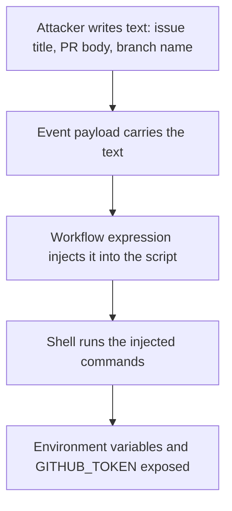

> **Section 05 · Lesson 10** · Level: advanced · ~20 min · Prereq: [Secrets in CI](05-Secrets-In-CI)

## Why this matters

A workflow file is code that runs with your repository's credentials, on a machine that can reach your secrets. Everything you put in it becomes part of your attack surface: the actions you call, the triggers you choose, the strings you interpolate into a shell. Most of the incidents in CI are not exotic — they are a mutable action tag, an unquoted event field, or a trigger that hands a stranger a token. This page is the short list of changes that remove the common ones.

## Pin third-party actions to a full commit SHA

An action reference has two parts: the repository, and the version. `@v4` is a **tag**, and a tag is a pointer that anyone with write access to the action's repository can move. If that repository is compromised, the attacker moves the tag to their commit and your next run executes it — with your secrets in scope. Because a single compromised action in a job can read the credentials of every job that shares the workflow, this is not a small risk.

A full-length commit SHA is immutable: it names one Git object and cannot be repointed. Pin every action that is not yours:

```yaml
    - uses: actions/checkout@<full-commit-sha> # v4
      with:
        persist-credentials: false
    - uses: actions/setup-python@<full-commit-sha> # v5
      with:
        python-version: "3.12"
```

Two habits make this workable: keep the readable version in a trailing comment on the same line, and let Dependabot open pull requests that bump the SHA and update that comment when a release lands. GitHub also offers policies that **reject** any action not pinned to a full SHA — worth turning on if you maintain more than one repository (as of 2026).

Pinning protects you from a moving tag, not from a malicious action. Read what an action does before you pin it, and prefer actions from a verified publisher.

## Script injection

This is the highest-yield thing to fix. Event payloads contain text that strangers control: an issue title, a pull request body, a branch name, a commit message. If that text is interpolated into a `run:` block, it is pasted into the script **before** the shell runs, so quoting does not save you.

```yaml
      # Do not do this — the title becomes part of the script.
      - run: echo "Title: ${{ github.event.pull_request.title }}"
```

The path from attacker text to your credentials looks like this:



The fix is to pass the value through an environment variable, so it arrives as data instead of as script text:

```yaml
      - name: Check pull request title
        env:
          TITLE: ${{ github.event.pull_request.title }}
        run: |
          if [[ "$TITLE" =~ ^octocat ]]; then
            echo "PR title starts with 'octocat'"
            exit 0
          else
            echo "PR title did not start with 'octocat'"
            exit 1
          fi
```

A value that arrives in the environment cannot change the shape of the command; it is just a string the script reads. Double-quote shell variables to avoid word splitting, and treat every `${{ github.event.* }}` inside a `run:` block as a bug to fix.

## Dangerous triggers

`pull_request_target` runs in the context of the **base** repository, which means it gets secrets and a write-capable token — and it can be triggered by a fork's pull request. The failure mode is always the same: the workflow checks out the untrusted pull request's code and then runs something, so the fork authors the script and your repository provides the credentials. That pattern can be used to take over a repository.

Rules that keep you out of trouble:

- Do not use `pull_request_target` unless you specifically need the privileged context, and never check out the pull request's head ref inside it.
- Prefer `workflow_run` for privilege separation when you truly need secrets after a PR workflow has finished, and treat artefacts uploaded by the PR workflow as untrusted input.
- If you must comment on a PR from a privileged workflow, pass the untrusted values to an action as *arguments*, not into a shell script.
- Remember that a fork pull request never gets secrets. If your workflow "requires" one on a fork, you have configured a privileged trigger and opened the door.

## Runners, tokens, and review of the config itself

**Self-hosted runners** are not the ephemeral, clean machines that GitHub-hosted runners are; untrusted code persists on them between jobs and can read anything left on disk. Use them cautiously even on private repositories that accept forks, and almost never for public ones.

**Tokens** follow the rule from the previous lesson: default to read-only, grant the minimum per job, and never grant a broader scope just to clear a 403 that one step produced.

**Workflow changes are changes to your security posture**, so they deserve review like code — and stronger. Put `.github/workflows/` under `CODEOWNERS`, enable Dependabot for action updates, and enable code scanning, which detects risky patterns such as injection and over-broad permissions. When Dependabot opens a bump, read the diff: the pin only helps if a human looked at what moved.

## Try it

1. Open each workflow and replace every `@vN` reference with a full-length commit SHA plus a `# vN` comment.
2. If your repository supports it, turn on the policy that requires actions to be pinned to a full SHA.
3. Search your workflows for `${{ github.event` inside `run:` blocks. Rewrite each one to flow through `env:`.
4. Search for `pull_request_target`. For each one, decide whether it needs the privileged context at all; if not, change the trigger.
5. Add `.github/workflows/` to `CODEOWNERS` and require a code-owner review for merges that touch it.

## Common mistakes

- **Pinning third-party actions but leaving first-party ones on tags.** A compromise in an action you trust is just as dangerous, and "it is official" is not a security property.
- **Using the short seven-character SHA.** It is ambiguous and not the immutability guarantee you think you bought. Use the full-length SHA.
- **Trying to fix injection by quoting the expression.** `echo "${{ github.event.issue.title }}"` looks safer and is not: substitution happens before the shell parses the script. It must go through `env:`.
- **Using `pull_request_target` "because the PR needed secrets" and then checking out the fork's head.** That combination is the classic takeover; it is the reason the trigger has a security page of its own.
- **Granting `write-all` to clear a permission error.** You turned one failing step into a token that can push to the repository. Add the single scope the step needs.
- **Running untrusted pull requests on a self-hosted runner.** The machine persists, so the next job inherits whatever the last one left behind.

## Key takeaways

- Pin every action to a full-length commit SHA, keep the version in a comment, and let Dependabot bump it.
- Never interpolate untrusted event text into a `run:` block; pass it through `env:` and quote the variable.
- Avoid `pull_request_target`; when you must use it, never check out the untrusted head ref.
- Fork pull requests get no secrets — treat any workflow that needs them on a fork as a red flag.
- Keep tokens read-only by default and grant one scope per job.
- Review workflow changes like code, because CI config is code that runs with your credentials.

## Further learning

- [Secure use reference — GitHub Docs](https://docs.github.com/en/actions/reference/security/secure-use) — the script-injection, third-party action, and trigger guidance this page is built from.
- [GitHub Actions policy now supports blocking and SHA pinning actions](https://github.blog/changelog/2025-08-15-github-actions-policy-now-supports-blocking-and-sha-pinning-actions/) — the platform feature that enforces pinning for you.
- [Pinning GitHub Actions for Enhanced Security](https://www.stepsecurity.io/blog/pinning-github-actions-for-enhanced-security-a-complete-guide) — a practitioner walkthrough of the pinning workflow and its trade-offs.
- [GitHub Actions documentation](https://docs.github.com/en/actions) — the root for triggers, contexts, and permissions.
