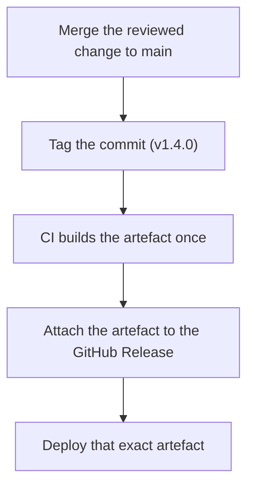

> **Section 05 · Lesson 11** · Level: intermediate · ~15 min · Prereq: [Branching and pull requests](05-Branching-And-Pull-Requests)

## Why this matters

A commit hash is a perfect identifier and a terrible announcement. Nobody says "we shipped 4f9c2ab". A release gives a change a name people can talk about, an artefact they can download, and a note that explains what changed. Get this right and "which version is in production?" has a one-word answer. Get it wrong and you spend an hour diffing tags to work out what is actually deployed.

## Semantic versioning in one paragraph

`MAJOR.MINOR.PATCH` — `1.4.2`. Increment **PATCH** for a backward-compatible bug fix, **MINOR** for backward-compatible new functionality, and **MAJOR** when you break something someone depends on. That is the whole scheme; the hard part is deciding what "breaking" means for what you ship.

- **An HTTP API** breaks when an existing client would stop working: a field removed from a response, a field renamed, an enum value that used to be rejected now accepted, a required parameter added, an auth rule tightened. Adding an optional field is a MINOR.
- **A CLI** breaks when a documented command, flag, or output format changes in a way a script would notice — including the exit codes. Adding a subcommand is a MINOR; changing what `status --json` emits is a MAJOR.
- **A mobile app** breaks when a user cannot update in a straight line. Store review, users who do not update, and an API that has moved on all collide, so mobile rewards additive releases and long deprecation windows over clean breaks.

## Tags, releases, and conventional commits

A **tag** is a name pointing at one commit. A **GitHub Release** is a tag plus notes plus optional downloadable files. Tag the commit you actually shipped, and treat published tags as permanent:

```bash
git tag -a v1.4.0 -m "v1.4.0"
git push origin v1.4.0
gh release create v1.4.0 ./dist/app-1.4.0.tar.gz \
  --title "v1.4.0" --notes-file CHANGELOG.md
```

Never delete or re-point a tag a consumer has pinned to; that is how "it worked yesterday" starts. If a release is wrong, cut a new patch version.

**Conventional commits** give you a machine-readable history. A commit subject shaped like `type(scope): subject` — `fix(payouts): reject short account numbers`, `feat(api): add wallet endpoint` — lets a tool work out the next version and group the changelog for you: `fix` maps to a patch, `feat` to a minor, and a `!` or a `BREAKING CHANGE:` footer to a major. You can enforce the shape on the pull request title with a small script step, which keeps the history honest without asking anyone to remember a rule. The automatic bump is a suggestion, though; a mislabelled `feat` that actually changes output is a MAJOR that shipped as a minor, so read the generated notes before you publish them.

## A changelog as the human-readable history

`CHANGELOG.md` in the repository, newest first, one section per version, with a link to the release. Keep an `Unreleased` heading at the top so entries land as work merges rather than being reconstructed later:

```markdown
# Changelog

## Unreleased

## [1.4.0] - 2026-05-02
### Added
- Wallet endpoint for merchant balance
### Fixed
- Reject account numbers shorter than six digits

[1.4.0]: https://github.com/your-org/your-repo/releases/tag/v1.4.0
```

Release notes kept only in the GitHub Release and nowhere in the repository are invisible to everyone reading the code.

## Build once, attach, deploy the same artefact

The rule that removes a whole class of "but it worked in staging" bugs: **build the artefact once, attach that exact file to the release, and deploy that exact file.** If the deploy stage rebuilds from source, you are shipping something no test ever touched.



```yaml
name: Release
on:
  push:
    tags: ["v*"]
permissions:
  contents: write
jobs:
  release:
    runs-on: ubuntu-latest
    steps:
      - uses: actions/checkout@<full-commit-sha> # v4
      - name: Build the artefact once
        run: ./scripts/build.sh "${{ github.ref_name }}"
      - uses: actions/upload-artifact@<full-commit-sha> # v4
        with:
          name: app-${{ github.ref_name }}
          path: dist/
      - name: Publish the release
        env:
          GH_TOKEN: ${{ secrets.GITHUB_TOKEN }}
        run: gh release create "${{ github.ref_name }}" dist/* --generate-notes
```

Some teams also keep a **moving tag** per environment — `staging-api` for the last commit whose API was deployed to staging, `prod-api` for the last one promoted. That single tag answers "what is actually running?" without opening a dashboard. Because the workflows force-move those tags, never move or delete them by hand; a tag that a human touched quietly stops being trustworthy.

## Version pinning discipline

Read the version from **one source of truth** and derive everything else from it. Many stacks already store it: `package.json`, `pyproject.toml`, `pubspec.yaml`. Tag names, build inputs, and the "latest download" link should all be computed from that one value, never typed a second time. Then add a check that the released tag matches the file, and fail the release if it does not — a mismatch between `v1.4.0` and a file that says `1.3.9` is a bug that hides until someone downloads the wrong binary. The same applies to artefacts: build a versioned, immutable file per release (for example `app-1.4.0.tar.gz`) and let a stable name be a pointer to whichever version is current, updated by the release workflow rather than by hand.

## Try it

1. Add `CHANGELOG.md` with an `Unreleased` heading and a link pattern for versions.
2. Tag a commit, push the tag, and create a release with `gh release create` attaching a build output.
3. Add the release workflow above and confirm a new tag produces a release with the artefact attached.
4. Add a step that reads the version from your project file and fails when it does not match the tag.
5. Re-read your last three commit subjects and rewrite them as conventional commits.

## Common mistakes

- **Rebuilding during deploy.** The deployed binary then differs from the released one; the smoke test proved nothing. Build once, ship the file you built.
- **Deleting or re-pointing a published tag.** Anyone pinned to it can no longer reproduce their build. Ship a new patch version instead.
- **Bumping the version in two places.** The tag says one thing and the file says another. Derive from one source and assert the match in CI.
- **Trusting an automatic major bump.** A commit typed `feat` that actually changes an API response ships a breaking change as a minor. Read the generated notes.
- **Changelog only in the release, or only in the file.** Keep the repository file as the history and link each release to its section.
- **A hand-moved environment tag.** Once a human edits it, it stops being evidence of what is deployed.

## Key takeaways

- Version as `MAJOR.MINOR.PATCH`; decide "breaking" per interface, not by feeling.
- Tag the shipped commit, treat published tags as permanent, and never re-point one.
- Use conventional commits to generate the version bump and the changelog grouping, then review them.
- Build the artefact once, attach it to the release, and deploy that same file.
- Read the version from one source of truth and fail CI when the tag disagrees.
- Keep a moving per-environment tag as the record of what is deployed, moved only by workflows.

## Further learning

- [Versioning and release notes](12-Versioning-And-Release-Notes) — how release notes fit a team's change-tracking routine.
- [Workflow syntax for GitHub Actions](https://docs.github.com/actions/using-workflows/workflow-syntax-for-github-actions) — the reference for the `on: push: tags:` trigger and `permissions:` used above.
- [Secure use reference — GitHub Docs](https://docs.github.com/en/actions/reference/security/secure-use) — why the release workflow's `GITHUB_TOKEN` should be scoped to `contents: write` and nothing else.
