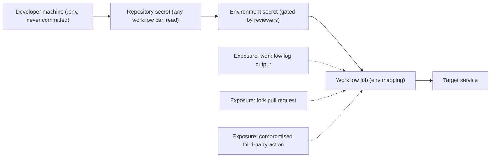

> **Section 05 · Lesson 9** · Level: intermediate · ~15 min · Prereq: [Your first CI pipeline](05-Your-First-CI-Pipeline)

## Why this matters

Your pipeline needs credentials: a database URL to run migrations, a deploy token, an API key for an integration test. The moment a credential enters a workflow it becomes readable by everyone who can read the repository and by every action that workflow calls. This page is about putting secrets where the runner can use them without leaking them into a log, into a fork's pull request, or into the hands of a compromised dependency.


## Where secrets live

- **Repository secrets** — **Settings → Secrets and variables → Actions**. Any workflow in the repository can read them, and any user with write access to the repository can read them too. So scope the credential itself, not just the secret: a token that can only deploy one service is worth more than a promise.
- **Environment secrets** — attached to an environment such as `production`. A job reads them only after that environment's protection rules pass, which is what makes them different from repository secrets.
- **Organisation secrets** — shared with selected repositories. Convenient for one deploy token across many repositories; keep the repository list tight.
- **OIDC tokens** — the workflow asks GitHub for a short-lived, signed identity token and exchanges it with a cloud provider that trusts it. Nothing long-lived is stored, so nothing long-lived can leak. Provider support and setup vary, so check the docs for your provider.

The supply chain below is the whole picture, with the three places it leaks marked:



## Environments with required reviewers

An environment turns a deploy into a decision. Create the environment (for example `production`) under **Settings → Environments**, add yourself or a teammate as a **required reviewer**, and then have the job name it:

```yaml
jobs:
  promote:
    runs-on: ubuntu-latest
    environment: production
    steps:
      - name: Deploy
        env:
          DATABASE_URL: ${{ secrets.DATABASE_URL_PRODUCTION }}
        run: ./scripts/deploy.sh
```

The run now pauses at "waiting for approval" and no job step — and no environment secret — is available until a reviewer clicks approve. That single setting is what makes a production deploy deliberate rather than a side effect of a merge. [Deployment pipelines](05-Deployment-Pipelines) builds the full promotion flow around it.

## Never echo, always mask, rotate on exposure

Redaction is real but best-effort. The runner redacts values it knows are secrets by matching them exactly, which means a secret that gets **transformed** — base64-encoded, URL-encoded, assembled into a JSON blob — can pass through into the log untouched. Treat these as rules:

- Never print a secret. Pass it through an environment variable, never as a command-line argument (arguments are visible in the process list of the machine).
- Mask values you generate inside the workflow with `echo "::add-mask::$VALUE"` so they are redacted if they later appear.
- Register derived secrets. If you sign a token with a key, the signed token is a secret too; if it is not registered, it will not be redacted.
- Never paste a structured blob (JSON, YAML, a whole config file) into a single secret. Exact-match redaction fails on blobs. Use one secret per value.
- **Assume a leaked log is a leaked key.** If a secret prints, delete the log *and* rotate the secret. Deleting the log does not un-leak it.
- Rotate on a schedule and delete secrets you no longer use. An old sandbox credential that still works is a finding waiting to happen.

## Least privilege for GITHUB_TOKEN

The `GITHUB_TOKEN` is minted for every run and has whatever permissions you grant. Set the default to read-only at the repository or organisation level, then widen it per job only where a job genuinely needs to write:

```yaml
permissions:
  contents: read

jobs:
  build:
    runs-on: ubuntu-latest
    steps:
      - uses: actions/checkout@<full-commit-sha> # v4
      - run: ./scripts/build.sh

  publish:
    runs-on: ubuntu-latest
    permissions:
      contents: read
      id-token: write   # only to exchange a short-lived OIDC token
    steps:
      - run: ./scripts/publish.sh
```

A token that can write to `contents` can push to your repository. A workflow that only reads code should not be able to push anything, even if an action it calls is malicious.

## Secret scanning and push protection

You will eventually paste a key. The backstop is GitHub's own secret scanning, which flags recognised credential patterns in the repository, and **push protection**, which blocks the push before the secret ever lands. Turn both on: scanning catches what is already there, push protection stops the next one. Neither is a substitute for rotating a leaked credential, and neither knows about a token format that is not in its pattern list — so keep your own habit of checking `git status` before you commit.

## Try it

1. Add a repository secret (say `SERVICE_API_KEY`), and map it into a step with `env:`. Add a second step that prints the length of the value, not the value.
2. Create a `production` environment, add yourself as a required reviewer, and give a job `environment: production`. Run it and watch the run wait for approval.
3. Set the repository's default `GITHUB_TOKEN` permissions to read-only, then fix any job that now fails by adding back exactly the one scope it needs.
4. Open your secret-scanning settings and confirm both scanning and push protection are enabled. Read the current alert list.
5. Rotate one existing secret end to end: generate the new value, update it in the secret store, redeploy, confirm the old value no longer works, and delete the old one.

## Common mistakes

- **Printing a secret and trusting redaction.** It holds for the exact string and fails for anything encoded or reassembled. One `echo` of a base64-encoded token is a leak.
- **Passing a secret as a command-line argument.** `./deploy.sh --token "$TOKEN"` shows the value in the process table on a shared or self-hosted runner.
- **One secret holding a whole config file.** Blob secrets defeat exact-match redaction; split them into individual values.
- **Reusing production credentials in CI for staging tests.** Staging then has the blast radius of production, and a fork or a test bug hits live data. Use separate credentials per environment.
- **Expecting secrets to be available on fork pull requests.** They are deliberately withheld. If a workflow "needs" them on a fork, it is using a privileged trigger wrongly — see [Hardening GitHub Actions](05-Hardening-GitHub-Actions).
- **Committing `.env` and deleting it in the next commit.** The value lives in history forever. Rotate it; do not just delete the file.

## Key takeaways

- Prefer environment secrets with required reviewers over repository secrets for anything that touches production.
- Prefer short-lived OIDC tokens over long-lived keys wherever the provider supports them.
- Default `GITHUB_TOKEN` to read-only and grant one scope per job that needs it.
- Redaction is best-effort; never echo a secret, mask generated values, and register derived secrets.
- Treat every leaked log entry as a compromised key: delete the log and rotate the credential.
- Enable secret scanning and push protection as the backstop for the secret you will eventually paste.

## Further learning

- [Secure use reference — GitHub Docs](https://docs.github.com/en/actions/reference/security/secure-use) — secrets handling, masking, and OIDC, in the words of the platform.
- [Workflow commands for GitHub Actions](https://docs.github.com/en/actions/reference/workflows-and-actions/workflow-commands) — the `::add-mask::` and other commands referenced above.
- [Secrets hygiene](09-Secrets-Hygiene) — the personal-workflow counterpart to this page.
