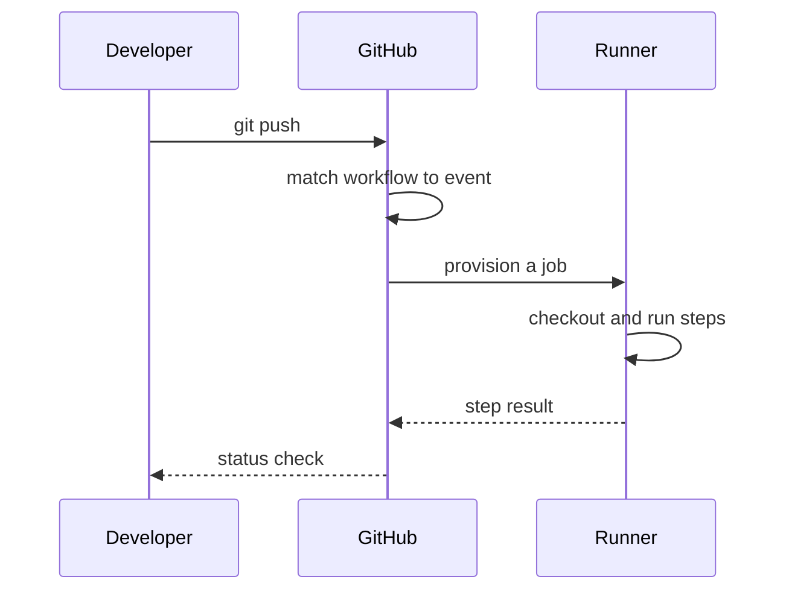

> **Section 05 · Lesson 4** · Level: beginner · ~20 min · Prereq: [Branching and pull requests](05-Branching-And-Pull-Requests)

## Why this matters

CI/CD means continuous integration and continuous delivery: a machine that runs your checks on every change so a broken commit never reaches `main` by accident. GitHub Actions is the machine GitHub gives you, configured with a YAML file in your repo. Six words of vocabulary separate copying a workflow from being able to fix one.


## Six words, then a workflow

- **Workflow** — one YAML file in `.github/workflows/` that says "run these things when this happens".
- **Event** — the trigger, written under `on:`.
- **Job** — a unit of work with a runner and steps. Jobs run in parallel unless you order them.
- **Step** — one command or action; steps run in order.
- **Action** — a published, reusable unit referenced with `uses:`.
- **Runner** — the machine that runs a job (`runs-on: ubuntu-latest` is a fresh Linux VM).

Here is a complete workflow for a Python project. Read it twice.

```yaml
name: PR checks

on:
  pull_request:
    branches: [main]

permissions:
  contents: read

jobs:
  test:
    runs-on: ubuntu-latest
    timeout-minutes: 15
    steps:
      - uses: actions/checkout@v4
      - uses: actions/setup-python@v5
        with:
          python-version: "3.12"
      - name: Install dependencies
        run: pip install -r requirements.txt
      - name: Lint and test
        run: |
          ruff check .
          pytest -q
```

`name:` is the label on the PR. `on:` limits it to pull requests into `main`. `permissions:` shrinks the automatic token to read-only, the recommended default. `jobs.test` is one job on a clean Ubuntu runner. `actions/checkout@v4` copies your repo in — without it the runner has no files. `actions/setup-python@v5` installs the runtime. The last step is a plain shell command, so a non-zero exit fails the job.

Here is that flow:



## Triggers, and what each costs

- `pull_request` — runs on every update to a PR. This is where your gates belong.
- `push` — runs on every push to the branches you list. Use it for `main` only, not for every branch, or you run everything twice.
- `workflow_dispatch` — adds a "Run workflow" button. Use it for deploys and promotions that a human should start.
- `schedule` — a cron timer. It burns runner minutes even when nothing changed, so reserve it for nightly jobs.

On a private repository, every runner minute is billed; public repositories are usually free on standard runners (check GitHub's current billing docs — this changes). Keep PR checks short and move slow suites to a nightly schedule.

## Runners, limits, and cancellation

A GitHub-hosted runner is a clean machine that exists for one job, then disappears. Nothing you write to it survives, which is why dependencies are re-installed every run and caching exists. Set `timeout-minutes:` at the job level so a hung test fails in fifteen minutes instead of holding a runner for hours.

Two pushes to a branch make the older run worthless. A concurrency group cancels it:

```yaml
concurrency:
  group: pr-${{ github.ref }}
  cancel-in-progress: true
```

`github.ref` is the branch ref, so each PR gets its own group, and a new push cancels the previous run. Never use this on a deploy job — you do not want a deploy cancelled halfway.

## Moving data between steps and jobs

Three mechanisms, three purposes:

- **`env`** — environment variables available to a step or a job. Good for configuration values.
- **`$GITHUB_OUTPUT`** — how a step publishes a small result that a later step can read.
- **Artifacts** — files (a coverage report, a build output) uploaded from one job and downloaded in another.

An output looks like this:

```yaml
      - name: Detect changed area
        id: scope
        run: |
          if git diff --name-only HEAD~1 | grep -q '^src/'; then
            echo "run_integration=true" >> "$GITHUB_OUTPUT"
          else
            echo "run_integration=false" >> "$GITHUB_OUTPUT"
          fi
      - name: Integration tests
        if: steps.scope.outputs.run_integration == 'true'
        run: pytest -q tests/integration
```

The step needs an `id` so later steps can reference `steps.scope.outputs.<name>`. Write to `$GITHUB_OUTPUT` with an append; it replaced the removed `set-output` command. Order jobs with `needs:`:

```yaml
  integration:
    needs: test
    runs-on: ubuntu-latest
```

`needs: test` means the integration job waits for `test` and is skipped if it fails. That is how a pipeline gets a shape instead of a pile.

## Local sanity before you push

Validate the YAML first — a bad indent means GitHub ignores the workflow. Then run the same commands locally:

```bash
python -c "import yaml; yaml.safe_load(open('.github/workflows/pr.yml'))"
ruff check . && pytest -q
```

If the commands pass locally and the job fails, the cause is almost always environmental: a different runtime, a missing system package, or an unset variable.

## Try it

1. Create `.github/workflows/pr.yml` with the workflow above, adjusted to your project.
2. Validate it: `python -c "import yaml; yaml.safe_load(open('.github/workflows/pr.yml'))"`.
3. Run the same lint and test commands in your terminal and fix anything they catch.
4. Commit, push a branch, and open a PR. Watch the run appear under the Checks tab.
5. Add `concurrency` with `cancel-in-progress: true` and push twice quickly. Confirm the first run is cancelled.
6. Break one test on purpose and confirm the job fails.

## Common mistakes

- **Forgetting `actions/checkout`.** Every `run:` step then executes in an empty directory and fails with "file not found". The checkout step must come first.
- **Using a `uses:` action that does not exist, or a tag that was never published.** An invented action name or a guessed version fails at job start. Stick to well-known actions and their real major tags.
- **Interpolating untrusted input into a shell command.** A PR title containing `"; rm -rf ...` can inject into your script. Pass untrusted values through an `env:` variable and quote it.
- **Running the same suite on `push` and `pull_request`.** You pay for it twice and reviewers wait longer. Trigger checks on PRs, and on pushes only to `main`.

## Key takeaways

- A workflow is a YAML file; `on:` decides when, jobs are runners plus steps, and `uses:` pulls in actions.
- Run gates on `pull_request`; reserve `schedule` and `workflow_dispatch` for jobs that should not run on every change.
- GitHub-hosted runners are ephemeral, so install and cache deliberately, and set `timeout-minutes`.
- Pass data with `env`, step outputs via `$GITHUB_OUTPUT`, files via artifacts, and order jobs with `needs:`.
- Validate the YAML and run the commands locally before you push.

## Further learning

- [Workflow syntax for GitHub Actions](https://docs.github.com/actions/using-workflows/workflow-syntax-for-github-actions) — the full reference for every key used above.
- [Workflows](https://docs.github.com/en/actions/concepts/workflows-and-actions/workflows) — concepts behind the YAML.
- [Workflow commands for GitHub Actions](https://docs.github.com/en/actions/reference/workflows-and-actions/workflow-commands) — `$GITHUB_OUTPUT`, masking, and annotations.
- [Secure use reference](https://docs.github.com/en/actions/reference/security/secure-use) — token permissions, injection, and pinning actions.
