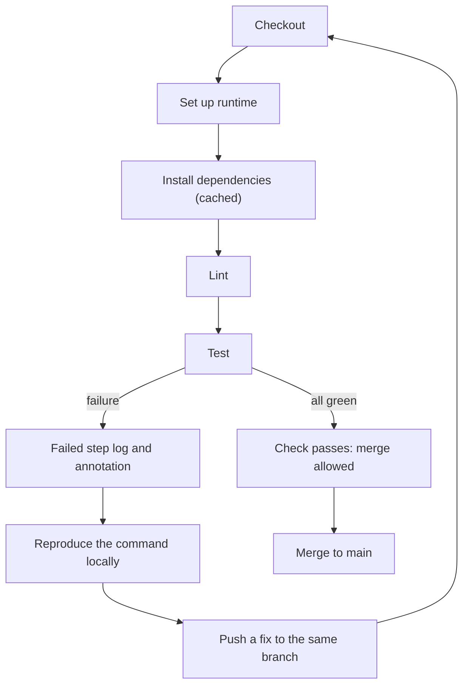

> **Section 05 · Lesson 5** · Level: beginner · ~20 min · Prereq: [Writing GitHub Actions](05-Writing-GitHub-Actions)

## Why this matters

A pipeline that runs your checks but never fails is worse than no pipeline, because it teaches you to trust a green tick that means nothing. This lesson builds one complete `pr.yml` for a small project, wires in caching, and makes sure a failing test actually turns the check red.


## A complete workflow for a small project

Save this as `.github/workflows/pr.yml`.

```yaml
name: PR checks

on:
  pull_request:
    branches: [main]

permissions:
  contents: read

jobs:
  checks:
    runs-on: ubuntu-latest
    timeout-minutes: 20
    steps:
      - uses: actions/checkout@v4

      - uses: actions/setup-python@v5
        with:
          python-version: "3.12"

      - name: Cache pip downloads
        uses: actions/cache@v4
        with:
          path: ~/.cache/pip
          key: pip-${{ runner.os }}-${{ hashFiles('requirements.txt') }}

      - name: Install
        run: pip install -r requirements.txt

      - name: Lint
        run: ruff check .

      - name: Test
        run: pytest -q
```

For a Node project the same shape works: swap in `actions/setup-node@v4` with `node-version`, cache `~/.npm`, key on `hashFiles('package-lock.json')`, and use `npm ci`, `npm run lint`, `npm test`.

The order matters. Checkout first, because every later step needs files. Runtime second, because install needs it. Then install, then cheap checks before expensive ones. The job graph below shows where a failure sends you.



## Why caching and pinned versions matter from day one

Without a cache, every run downloads every dependency from scratch. That is a minute or two of pure waiting on every push, multiplied by every PR, multiplied by everyone on the repo. `actions/cache@v4` stores the download directory between runs and restores it when the key matches. The key includes `hashFiles('requirements.txt')`, so when your dependencies change the cache is not reused — which is exactly what you want. A stale cache that hides a dependency change causes failures nobody can explain.

Pinned versions apply to actions, not just packages. `actions/checkout@v4` points at a major-version tag, and a tag can be moved to different code. The secure-use guidance is that pinning to a full-length commit SHA is the only immutable way to reference an action; GitHub also offers repository and organization policies that require SHA pinning. Start with major tags for readability and pin to a SHA for anything third-party or sensitive:

```yaml
      - uses: actions/checkout@v4  # pin to a full commit SHA for an immutable release
```

## Fail loudly

The classic beginner trap is a test step that cannot fail. Watch for these:

```yaml
      - name: Test
        run: pytest -q || true      # swallows the exit code
        continue-on-error: true     # any failure is reported as a warning
```

A pipeline built like that is green forever. The other version of the same bug is a pipe:

```yaml
      - name: Test
        shell: bash
        run: |
          set -o pipefail
          pytest -q | tee pytest.log
```

Without `set -o pipefail`, the status of the pipeline is the exit status of the *last* command — `tee` — which succeeds even when `pytest` failed. Add `pipefail` whenever you pipe a check into another command.

Verify the trap is really closed: break a test, push, and confirm the check goes red. Do that once, deliberately, before you trust the pipeline.

## Reading a failed run

Open the run from the PR's Checks tab or with the CLI. Three places tell you what happened:

- **The job graph** shows which jobs ran, which were skipped, and which failed in the dependency order you configured.
- **Step logs** expand per step. Only one or two steps usually matter; `gh run view <run-id> --log-failed` prints just the failed steps.
- **Annotations** appear next to your code in the PR's Files changed view. They come from `::error::` and `::warning::` lines in a script, so adding one is a good way to point a reviewer at a problem.

Then reproduce it locally. Run the exact commands the job ran — `ruff check .`, `pytest -q` — in the same runtime version. When they pass locally and fail in CI, the cause is almost always environmental: a different runtime, a missing system package, a file that is gitignored but present on your machine, or an unset variable. The fastest fix is to run the command inside the same container image the job uses.

## Try it

1. Add the workflow above to a small project and commit it on a branch.
2. Open a PR and watch the run under the Checks tab.
3. Deliberately break a test, push, and confirm the check fails. Fix it and confirm it goes green.
4. Add `actions/cache@v4` and compare two consecutive run durations. The second should be faster.
5. Introduce a pipe with `| tee` without `pipefail` and confirm a failing test still shows green — then add `set -o pipefail` and confirm it goes red.
6. Run `gh pr checks --watch` from your terminal and watch the same run from the CLI.

## Common mistakes

- **A step that ignores exit codes.** `|| true`, `continue-on-error: true`, and unguarded pipes all report success on failure. Remove them and add `set -o pipefail` when you pipe.
- **Caching the wrong directory or an unstable key.** A key that changes every run never hits, and a key that never changes serves stale dependencies. Key on the lockfile hash.
- **Using floating action versions everywhere with no review.** A moved tag silently changes what runs in your CI. Pin third-party actions to a commit SHA.
- **Blaming the code when the environment differs.** "Passes locally, fails in CI" is usually the runtime version or a missing system dependency. Match the environment before you change code.

## Key takeaways

- A complete pipeline is checkout → runtime → cache → install → lint → test, in that order.
- Cache dependency downloads keyed on your lockfile hash, or you pay the same cost every push.
- Pin actions to a commit SHA for anything you do not fully trust; a tag can move.
- Prove a failing test fails the job, then never use `|| true`, `continue-on-error`, or an unguarded pipe around a check.
- Reproduce failures locally with the exact same commands and runtime before editing code.

## Further learning

- [Dependency caching](https://docs.github.com/en/actions) — the caching concepts behind `actions/cache`.
- [Workflow syntax for GitHub Actions](https://docs.github.com/actions/using-workflows/workflow-syntax-for-github-actions) — `timeout-minutes`, `continue-on-error`, and `shell`.
- [Workflow commands for GitHub Actions](https://docs.github.com/en/actions/reference/workflows-and-actions/workflow-commands) — annotations and `::error::`.
- [CI troubleshooting](05-CI-Troubleshooting) — what to do when a red run makes no sense.
