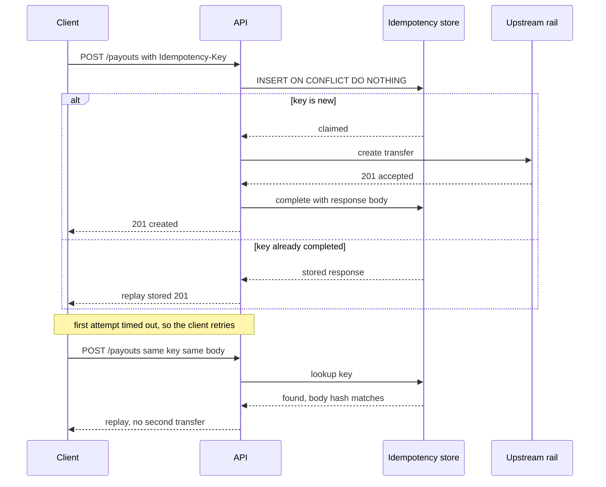

> **Section 06 · Lesson 1** · Level: intermediate · ~20 min · Prereq: [Data modeling basics](06-Data-Modeling-Basics)

## Why this matters

An API is the contract between everything that calls your service and the data model beneath it. Once a mobile app you cannot force-update depends on a field name, that name stops being yours to change. Most "the app shows an empty list but the API returned data" bugs are contract bugs, not database bugs.

## Resources and verbs

Let the URL name the thing and the method name the action.

| Method | Meaning | Safe to retry? |
|--------|---------|----------------|
| `GET` | read the thing | yes, no side effects |
| `POST` | create, or run an operation | no, unless you use an idempotency key |
| `PATCH` | change part of the thing | no |
| `PUT` | replace the thing | no |
| `DELETE` | remove the thing | no |

`GET /payouts/:id` reads a payout. `POST /payouts` creates one. Resist verbs in paths such as `/createPayout` or `/getPayoutList` — they grow into a second, inconsistent API beside the first.

## One wire format, decided once

Pick camelCase or snake_case and enforce it in exactly one place. On a real payments backend, database rows lived in snake_case and API responses in camelCase, converted by a single serialisation helper so client models always matched. A route that bypassed the helper returned raw snake_case keys, the client's parser threw a silent type error, and the user saw "no wallet yet" while the API had returned perfect data.

Two rules follow. Keep one conversion boundary so a new route cannot opt out. Parse optional fields defensively (`json["x"] as String? ?? ""`) so one renamed field degrades to a missing value rather than a blank screen.

## Errors that mean something

Use `400` for a malformed request, `401` for bad credentials, `403` for a caller who is authenticated but not allowed, `404` for a missing thing, `409` for a conflict, `422` for validation failure, `429` for rate limiting, and `5xx` for your fault.

Every error should carry the same body:

```json
{
  "error": {
    "code": "E_INSUFFICIENT_BALANCE",
    "message": "Balance too low for this transfer"
  }
}
```

The `code` is stable and machine-readable; the `message` is for humans and may change. Log the upstream provider's raw text, but never return it — upstream messages leak internal hostnames and account identifiers.

## Versioning, pagination, filtering, rate limits

- **Versioning.** Put a version in the path (`/v1/...`) from day one. Additive changes need no new version; removing or renaming a field does. Announce a deprecation window first.
- **Pagination.** Prefer a cursor over an offset: offsets drift when rows are inserted mid-scan, skipping or repeating items. Cap page size server-side.
- **Filtering.** Use explicit query parameters with a documented allowlist. Never interpolate a client-supplied column name into SQL.
- **Rate limits.** Return `429` with a `Retry-After` header. Limit per identity first and per IP second, and derive the IP from a trusted proxy header, not one the client supplied.

## Idempotency keys for anything that moves value

A create endpoint that moves money, sends a message, or charges a card must accept an `Idempotency-Key` header. The server claims the key atomically, runs the work, and stores the response. A retry with the same key and the same body replays the stored response instead of doing the work twice.



Two details separate a working key from a dangerous one. If the same key arrives with a different body, return `422` — never overwrite and re-execute. And when the upstream call times out, do not delete the key: the upstream may have executed. Mark it ambiguous, return `504` telling the caller to check their history, and let reconciliation settle it.

## Let CI check the docs

Generate an OpenAPI document from your routes and commit it. Then have CI fail when the committed file and the generated one differ, so the docs cannot drift:

```bash
python -m tools.gen_openapi > /tmp/openapi.json
diff -u docs/openapi.json /tmp/openapi.json
```

## Try it

1. Write one endpoint's contract on paper: URL, method, request body, success status, error codes, pagination shape.
2. Send two identical `POST` requests with the same `Idempotency-Key` and confirm you created only one row.
3. Call the endpoint with a missing field, a bad token, and a nonexistent id. Check each returns a distinct status code and the same error body shape.
4. Generate an OpenAPI file, commit it, and add the `diff` check above to CI.

## Common mistakes

- **Returning `200` with `{"success": false}`** — clients, retries and dashboards all read it as success. Use the status code.
- **Echoing the upstream error message** — it leaks internal detail, and sometimes identifiers. Map it to your own code.
- **Deleting the idempotency key on timeout** — if the upstream executed, the retry pays twice. Keep it ambiguous.
- **Overwriting the stored request hash on key reuse** — a client with a hardcoded key can then run different operations under one key. Return `422`.
- **Offset pagination over a live table** — rows inserted during the scan shift the window and you skip records.
- **A second serialisation path** — one helper for the whole API, or keys will drift per route.

## Key takeaways

- URL names the resource, method names the action, and there is one collection endpoint per resource.
- Decide camelCase or snake_case once and enforce it in a single serialisation boundary.
- Status codes plus a stable error `code` are part of the contract; never leak upstream text.
- Idempotency keys are mandatory for create-and-move-value endpoints, and a timeout must not free the key.
- Generate your OpenAPI spec and let CI fail when the committed copy drifts from the code.

## Further learning

- [OWASP API Security project](https://owasp.org/) — the API risk catalogue behind most of these mistakes.
- [Anthropic engineering](https://www.anthropic.com/engineering) — wiring an API into agent workflows without losing the contract.
- [Railway docs](https://docs.railway.com/) — deploying the service that serves this API.
