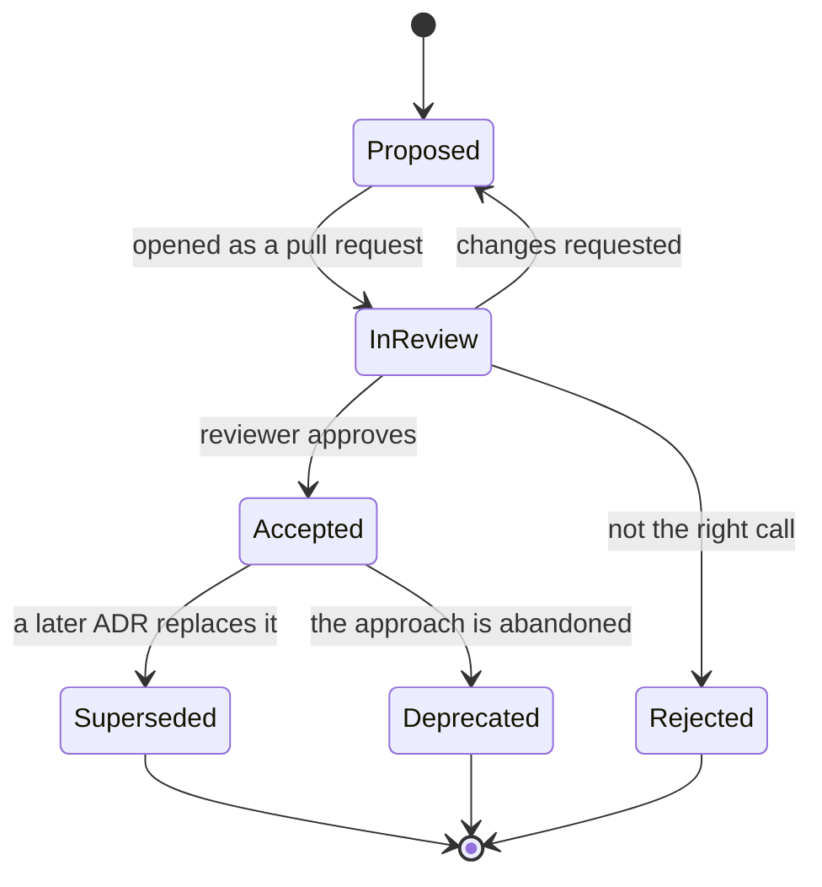

> **Section 06 · Lesson 5** · Level: beginner · ~15 min · Prereq: [Why architecture before code](06-Why-Architecture-Before-Code)

## Why this matters

Six months from now, someone will ask why the tenant key sits on every table, or why one provider call is queued and another is not. If the answer lives in a chat session that has been deleted, the question gets answered by whoever argues hardest, and the answer changes. An architecture decision record is one dated file per significant decision, and it costs twenty minutes.

## What an ADR is

An ADR is a short markdown file, numbered, committed with the change it explains. It contains five things:

- **Context** — the forces: the constraint, the deadline, the incident that forced a choice.
- **Options considered** — the real alternatives, with their trade-offs.
- **Decision** — what you chose, in the active voice.
- **Consequences** — what becomes easier, what becomes harder, what everyone must now do.
- **Status and date** — proposed, accepted, superseded, deprecated.

One decision per file. The MADR template is a widely used format; a minimal version looks like this.

```markdown
# 0007 One idempotency table for all money movement

- Status: accepted
- Date: 2026-08-15
- Supersedes: none

## Context
Two simultaneous payout requests both passed a read-then-insert duplicate
check and started two transfers. The check and the insert were not atomic.

## Options considered
1. Per-endpoint deduplication in application memory
   - Cheap, but lost on restart and wrong on more than one instance.
2. A unique index on a request fingerprint built in the route
   - Correct at the database, but every route must build it the same way.
3. A central idempotency table claimed with INSERT ... ON CONFLICT DO NOTHING
   - One extra write per request; a single mechanism for every money route.

## Decision
Option 3. Every money-movement route claims a key before calling the provider.

## Consequences
- Losing the claim race returns 409, and clients must treat that as "already done".
- Reusing a key with a different body returns 422 instead of re-executing.
- A claim that times out becomes ambiguous and is reconciled, never deleted.
```

## Write it when the decision is made

A decision with no rejected alternatives is an announcement, not a record: the next person cannot tell whether their idea was considered and dismissed.

The trigger list matters more than the format: write an ADR when a change touches the database schema, an external provider, the data a client may see, or how money or identity is verified. The payments platform that did this put the checklist in its pull request template — a schema change means a migration *and* an ADR; a new external dependency means an ADR.

## Immutable once accepted

An accepted ADR is history. When the decision changes, do not rewrite the file — write a new one that supersedes it, and add a line to the old file pointing forward. This keeps the original context intact, which is exactly what you need when you ask "why did we ever do it that way?" and the answer is "because of a constraint that no longer exists".

Editing an accepted ADR destroys the audit trail: readers can no longer tell whether a decision predates the code that implements it.

## Numbering, the index, and CI validation

Numbering is how decisions reference each other. Keep a `README.md` index in the same directory, listing every ADR with its status, then let CI enforce the small rules so they never depend on memory.




A validation script in CI only needs to check the boring things:

```bash
#!/usr/bin/env bash
set -euo pipefail
dir=docs/decisions
[ -d "$dir" ] || { echo "no ADR directory"; exit 1; }
for f in "$dir"/*.md; do
  base=$(basename "$f")
  [[ "$base" =~ ^[0-9]{4}-[a-z0-9-]+\.md$ ]] || { echo "bad ADR name: $base"; exit 1; }
  grep -q '^## Decision' "$f" || { echo "no Decision section: $base"; exit 1; }
done
grep -q '0007' "$dir/README.md" || { echo "ADR 0007 missing from the index"; exit 1; }
echo "ADR checks passed"
```

Numbers must be unique and the index must list every file. Wire the script into your pull request workflow so a missing index entry fails the build rather than being noticed by nobody — [GitHub Actions](https://docs.github.com/en/actions) is enough to run it.

## Using ADRs with agents

An agent has no memory of your reasoning, so it will re-litigate settled ground: it will propose microservices after you deliberately chose a modular monolith, or reintroduce a dependency you removed. The ADR is the context that stops this. Two habits make it work.

First, point the agent at the decision: "Read `docs/decisions/0007-*.md` before you touch payouts. Do not change the idempotency mechanism." Second, make decisions the first step of the workflow — the pattern of *issue, ADR, code, gates, merge* keeps the decision upstream of the diff instead of a comment in review. Adding a decision record to your rules file ([rules files](02-Rules-Files-AGENTS-and-CLAUDE-md)) means the agent sees the rule without being asked.

## Try it

1. Create `docs/decisions/` and `docs/decisions/README.md` with a table for your index.
2. Write `0001` for a decision you have already made — a database library, the idempotency mechanism, where the tenant key lives. Fill in *options considered* honestly.
3. Add `scripts/check-adrs.sh` from above and wire it into your pull request workflow. Open a pull request with a badly named ADR to confirm it fails.
4. In your next agent session, include the ADR and ask the agent to name one consequence of it that your change would violate.

## Common mistakes

- **A record with no alternatives.** Write down the two options you dismissed and why; otherwise nobody can tell whether the choice was examined.
- **Writing it after the fact from memory.** You will lose the constraint that drove the choice, and the record will read like a justification.
- **Editing an accepted ADR.** Supersede it instead. Rewritten history makes every downstream reference unverifiable.
- **Using an ADR for trivial choices.** Naming and formatting do not need a file each; a growing pile nobody reads is a sign the trigger list is too loose.
- **Writing one and never linking it.** An ADR that is not in the index, not in the pull request and not in the agent's context is a diary entry, not a decision.

## Key takeaways

- One dated file per significant decision, with context, options, decision and consequences.
- Write it when the decision is made; the rejected alternatives are the part you cannot reconstruct later.
- Accepted ADRs are immutable — supersede them, never rewrite them.
- Number them, index them, and validate the naming, headings and index in CI.
- Feed an ADR to an agent at the start of a task so it does not re-litigate ground you already settled.

## Further learning

- [ADRs in practice](12-ADRs-In-Practice) — the same practice inside a wider set of operating rules, with more templates.
- [Change tracking](12-Change-Tracking) — how decisions, issues and releases connect to the same diff.
- [Docs as code](11-Docs-As-Code) — keeping decision records in the repository where the code and the agent can see them.
- [Diagrams as code](06-Diagrams-As-Code) — why a committed lifecycle diagram beats a picture of one.
- [GitHub Actions documentation](https://docs.github.com/en/actions) — running a validation script on every pull request.
