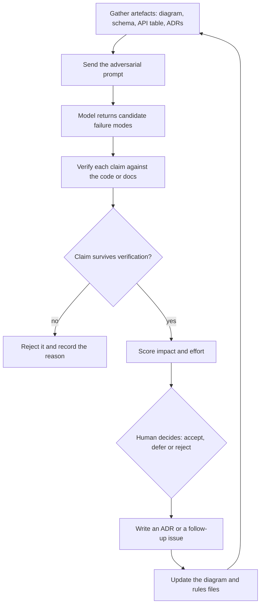

> **Section 06 · Lesson 6** · Level: intermediate · ~15 min · Prereq: [Thinking in boundaries](06-Thinking-In-Boundaries)

## Why this matters

You have a diagram, a schema, an API table and a couple of ADRs. A model reads all of that in seconds and is genuinely good at one thing: finding the failure you did not think about. It is genuinely bad at another: knowing what you are allowed to build. Use it as a tireless critic and keep the decision.

## The adversarial prompt

Ordinary review prompts produce comfort. Ask for the opposite:

```
You are reviewing a design, not approving it.

Artefacts: [architecture diagram] [schema] [API endpoint table] [ADRs 0007, 0011]

Argue why this design fails in these three scenarios, in this order:
1. At 10x current traffic — name the first component to break and why.
2. At each trust boundary on the diagram — what a caller with a valid
   session could reach that they should not.
3. When each external dependency is down — what the user sees, and what
   data becomes wrong or unrecoverable.

Rules:
- Cite the artefact and the specific line or node for every claim.
- Mark each claim CONFIRMED (you can point at the artefact),
  PLAUSIBLE (needs checking in code), or SPECULATION.
- Do not assign severities to anything that is not CONFIRMED.
- List what is missing from the artefacts that would let you answer.
```

Three details do the work. The scenario list forces coverage instead of a rambling list of generic advice. The citation rule makes every finding checkable. The verdict rule stops the model from writing "critical: SQL injection" about a line it invented.

## Give it the artefacts, not a vibe

A model can only critique what it can read. Hand it the real files:

- The **diagram source** (Mermaid or a labelled image), so it can reason about which component talks to which.
- The **schema** — tables, columns, indexes, constraints. Missing unique constraints are exactly the class of thing it spots.
- The **API table** — route, method, auth requirement, and whether the handler is idempotent.
- The **ADRs**, so it checks the design against decisions you already made.

A prompt like "review my architecture, it is a FastAPI app with Postgres" returns advice you already know. The same model with four real artefacts returns specific findings.

The review loop:



## What AI review is good for

- **Enumerating failure modes.** It will list ten ways a request can half-succeed. You need one you missed.
- **Missing states.** Feed it a state machine and it finds the transition nobody handles — the terminal state that does not revoke access, the retry that re-runs a completed job.
- **Inconsistency with your own documents.** The highest-value category, because the knowledge already exists in your repo. A real audit found that a signature was verified but never enforced, and a role table that the client-side navigation did not mirror. Both are "the design says X, the code does Y" findings.
- **Drafting the boring parts.**

Treat its output as a candidate list, not a verdict. Every claim gets one of three labels when you process it: **confirmed** (you reproduced it or found the line), **needs verification** (one specific unknown remains, and you must not assign severity yet), or **rejected** (with the reason). Assigning a severity to an unconfirmed claim is the tell that you are about to write a convincing report about nothing.

## What it cannot do

The model does not know:

- **Your compliance constraints.** Whether a field may leave your jurisdiction, whether a regulator requires a report within a fixed window, whether a contract forbids a subprocessor. Nothing here is legal advice — read the official guidance and verify.
- **Your budget.** It will happily recommend a queue, a read replica and a tracing backend for a product with ten users.
- **Your team.** A recommendation that adds an operational surface only one person understands is a liability, not an improvement.
- **Your risk tolerance.** Two teams looking at the same finding make opposite calls.

So the loop ends at a human: the model widens the list of things you considered, and you decide what to act on, in what order, and what you are choosing not to do.

## Record the outcome, never leave it in chat

A review that lives in a chat window is gone next week. For each accepted finding write either an **ADR** (if it changes a decision) or a **follow-up issue** (if it is work), with the finding, the evidence, the decision and the date.

```markdown
# ADR 0014 — Externalise job state before adding a second replica

Status: Accepted
Context: Review found in-process job state, so a job started on one
  instance is invisible to the other (needs verification: confirm at
  deploy time by running two instances).
Decision: Move job status into the database before autoscaling past one.
Consequences: One extra write per job step; status survives redeploys.
```

Rejected findings deserve one line and a reason too, or the same candidate resurfaces every review and nobody remembers why it was declined.

## Try it

1. Gather your four artefacts: diagram source, schema, API table, one ADR.
2. Paste the adversarial prompt above, with the artefacts beneath it.
3. Sort every claim into confirmed, needs verification, or rejected. Verify the confirmed ones against the code before repeating them.
4. Pick the highest-impact confirmed finding and write an ADR or an issue for it.
5. Delete the chat. The artefact folder is the record.

## Common mistakes

- **Asking for a review without artefacts** — you get generic advice and mistake it for insight.
- **Accepting findings because they sound confident** — the model writes the same certainty about real and invented problems.
- **Assigning severity before verification** — this is how a plausible claim becomes a wrong priority.
- **Letting the model decide** — it does not know your budget, team or regulator. The decision stays human.
- **Leaving the outcome in the chat** — no ADR, no issue, and the finding is lost when the session ends.
- **Reviewing only the diagram** — the schema and the API table are where the sharpest findings are.

## Key takeaways

- Ask the model to attack the design across traffic, trust boundaries and dependency outages, with citations.
- Feed it real artefacts; a vibe description produces vibe advice.
- Its strengths are enumerating failure modes and finding gaps between your docs and your code.
- Give every candidate a verdict — confirmed, needs verification, or rejected — and never a severity before confirmation.
- End in an ADR or an issue written by a human, not in a chat transcript.

## Further learning

- [Building effective agents](https://www.anthropic.com/engineering/building-effective-agents) — the evaluator-optimizer pattern this loop borrows from.
- [Understanding spec-driven development](https://martinfowler.com/articles/exploring-gen-ai/sdd-3-tools.html) — what reviewing specs instead of code buys you, and where it misleads.
- [Architecture decision records](06-Architecture-Decision-Records) — where the accepted findings go.
- [Reviewing agent output](03-Reviewing-Agent-Output) — the same discipline applied to every diff an agent writes.
