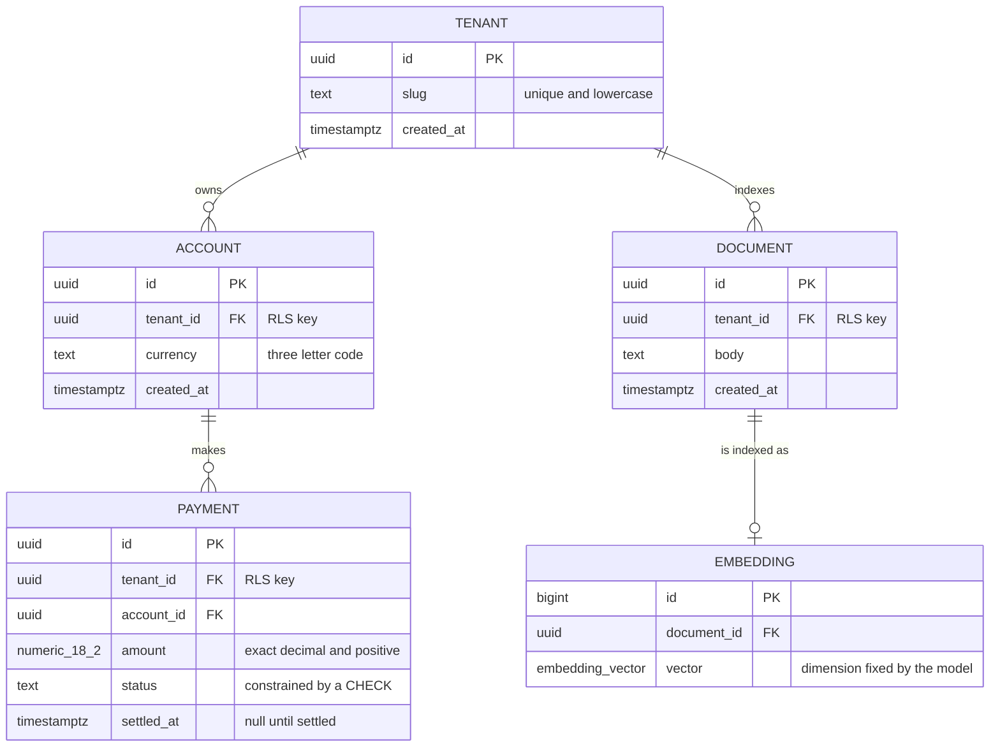

> **Section 06 · Lesson 6** · Level: intermediate · ~20 min · Prereq: [Thinking in boundaries](06-Thinking-In-Boundaries)

## Why this matters

Constraints are the cheapest correctness you will ever buy. A check constraint costs one line and removes a whole class of bug forever, including the classes an agent invents at two in the morning. The schema is also the part of the system that is genuinely hard to change later.

## Tables, keys, and the constraints worth adding

A primary key identifies a row, a foreign key says this row cannot exist without that one, uniqueness says there can be only one, and nullability says this may be absent.

Put the rule in the database even when your code also checks, because the application check runs before the insert and loses the race: two simultaneous signups with the same email both pass an application check, and only a unique index refuses the second. Nullability deserves the same care — one table linked a fulfilled request to the transaction that paid it but let the column be null, which allowed rows nobody could trace back to money.

## Types that bite

- **Money.** Use `numeric(18,2)` in the schema and never a floating-point type, and check the application too: one platform had the column right but accumulated balances in double-precision maths, where repeated additions introduce rounding error.
- **Timestamps.** Always timezone-aware (`timestamptz`), stored in UTC, converted only for display. An `updated_at` column missing on one table made a callback's `UPDATE` fail with an undefined-column error, which left the event unprocessed and looked like a provider problem.
- **Enums versus lookup tables.** A text column plus a `CHECK` constraint is easy to extend and shows up plainly in an `erDiagram`; a database enum type is stricter and awkward to change.
- **Identifiers.** Sequential integers are compact; UUIDs are not guessable and let rows be created in two environments without collision. Use UUIDs for anything an outside caller sees.

## Normalise by default, denormalise on purpose

One fact lives in one place; each entity gets its own table; link them with foreign keys instead of copying values, and compute derived values rather than storing them. Every fact then has one writable home.

Denormalise when you have measured a read path that hurts, then make one code path responsible for the copy. An append-only ledger is a better kind of denormalisation: instead of a mutable `balance` column, store `direction`, `amount` and `balance_after` rows and treat the balance as a `SUM`.

Read it as a security checklist too: every table carries `tenant_id`, and that column is what your access rules filter on. A missing tenant column leaks rows across customers.

## Migrations: versioned, idempotent, forward-only

Migrations are numbered SQL files, `NNNN_description.sql`, applied in order, and three rules keep them safe. They must be **idempotent** — `CREATE TABLE IF NOT EXISTS`, `ADD COLUMN IF NOT EXISTS`, `DROP CONSTRAINT IF EXISTS` then `ADD CONSTRAINT` — because the runner may re-run the file on every deploy. They must be **forward-only, never destructive in the same step as a feature**: a CI lint can reject `DROP TABLE` and `TRUNCATE`, and a column is dropped in a later release once nothing reads it. And they are **schema, not data**: test rows belong in a seed script.

Ordering is part of the design: **migrations land before the code that reads the new schema.** Migrate, then deploy the API. One runner detail cost a platform real downtime — a naive runner splits a file on `;` and does not understand PostgreSQL dollar-quoting, so a `DO $$ ... $$` block breaks the job.

## Deny by default

Anything publicly reachable should default to no access. One platform enabled row-level security on every table in the public schema and added **no policies at all**: only the backend, using a service-role key, could read anything, so a leaked anon key reads nothing. If you want per-tenant policies, write them against the tenant column you just made mandatory, and test them by connecting as the restricted role. [Neon docs](https://neon.com/docs/introduction) covers branching, which is how you exercise a migration on a copy of production first — see [Postgres on Neon](07-Postgres-On-Neon).

## Schemas for AI

A vector column's dimension is fixed by the model that produced the embedding, so changing model means you cannot reuse the column: add a new column or table, re-embed, and switch the read path when the backfill finishes. Index it too, or a retrieval query can exceed the statement timeout.

## Try it

1. Write an `erDiagram` for four tables in your project and mark the tenant or owner column on every one.
2. Write a migration that adds a constraint idempotently, then run it twice: the second run must be a no-op.
3. Insert two rows with the same unique value, and one with a null in a column you believe is mandatory. If the database accepts them, your constraints are missing.

## Common mistakes

- **Money as a float anywhere.** The column can be exact while the application is not. Check the accumulation code.
- **A nullable tenant or owner column.** One table without it becomes the cross-tenant leak.
- **"We will add constraints later."** Later, existing rows already violate them, so the `ALTER` fails under pressure.
- **Deploying the API before the migration.** Migrate first; code must never outrun the schema.
- **Reusing a vector column after changing models.** The dimension will not match, so the insert fails or stores nonsense.

## Key takeaways

- Put the constraints in the database — keys, uniqueness, `NOT NULL`, `CHECK` — not just in code.
- Money is exact decimal or integer minor units end to end; timestamps are timezone-aware and stored in UTC.
- Normalise first, denormalise on purpose, and prefer an append-only ledger to a mutable balance.
- Migrations are numbered, idempotent, forward-only and non-destructive, and they land before the code that reads them.
- Deny by default for anything public, and make the tenant column mandatory on every table.

## Further learning

- [Postgres on Neon](07-Postgres-On-Neon) — branches, migrations and connection handling on a serverless Postgres.
- [Environments and promotion](07-Environments-And-Promotion) — running a migration against a copy before it reaches production.
- [Diagrams as code](06-Diagrams-As-Code) — writing the schema diagram your next table change will update.
- [Security architecture](06-Security-Architecture) — where row-level security, trust boundaries and tenant isolation sit in the wider picture.
- [Neon documentation](https://neon.com/docs/introduction) — serverless Postgres with branching, autoscaling and instant restore.
