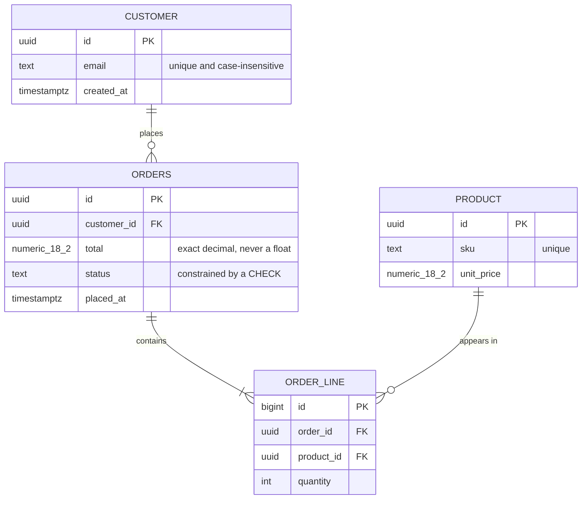
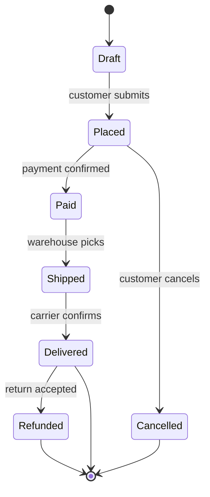

> **Section 06 · Lesson 3** · Level: beginner · ~18 min · Prereq: [Thinking in boundaries](06-Thinking-In-Boundaries)

## Why this matters

A drawing in a design tool is a picture nobody can diff, so it goes stale the week after it is made. A diagram written in text lives next to the code, appears in the pull request, and shows up in review as a change you can read.

## Why diagram-as-code beats a picture

Text diagrams live with your source, so they travel with the branch, the review and the history. When a table gains a column, the diagram change is a line in the diff, and a reviewer who disagrees edits the text instead of re-exporting a PNG.

The rule that makes this work: the diagram is a summary, not the source of truth. Keep it small enough to fit in a diff, and update it in the same pull request as the change.

## Mermaid: four types, four jobs

GitHub renders Mermaid inside a fenced block tagged `mermaid`. Four types cover almost everything:

- `flowchart` (`graph`) for process and structure — what talks to what.
- `sequenceDiagram` for interactions in time — who calls whom, in what order.
- `stateDiagram-v2` for lifecycles — the legal states of one thing.
- `erDiagram` for schemas — tables, keys and relationships.

Two worked examples follow. Both are real shapes, and both are short on purpose.

### A schema, as an erDiagram

Read the arrows as sentences: a customer places zero or more orders, an order contains one or more lines, a line points at exactly one product. The `||` end is the "exactly one" side and the `o{` end is the "zero or many" side.

### A lifecycle, as a stateDiagram-v2

The states are the nouns, the labelled arrows are the events, and `[*]` is the start and the terminal state. Two things are immediately checkable: nothing returns from `Delivered` to `Placed`, and `Cancelled` cannot come back. If your code disagrees with the picture, one of them is a bug.

## C4 in plain language

C4 is a naming scheme for diagrams at four zoom levels. You need the first two.

- **Context** — your system as one box, with the people and outside services it talks to. Five boxes maximum. Useful for a README.
- **Container** — the pieces you deploy: web client, API, database, background worker. This is the diagram you draw when a new contributor joins.
- **Component** and **Code** — the modules inside one container, and the classes inside those. Usually skippable: that is what your boundary diagram and folder structure are for.
- **Code** — classes and functions. Never draw this by hand.

Pick one level per diagram. The commonest bad diagram is a container-level picture with two tables and a function call squeezed into it.

## Diagram hygiene

Three habits make diagrams useful rather than decorative:

1. **Label the trust boundary.** Draw a line where data stops being untrusted — the public endpoint, the provider callback, the admin route. Most security bugs live on the wrong side of an unlabelled line.
2. **Point arrows in the direction of control or data flow, and say which.** An arrow that means "depends on" in one place and "calls" in another is worse than no arrow.
3. **Draw the failure paths.** Timeout, duplicate delivery, partial success. A diagram with only happy paths is a wish, and the failure paths are where the state machine lives ([State machines for real features](06-State-Machines-For-Features)).

## Making it a habit

Use the planning rule: **if a feature has state that survives a restart, draw its state machine before you write code**, and commit the diagram in the same branch. Include it when you ask an agent for a change: it is cheaper context than three files of prose.

Diagrams and decision records are two halves of one habit. A picture with no decision behind it rots quietly; the lifecycle below shows how a recorded decision is proposed, reviewed and later superseded.

## Try it

1. Create `docs/diagrams/` and draw a context diagram for your project: your app, its users, and every outside service, as one `flowchart`.
2. Add an `erDiagram` for your three most important tables. Mark keys and note one constraint per table.
3. Ask the agent: "Read `docs/diagrams/orders.md`. List every state transition in the code that is not in the diagram." Fix whichever is wrong.
4. Commit the diagrams in the same branch as your next feature and reference them from the pull request description.

## Common mistakes

- **Pasting a screenshot from a design tool.** It cannot be diffed, reviewed or edited.
- **One diagram that does everything.** Twenty boxes with four kinds of arrow is unreadable.
- **Unquoted labels with punctuation.** `A[Verify (twice)]` can break the parser; write `A["Verify (twice)"]`.
- **Showing only the happy path.** If every arrow succeeds, the diagram hides the retries and duplicate callbacks that cause the incidents.
- **Updating the diagram and never the code, or the reverse.** Whichever is stale will be believed, so change both in one pull request.

## Key takeaways

- Diagrams as code diff, review and live next to the code; a picture does not.
- Match the Mermaid type to the job: flowchart for structure, sequence for interaction, state for lifecycles, erDiagram for schemas.
- C4 gives you two useful zoom levels, context and container. Anything deeper is a folder structure.
- Label the trust boundary, the arrow's meaning, and at least one failure path on every diagram.
- Stateful features get a state machine before code, and the diagram ships in the same branch.

## Further learning

- [Mermaid cookbook](16-Mermaid-Cookbook) — copy-paste snippets for each diagram type and the syntax traps.
- [State machines for real features](06-State-Machines-For-Features) — turning a lifecycle diagram into guards, tests and idempotent transitions.
- [Architecture decision records](06-Architecture-Decision-Records) — the written half of the same habit.
- [Docs as code](11-Docs-As-Code) — keeping diagrams, decisions and documentation in the repository beside the code.
- [Anthropic engineering](https://www.anthropic.com/engineering) — how compact, structured context changes what an agent gets right.
