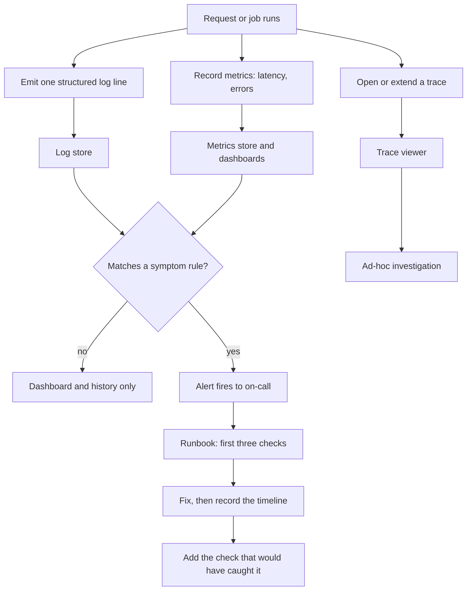

> **Section 06 · Lesson 4** · Level: intermediate · ~18 min · Prereq: [Reliability patterns](06-Reliability-Patterns)

## Why this matters

Without observability, a production problem reaches you as a support message: "the app is broken". With it, the problem arrives as an alert with a request id, a failing route and a timeline. Most small products do not need dashboards to start with. They need a health endpoint, one structured log line per event, and three alerts that wake somebody.

## The three signals, and the endpoint you write first

- **Structured logs** — one line per event, JSON, with fields. Text you have to squint at is not a signal.
- **Metrics** — numbers over time: counts, rates, latency percentiles.
- **Traces** — one request's path across services, with per-stage timing.

Before any of those, write the honest health endpoint. It is the cheapest observability you will ship, and what platforms use to decide whether to send traffic to your instance. Return real state, not a hardcoded `200`:

```json
{"status": "ok", "db": "connected", "version": "1.4.2"}
```

Point the platform's healthcheck at it and add a startup probe so traffic waits until it answers. A process that boots but cannot reach its database should fail the probe and be replaced, not serve errors. A healthcheck that only says "the process is running" is worse than none, because it hides a broken instance behind a green dashboard.

The signal flow for one event:



## Log discipline

One line per event, machine-parseable, with a correlation id:

```python
log.info(
    "payout.created",
    extra={"request_id": rid, "account_id": aid, "rail": "bank",
           "amount_cents": 125000, "duration_ms": 240, "outcome": "accepted"},
)
```

Give every inbound request an id (accept the platform's or generate one) and thread it through logs, downstream calls and error responses. Then "what happened to request abc123" is one query.

Two prohibitions. No PII — log an id, not a name, phone number or email. No secrets, ever, not the prefix and not "just the last four". A log aggregator is a database you forgot to secure, and retaining customer data in it turns an incident into a compliance problem. Scrub query strings too: one review found destination and status details arriving in URLs, which then landed in proxy logs and referrer headers.

## Metrics that matter for a small product

Six metrics carry a small product:

- **Error rate** — 5xx per route per minute. Alert on a sustained rise, not a single failure.
- **Latency p50 and p95** — the median tells you normal, p95 tells you what people complain about. Averages hide the tail.
- **Saturation** — CPU, memory, connection pool usage. High is a symptom; rising is the signal.
- **Queue depth and age** — the oldest unprocessed job. Depth can look fine while one job is stuck.
- **Cost per request** — for anything calling a paid API.
- **Business counters** — payments attempted versus settled, signups, failed logins.

Thresholds a payments platform settled on: alert when p95 exceeds roughly 3 seconds, when callback processing failures exceed zero in 10 minutes, and when any pending transaction is older than 2 hours. Those are symptoms a user feels. Start with a couple of SQL queries on a timer if that is all you have.

## Alerts that are actionable

An alert nobody acts on is noise, and noise trains people to ignore the next one.

- **Alert on symptoms, not blips.** "p95 latency above 3s for 5 minutes" beats "CPU above 80% once".
- **Page a human only when a human must act now.** Everything else goes to a channel or a digest.
- **Write the runbook with the alert.** The alert links to three concrete checks. If you cannot write the runbook, the alert is probably not actionable.

## Observability for AI features

AI features fail differently: they can return a `200` with a bad answer. Track quality and cost together:

- **Token usage** — input and output split, per request and per user.
- **Cache hit rate** — a semantic cache dropping from 30% to 3% multiplies the bill.
- **Retrieval quality** — how often answers fall back to generic results; one assistant alerted when that share crossed a threshold.
- **Eval scores over time** — sample a slice of live traffic (one project scored about 5% of production requests) for faithfulness, relevance and context precision, then watch the trend.

One measured figure to plan with, as of 2026: roughly $0.0017 per uncached question, with cached answers costing about nothing. Cost is a first-class signal.

## Post-incident

After the fix, write three things while memory is fresh: a timeline with timestamps, the root cause stated plainly, and the one change that would have caught it earlier. Then make that change. A missing timeout is a bug; a request that hangs forever with no error and no log is a bug that hides itself, and the worst user experience is a spinner that never fails.

## Try it

1. Add `/health` returning status, database connectivity and the running version, and point the platform healthcheck at it.
2. Convert one log line to JSON with a `request_id`, and thread that id into your error responses.
3. Add two metrics — 5xx per minute and p95 latency — and draw them on one dashboard.
4. Write one alert with a runbook of three checks, trigger it deliberately, and follow your own runbook.

## Common mistakes

- **A healthcheck that returns `200` unconditionally** — the platform routes traffic to a broken instance.
- **Unstructured log lines** — you cannot filter or count them, so they are only useful once you are already reading.
- **PII or tokens in logs** — a long-lived leak in a store with weaker access control than your database.
- **Alerting on every CPU spike** — the team mutes the channel and misses the real page.
- **Watching latency but not cost** — an AI feature can be perfectly healthy and ten times over budget.

## Key takeaways

- Ship a real health endpoint first; it is what platforms and load balancers act on.
- One structured log line per event with a correlation id, no PII and no secrets.
- Six metrics beat fifty: error rate, p50/p95 latency, saturation, queue age, cost, business counters.
- Alert only on symptoms a user feels, and write the runbook in the same commit as the alert.
- For AI features, watch token usage, cache hit rate, retrieval quality and eval trend, not just uptime.

## Further learning

- [Railway docs](https://docs.railway.com/) — healthchecks, logs and restart behaviour on the platform running your service.
- [Neon docs](https://neon.com/docs/introduction) — slow query logging and database metrics for the store behind your API.
- [Evaluating AI features](10-Evaluating-AI-Features) — the eval loop behind the quality scores above.
- [Lesson banks and retros](11-Lesson-Banks-And-Retros) — where the post-incident write-up belongs.
