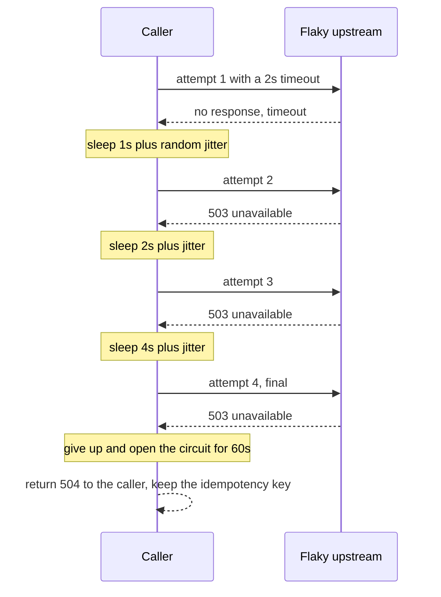

> **Section 06 · Lesson 2** · Level: advanced · ~20 min · Prereq: [API design basics](06-API-Design-Basics)

## Why this matters

Every dependency you call will eventually be slow, wrong, or absent: a database failover, a provider outage, a network partition, a deploy that half-rolled. A design with no answer for that is a bet. The biggest outage in a real payments platform was not a hack or a bug — it was a dependency going down with no degradation path, so every request waited 45 seconds and then failed.

## Failure is normal

Bound every outbound call with a timeout. A call with no timeout can hang a worker forever, and the user just watches a spinner that never errors. After the timeout, decide:

- **Retry** — only for safe operations (a `GET`, or a create with an idempotency key) and only for transient failures. A `400` will still be a `400` on attempt four.
- **Exponential backoff with jitter** — double the wait each attempt, then add randomness. Without jitter, every client that failed at the same moment retries at the same moment and hits the recovering service as a second wave.
- **Circuit breaker** — after N failures in a window, stop calling for a cooldown and fail fast with a clear "temporarily unavailable". A 30-second outage stays a 30-second outage instead of becoming a 45-second wait on every request.
- **Bulkhead** — give each dependency its own concurrency pool, so one slow provider saturates its own pool rather than the whole handler.

The retry loop, including the give-up path:

Giving up is a design decision with an owner, not a crash.

## Queues and async work

If a user request needs a slow upstream, take the slow part out of the request. Write a job row, return `202 Accepted` with a job id, let a worker do the work, and let the client poll or receive a push. The user now waits on your database, not the provider.

At-least-once delivery is the default: a queue may deliver a message twice, because a worker can die after finishing the work but before acknowledging it. So handlers must be idempotent — the same key, claim and stored result as the API lesson. A worker that sends a message or a transfer without that check will double-send on the first redelivery.

## Caching

Cache to avoid recomputation, and be precise about the key. A multi-agent research assistant used a **semantic cache**: it embedded the incoming question, matched it against stored questions by vector similarity above a high threshold, and returned the stored answer in tens of milliseconds. That stayed safe only because the lookup was scoped to a topic category, so a question about one domain could never match a cached answer from another.

Three rules follow:

- **The key must include everything that changes the answer** — tenant, user role, locale, data version. A tenant id missing from the key is a cross-customer data leak.
- **Never cache across tenants or domains** without an explicit scope field you can audit.
- **You must be able to invalidate** — include the source row's version or timestamp in the key, so writes naturally produce misses.

## Graceful degradation

Ask what the product does when dependency X is down, and write the answer down:

- Reads served from cache or a local copy; writes queued.
- A feature switched off with a banner ("bank transfers are delayed") rather than an exception.
- A dry-run mode that queues the operation for retry when the provider returns.

One platform's fallback returned four hardcoded parcels whenever the database query failed. Users saw plausible data that was wrong. A visible failure does far less damage than a confident lie, so fail closed on anything that moves value.

## Consistency

Read-after-write breaks the moment you cache or replicate. Two rules keep it honest:

- **Where the user must see their own write, read from the primary** — or write through the cache — for a short window.
- **Where money or entitlements are involved, never guess.** A stale balance that shows a merchant more than they hold leads to a rejected payout after they have committed. Reconcile against the source of truth and treat the cached number as a hint, not a fact.

Eventual consistency is fine for a feed, a count, or a dashboard. It is not fine for a balance you are about to debit.

## Try it

1. Wrap one outbound HTTP call with a 2-second timeout, three retries, exponential backoff with jitter, and a log line per attempt. Point it at a URL you know returns `503`.
2. After the final attempt, return `504` and log the reason. Confirm the caller sees a message, not a hang.
3. Add a circuit breaker: after 5 failures in 30 seconds, fail fast for 60 seconds. Hit it 10 times and check the fast failures.
4. Write one paragraph answering "what does the product do when our payment provider is down?" Keep it next to the code.

## Common mistakes

- **No timeout at all** — the request hangs and every worker threaded through it is stuck.
- **Retrying a non-idempotent create** — the duplicate executes. Only retry with a key.
- **Backoff without jitter** — synchronised retries hammer the recovering service.
- **Releasing the idempotency key on a timeout** — the upstream may have executed; keep it ambiguous and reconcile.
- **A cache key missing the tenant** — one customer sees another's data.
- **A silent fallback returning fabricated data** — worse than an error, because nobody notices.

## Key takeaways

- Bound every outbound call with a timeout; treat the timeout as the common case.
- Retry only safe, idempotent operations, with exponential backoff plus jitter, and give up loudly.
- A circuit breaker turns a dependency outage from a hang into a fast, honest failure.
- At-least-once delivery is the default, so every queue handler needs idempotency.
- Write down the degradation path for each dependency and fail closed where value moves.

## Further learning

- [Building effective agents](https://www.anthropic.com/engineering/building-effective-agents) — routing and chaining patterns that keep failure paths explicit.
- [Railway docs](https://docs.railway.com/) — healthchecks and restarts on the platform running the service.
- [Neon docs](https://neon.com/docs/introduction) — what the managed database already handles during failures.
